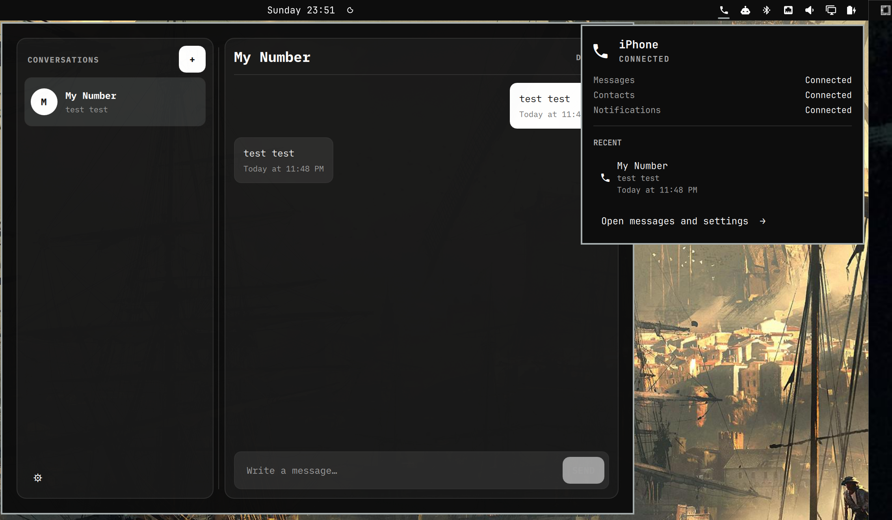

# BlueFerry



Use your iPhone's messages on Linux over Bluetooth.

<p align="center">
  
</p>

BlueFerry brings SMS, RCS, and iMessage from a paired iPhone to your Linux desktop.
You can read and reply to messages, start a conversation, search synced
contacts, and optionally mirror other iPhone notifications. There is no Mac
relay, Apple login, cloud service, or subscription.

This is still experimental software. Most development has used an iPhone 16
Pro Max on iOS 26.5, with additional successful testing on an iPhone 17 Pro Max
running an iOS 27 beta. Apple can change the Bluetooth behavior BlueFerry relies
on, so don't make it your only way to receive an important message yet.

## What works

- Receive and send SMS, RCS, and iMessage through the iPhone.
- Sync contacts, including phone numbers and Apple-ID email addresses.
- Mark messages read from the desktop.
- Use native GTK, KDE/Kirigami, Quickshell, or terminal clients.
- Keep local history encrypted with GNOME Keyring or KDE Wallet.
- Group chats, when BlueFerry can identify the participants safely.

BlueFerry only knows about messages it sees while connected; it does not
download your iCloud Messages archive. Attachments, reactions, typing
indicators, FaceTime, calls, and complete sent-message history are not
supported.

Direct conversations combine the phone numbers and email addresses that belong
unambiguously to one synced contact. Replies use the most recent incoming
address, shown as **Reply to** above the conversation. Shared addresses and
contacts that merely have the same name stay separate. Original message
addresses are retained; editing and syncing contacts updates the grouping.

Group replies are deliberately cautious. Bluetooth does not give BlueFerry a
reliable group ID or complete roster, so it disables replies when the
participants are unclear. Named groups may ask you to confirm a local reply
roster. This does not change the group on the iPhone.

## Install

Download the native packages for your distribution from the
[latest BlueFerry release](https://github.com/erikwb/blueferry/releases/latest).
Install `blueferry-backend` plus the client for your desktop. The backend also
includes the `blueferry-tui` terminal client.

For Arch Linux or CachyOS, download the `.pkg.tar.zst` files and install them
with pacman. For example, to install the GTK client:

```bash
sudo pacman -U ./blueferry-backend-*.pkg.tar.zst ./blueferry-gtk-*.pkg.tar.zst
```

For Debian, Ubuntu, Mint, Pop!_OS, or PikaOS, download the `.deb` files and
install them with apt:

```bash
sudo apt install ./blueferry-backend_*.deb ./blueferry-gtk_*.deb
```

For Fedora, download the `.noarch.rpm` files whose `.fcNN` tag matches your
Fedora release, then install them with dnf:

```bash
fedora_release=$(rpm -E %fedora)
sudo dnf install ./blueferry-backend-*.fc${fedora_release}.noarch.rpm \
  ./blueferry-gtk-*.fc${fedora_release}.noarch.rpm
```

Replace the GTK package with `blueferry-qt` for KDE Plasma. Arch and CachyOS
also provide `blueferry-quickshell`. The tested matrix currently covers Arch
Linux, CachyOS, Debian 13, Ubuntu 24.04 and 26.04, Linux Mint 22.3, Pop!_OS
24.04, PikaOS IV, and Fedora 43, 44, and 45. Ubuntu 24.04, Mint, and Pop!_OS do
not provide necessary Qt dependencies, so use the GTK or terminal client there.

Arch and Fedora packages set up the newer Bluetooth support needed for iPhone
system notifications. Debian-family packages do not change or restart
Bluetooth; messages and contacts still work, and notifications are added only
when that machine already supports them.

### Build packages from source

Clone the repository, then choose the build instructions for your
distribution:

```bash
git clone https://github.com/erikwb/blueferry.git
cd blueferry
```

#### Arch based distros

Install the basic build tools, then build and install all four packages:

```bash
sudo pacman -S --needed base-devel python
./build.sh -si
```

Run `./build.sh` without `-i` to build without installing. Finished packages
are written to `packaging/arch/`.

The build always uses `/usr/bin/python`, because the build and test
dependencies are Arch packages for the system interpreter. A mise, pyenv,
conda, or activated virtualenv python earlier in `PATH` is ignored rather
than producing a package for the wrong `site-packages` directory.

#### Debian based distros

```bash
sudo apt-get install devscripts equivs
sudo mk-build-deps -i -r -t 'apt-get -y --no-install-recommends' packaging/deb/control
./packaging/build-deb.sh
```

Finished packages are written to `dist/deb/`.

#### Fedora

```bash
sudo dnf install dnf-plugins-core rpm-build
sudo dnf builddep packaging/rpm/blueferry.spec
./packaging/build-rpm.sh
```

Finished packages are written to `dist/rpm/`.

See [packaging/README.md](packaging/README.md) for the exact support matrix and
more packaging details.

## Pair an iPhone

Start the client that fits your desktop:

```bash
blueferry-gtk         # GNOME, Cinnamon, and similar desktops
blueferry-qt          # KDE Plasma
blueferry-quickshell  # Quickshell
```

Then:

1. Keep the iPhone unlocked with **Settings → Bluetooth** open.
2. Let BlueFerry check your Bluetooth controller.
3. In BlueFerry, choose **Scan**, select the iPhone, and choose **Pair**.
   BlueFerry starts the pairing request; you do not need to find and tap the
   computer under **Other Devices** on the phone.
4. When the request appears on the iPhone, approve it and confirm that both
   devices show the same code. It can take around 15 seconds to appear.
5. After pairing, tap **ⓘ** beside the computer on the iPhone and enable
   **Show Message Notifications** and **Sync Contacts**. If the toggles are
   missing, return to the Bluetooth device list and reopen the **ⓘ** page a few
   times. If iOS asks to **Allow System Notifications**, approve that too.
6. Wait for Messages and Contacts to show as connected. If you use the default
   encrypted storage, approve the desktop wallet prompt.

System Notification access lets BlueFerry recognize group-message metadata.
When it is unavailable, ordinary messages and contacts still work, but a group
message may look like a direct conversation with its sender.

### Pairing options

Most people should leave both options unchecked.

- **Compatibility pairing for iOS 18 or earlier** keeps the signal that makes
  the Messages and Contacts permissions appear, but does not connect iPhone
  system notifications. BlueFerry also chooses this automatically when the
  local BlueZ stack cannot support them.
- **Use explicit Bluetooth pairing** skips the normal connection-first
  approach and asks BlueZ to pair immediately. Try it only if normal pairing
  keeps getting canceled on that Bluetooth controller. It is independent of
  iOS compatibility mode.

For a clean retry, forget the computer on the iPhone and forget the iPhone on
Linux before pairing again. Stale phone-side Bluetooth state can survive a
one-sided forget, so reset both sides rather than repeatedly pairing over the
old record.

The terminal wizard exposes the same flow:

```bash
blueferry pair-setup
blueferry pair-setup --compatibility-mode
blueferry pair-setup --explicit-pairing
```

Once setup is complete, the backend starts automatically and reconnects after
normal Bluetooth interruptions. Package upgrades and same-version local
rebuilds are detected automatically, so an old backend process is restarted
when needed.

## Terminal client

The TUI is included in `blueferry-backend` on every supported package format.
Arch uses its repository Textual package; DEB and RPM builds carry a private
Textual 8 runtime for the TUI.

Start it with either:

```bash
blueferry-tui
blueferry tui
```

Press `?` for the keyboard map or `Ctrl+P` for the command palette. The TUI has
conversation search, a multiline composer, mouse support, themes, and a layout
that adapts to narrow terminals.

## Omarchy Quattro

The native bar panel lives in
[omarchy-blueferry](https://github.com/erikwb/omarchy-blueferry):

```bash
omarchy plugin add https://github.com/erikwb/omarchy-blueferry.git
```

Enable it from **Setup › Plugins**. Its popup shows connection health and recent
conversations; the full Quickshell client handles pairing, messages, and
preferences.

## Notifications and local data

BlueFerry can show message notifications only—the default—all iPhone
notifications, or none. Other app notifications are displayed and discarded;
they are not added to message history. Messages seen through both MAP and ANCS
are deduplicated.

Message history and contacts are encrypted by default with a random key stored
in GNOME Keyring or KDE Wallet. If the wallet is locked, live messages continue
to work, but retained history and contact lookup wait until you unlock it. You
can also choose unencrypted storage or **Do not retain local data**. Changing
storage modes clears the existing cache so encrypted and plaintext records are
never mixed.

Starred conversations and saved group confirmations follow the same storage
policy as history. Older plaintext preferences are encrypted during upgrade
when the wallet is available; if it is locked, those old preferences are
cleared so contact identities are no longer retained in plaintext. You can
star conversations and confirm group rosters again after unlocking.

Configuration lives in `~/.config/blueferry`; local state lives in
`~/.local/state/blueferry`. Uninstalling packages does not delete either
directory.

The common retention settings live in `~/.config/blueferry/local.env`:

```bash
BLUEFERRY_SHOW_NOTIFICATION_CONTENT=false
BLUEFERRY_KEEP_PHONE_AUDIO_ON_PHONE=true
BLUEFERRY_NOTIFICATION_TIMEOUT_MS=8000
BLUEFERRY_HISTORY_RETENTION_DAYS=30
BLUEFERRY_HISTORY_MAX_EVENTS=10000
BLUEFERRY_HISTORY_MAX_PAYLOAD_BYTES=268435456
```

When **All iPhone Notifications** is selected, optional exact bundle-ID rules
can limit which non-Messages ANCS apps create desktop popups:

```bash
# Keep all iPhone app notifications except these apps:
BLUEFERRY_ANCS_APP_BLOCKLIST=com.example.Chat,com.example.Mail

# Or allow only these apps (omit this setting to allow every unblocked app):
# BLUEFERRY_ANCS_APP_ALLOWLIST=com.example.Calendar,com.example.Reminders
```

If both are configured, the blocklist wins. An explicitly empty allowlist
blocks every non-Messages app. Apple Messages is always processed for group
conversation metadata, but its duplicate ANCS popup remains suppressed in
favor of the MAP message popup.

Bundle IDs are case-sensitive. To discover them, follow the user-service log
while causing the app to send a notification; BlueFerry logs each app once per
daemon run without logging its notification content:

```bash
journalctl --user -u blueferry -f | grep "ANCS app observed"
```

Restart the user service after editing `local.env` settings.

When WirePlumber 0.5 or newer is installed, BlueFerry keeps calls and music on
the iPhone by writing
`~/.config/wireplumber/wireplumber.conf.d/99-blueferry-keep-phone-audio.conf`
before pairing and waiting for WirePlumber to reload it. The fragment removes
the adapter roles that make this computer an A2DP/HFP sink, and disables
auto-connect on phone cards so a later `bluetooth-a2dp-autoconnect` rule cannot
steal the stream. A failed pairing attempt removes a fragment that attempt
installed. After a successful bond the daemon keeps reconciling the same
file. Set `BLUEFERRY_KEEP_PHONE_AUDIO_ON_PHONE=false` to remove BlueFerry's
fragment only.

## Command line

The graphical clients cover normal use, but the CLI is useful for diagnostics
and scripts:

```bash
blueferry sms-list
blueferry sms-send '+15551234567' 'on my way'
blueferry sms-send person@icloud.com 'hello from Linux'
blueferry sms-send Alice 'running late'
blueferry contacts-sync
blueferry history-clear
blueferry doctor
```

Ambiguous contact names are presented for you to choose from rather than
guessed.

## Troubleshooting

Start with the iPhone page in the app. It reports Messages, Contacts, and iPhone
Notifications separately; messages and contact sync can work even when the
optional notification connection does not.

For logs and prerequisite checks:

```bash
blueferry doctor
journalctl --user -u blueferry -f
```

If messages work but names do not, use **Sync Contacts** or run
`blueferry contacts-sync`.

Pairing failures save a scrubbed report that can be attached to a GitHub issue.
It includes the package build and source SHA, pairing mode, controller details,
and an ordered setup timeline. Please also include the iPhone model and iOS
version. Reports remove Bluetooth addresses and home-directory paths, but it is
still sensible to inspect anything before posting it publicly.

## Technical details

BlueFerry uses three standard Bluetooth services:

- MAP over Bluetooth Classic carries messages, read state, and sends.
- PBAP over Bluetooth Classic supplies contacts.
- ANCS over Bluetooth LE supplies optional notifications and group-message
  display information.

One unprivileged per-user backend owns those connections and exposes a small
session D-Bus API to the clients. Quickshell messaging reaches that API through
one persistent stdin bridge; its short-lived command helpers are limited to
setup before the backend is configured. Pairing and unpairing require approval
in the initiating BlueFerry client and use normal Bluetooth confirmation;
there is no hidden Apple protocol.

The deeper design and protocol notes live in
[ARCHITECTURE.md](ARCHITECTURE.md), [PROTOCOL.md](PROTOCOL.md),
[TESTING.md](TESTING.md). Release history is in [CHANGELOG.md](CHANGELOG.md).

BlueFerry began from
[iphonebridge](https://github.com/gabrielmeir53/iphonebridge), created by Gabe
Shatunovsky. The ANCS constants and wire-format code are adapted from
[ANCS4Linux](https://github.com/bmh129/ancs4linux), by Paweł Zmarzły and
Bradley Harmon, under GPL-2.0-or-later.

BlueFerry is licensed under [GPL-2.0-or-later](LICENSE).
