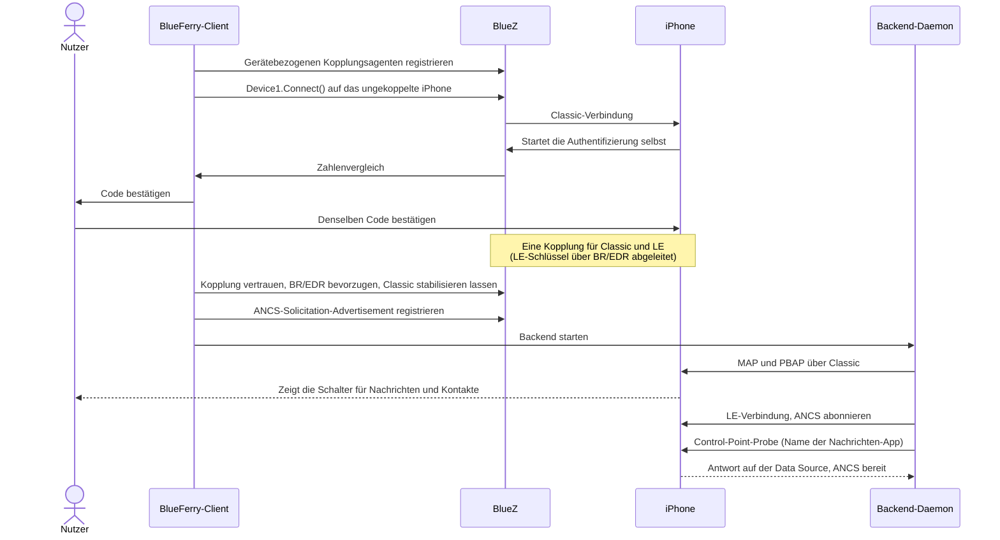

# Architektur

> **Hinweis:** Dies ist eine kurze Zusammenfassung.
> [ARCHITECTURE.md](https://github.com/erikwb/blueferry/blob/main/ARCHITECTURE.md)
> (Englisch) ist die maßgebliche und vollständige Beschreibung, einschließlich
> der Modulübersicht.

## Prozessgrenzen

- `blueferry-backend` besitzt MAP, PBAP, ANCS, die Kontaktauflösung, die
  Identität der Unterhaltungen, die Aufbewahrung des Verlaufs, die
  Mitteilungsrichtlinie und die D-Bus-API. Es läuft unprivilegiert und hat
  keinen sudo-Pfad.
- GTK, Qt, TUI, Quickshell und die Nachrichtenbefehle der CLI sind
  austauschbare Clients. Sie erhalten undurchsichtige Thread-Schlüssel und
  können für eine bestehende Unterhaltung keine anderen Empfänger bilden.
- Im Backend ist `dbus_service` nur ein Adapter über `backend_operations`.
  `daemon` steuert den Lebenszyklus, `event_dispatcher` verteilt Ereignisse
  an die Senken, und `profile_supervisor` verwaltet die Zustandswechsel von
  MAP/PBAP.

## Bluetooth

| Profil | Transport | Module |
| --- | --- | --- |
| MAP | Classic, OBEX | `obex/` (Sitzungen, Worker, Ereignisse, Senden, Lesen) |
| PBAP | Classic, OBEX | `contacts.py`, `contact_sync.py`, `contact_repository.py` |
| ANCS | LE, GATT | `ancs/` (Client, Parser, Sequencer) |

- Ein Worker-Thread mit eigener Bus-Verbindung serialisiert jede blockierende
  OBEX-Operation, damit die GLib-Hauptschleife nie blockiert.
- `bearer_supervisor` verbindet zuerst Bluetooth Classic und hält danach LE
  parallel verbunden. `solicitation_supervisor` hält das ANCS-Advertisement
  aktiv, bis ANCS nachweislich funktioniert.
- `adapter_class_supervisor` korrigiert eine abweichende Class of Device über
  einen festen systemd-Helfer, den eine enge Polkit-Regel erlaubt.
- `bluetooth_recovery` schaltet den Adapter bei anhaltenden ANCS-Ausfällen
  als letzte Maßnahme und mit Ratenbegrenzung aus und wieder ein.

## Kopplung

`pair_setup` ist die unterste Schicht, `setup_client` stellt GTK, Qt und dem
CLI-Assistenten typisierte Operationen bereit. Quickshell erreicht dieselben
Operationen über die JSON-Helfer `pairing-*`. `pairing_policy` löst zwei
unabhängige Achsen auf, statt eine Tabelle mit Geräteeigenheiten zu pflegen:

- **Zustellmodus:** voll (MAP, PBAP, ANCS) oder Kompatibilität (nur MAP und
  PBAP, `BLUEFERRY_ANCS_ENABLED=false`).
- **Authentifizierung:** zuerst verbinden und das iPhone die
  Authentifizierung starten lassen, oder ein explizites `Device1.Pair()` für
  Controller, die den Connect-first-Weg abbrechen.

Die Bestätigung im auslösenden Client ist Pflicht; kein Aufrufer fällt auf
einen Bluetooth-Agenten des Desktops zurück.

### Ablauf der Kopplung (voller Modus, Connect-first)

Erfolg heißt, dass MAP/PBAP durchgehend funktionieren, nicht nur, dass eine
Kopplung existiert. Das Verhalten hinter jedem Schritt beschreibt
[PROTOCOL.md](https://github.com/erikwb/blueferry/blob/main/PROTOCOL.md#pairing-and-iphone-permissions)
(Englisch).

## Speicher und Datenschutz

- Alles vom iPhone ist nicht vertrauenswürdige Eingabe. Parser, Übertragungen
  und gespeicherte Daten haben feste Grenzen in `limits.py`.
- Verlauf und Kontakt-Cache sind SQLite-Dateien, die nur dem Benutzer gehören.
  Sensible Datensätze sind mit AES-256-GCM verschlüsselt, unter einem
  Zufallsschlüssel aus dem Secret Service. Clients sehen den Schlüssel nie.
- Der Speicher schlägt sicher fehl: Fehlt der Schlüssel oder ist er falsch,
  wird der Speicher unverfügbar, ohne Datensätze zu löschen, und neue
  Nachrichten kommen weiter an.
- Logs enthalten nie Nachrichtentexte, Mitteilungsinhalte oder
  Empfängeridentitäten.

## Clients

- Alle Python-Clients dekodieren die API über `client_wire` in `models` und
  teilen die Logik für Unterhaltungen und Antworten in `conversation_state`.
- GTK nutzt eine Bus-Verbindung in einem Worker, Qt einen
  `BridgeController` mit Thread-Pool, die TUI Textual-Worker. Quickshell
  spricht über stdin mit einem dauerhaften `quickshell_bridge`-Prozess.
- Einige Regeln sind für Quickshell in QML nachgebaut
  (`OnboardingState.qml`, `ConversationLogic.qml`). Eine Änderung an diesen
  Regeln muss an beiden Stellen erfolgen.

## Wachstumsregeln

- Bluetooth und Speicher gehören ins Backend.
- Neues Protokollverhalten kommt hinter die D-Bus-Grenze, bevor es UI dafür
  gibt.
- Versionierte Schnittstellen nur kompatibel ändern und XML und Client-Modelle
  im selben Patch anpassen.
- Signale auf `Events1` bleiben inhaltsfrei.

Jede Regel ist in
[ARCHITECTURE.md](https://github.com/erikwb/blueferry/blob/main/ARCHITECTURE.md#growth-rules)
erklärt.
