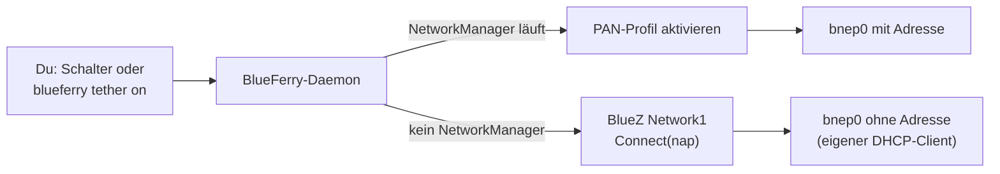

# Internetfreigabe (Bluetooth-Tethering)

BlueFerry kann den persönlichen Hotspot deines iPhones über Bluetooth (PAN)
nutzen. Dein Rechner bekommt so Internet über das Telefon, mit dem er
ohnehin verbunden ist. Ein WLAN-Hotspot muss nicht eingerichtet werden.

Die Funktion ist **experimentell**. Sie wurde bisher nur gegen simulierte
BlueZ- und NetworkManager-Dienste getestet, noch nicht mit einem echten
iPhone.

## Was die Funktion macht

- Die Funktion ist **aus, bis du sie aktivierst**. Solange sie aus ist,
  ignoriert BlueFerry Bluetooth-Netzwerkverbindungen vollständig, auch
  solche, die du im Plasma-Netzwerk-Applet startest (siehe
  [Solange sie aus ist](#solange-sie-aus-ist)).
- Ist sie aktiviert, schaltest du die Freigabe selbst ein und aus. BlueFerry
  startet sie nie von sich aus, außer du aktivierst zusätzlich das
  automatische Tethering.
- Sie nutzt die Bluetooth-Verbindung, die BlueFerry ohnehin zum iPhone hält.
  BlueFerry verbindet oder trennt das Telefon dafür nie selbst. Nachrichten,
  Kontakte und Mitteilungen funktionieren während der Freigabe weiter.
- Mit NetworkManager holt NetworkManager Adresse und DNS. Ohne
  NetworkManager baut BlueFerry nur die Verbindung auf, und du startest einen
  DHCP-Client.

## So benutzt du sie

1. Aktiviere die Funktion einmalig:
   - KDE-, GTK- oder Quickshell-Client: **iPhone Settings → Internet
     Sharing → Enable Bluetooth tethering** (Quickshell: **Internet sharing**).
   - Terminal-Client: `t` drücken und **Enable Bluetooth tethering**
     ankreuzen.
   - Kommandozeile: `blueferry tether enable` (mit `--autoconnect` auch
     automatisch freigeben).

   Erst danach erscheinen der Schalter **Share iPhone Internet** und **Connect
   automatically when the iPhone is connected**.
2. Öffne auf dem iPhone **Einstellungen → Persönlicher Hotspot** und
   aktiviere **Zugriff für andere erlauben**. Ist das aus, scheitert die
   Verbindung meist, und BlueFerry weist dich darauf hin.
3. Stelle sicher, dass BlueFerry wie gewohnt mit dem iPhone verbunden ist.
4. Schalte die Freigabe mit **Share iPhone Internet** oder `blueferry tether
   on` ein.
5. Ausschalten geht genauso, oder mit `blueferry tether off`.

`blueferry tether` (oder `blueferry tether status`) zeigt den aktuellen
Zustand. `--json` gibt ihn als JSON aus, und `--wait SEKUNDEN` legt fest, wie
lange `on`, `off` und `disable` auf das Ergebnis warten (Standard 60, `0`
kehrt sofort zurück). Exit-Status: `0` erreicht (oder mit `--wait 0`
angenommen), `1` nicht erreicht, `2` abgelehnt, zum Beispiel weil Tethering
nicht aktiviert ist (die Meldung sagt, wie du es aktivierst).

`blueferry tether disable` schaltet die Funktion wieder aus. Eine von
BlueFerry gestartete Freigabe wird dabei beendet; eine von einem anderen
Werkzeug gestartete läuft weiter, BlueFerry verfolgt sie nur nicht mehr.

### Mit NetworkManager

BlueFerry bittet NetworkManager, das Bluetooth-Netzwerkprofil des Telefons
zu aktivieren. Gibt es schon eines, zum Beispiel weil du dich früher über das
Plasma-Netzwerk-Applet verbunden hast, nutzt BlueFerry es unverändert und
ändert oder löscht es nie. Nur wenn keines existiert, legt BlueFerry
„BlueFerry iPhone hotspot“ an: nur für deinen Benutzer sichtbar und ohne
automatisches Verbinden.

Meldet NetworkManager einen Berechtigungsfehler, sieht polkit den
BlueFerry-Daemon vermutlich nicht als Teil deiner aktiven Desktop-Sitzung.

### Ohne NetworkManager

BlueFerry baut nur die Bluetooth-Verbindung auf und zeigt den
Schnittstellennamen an, meist `bnep0`. Starte darauf deinen eigenen
DHCP-Client, zum Beispiel `sudo dhcpcd bnep0`. BlueFerry führt nie
privilegierte Befehle aus. Diese Verbindung gehört zur D-Bus-Verbindung des
Daemons und endet deshalb, wenn der Daemon stoppt oder neu startet.

## Einstellungen

**Enable Bluetooth tethering** und **Connect automatically** werden in
BlueFerrys `settings.json` gespeichert, sobald du sie in einem Client oder
mit `blueferry tether enable`/`disable` änderst, und wirken sofort.
Automatisches Tethering funktioniert nur, solange Tethering aktiviert ist;
`blueferry tether off` oder Ausschalten im Netzwerk-Applet pausiert es bis
zum nächsten ausdrücklichen `on`.

Optionale Variablen in `~/.config/blueferry/local.env`:

| Variable | Standard | Bedeutung |
| --- | --- | --- |
| `BLUEFERRY_TETHER_ENABLED` | `false` | Anfangswert für **Enable Bluetooth tethering**. Eine später gespeicherte Wahl hat Vorrang; der Daemon protokolliert, wenn er den Wert deshalb ignoriert. |
| `BLUEFERRY_TETHER_AUTOCONNECT` | `false` | Anfangswert für **Connect automatically**. Eine später gespeicherte Wahl hat Vorrang. |
| `BLUEFERRY_TETHER_BACKEND` | `auto` | `auto` bevorzugt NetworkManager, `networkmanager` erzwingt ihn, `bluez` erzwingt den reinen Verbindungsmodus. |

Starte den Daemon nach einer Änderung an `local.env` neu.

## Voraussetzungen

- Kernel mit Bluetooth-BNEP-Unterstützung (`CONFIG_BT_BNEP`).
- BlueZ mit seinem Netzwerk-Plugin.
- Für den NetworkManager-Weg: NetworkManager mit Bluetooth-Unterstützung.

## Grenzen

- Noch nicht mit einem echten iPhone geprüft. Offen ist vor allem, ob iOS die
  Verbindung von einem über BlueFerry gekoppelten Rechner annimmt und ob
  Nachrichten während der Freigabe stabil bleiben.
- Hat das iPhone beim Koppeln seinen Netzwerkdienst nicht angeboten, zeigt
  der Zustand `not-supported`, bis BlueZ die Dienste des Telefons neu
  einliest.
- Ein vorhandenes Netzwerkprofil wird so genutzt, wie es eingerichtet ist.
  Verbindet es automatisch, kann NetworkManager die Freigabe selbst starten;
  BlueFerry ändert keine Profile, die es nicht angelegt hat.
- „Persönlicher Hotspot ist aus“ ist eine Vermutung: BlueZ meldet nur einen
  allgemeinen Fehler, deshalb ist die Meldung vorsichtig formuliert.
- Eine Freigabe, die beim Deaktivieren bereits besteht und die BlueFerry nicht
  in dieser Sitzung gestartet hat (etwa nach einem Daemon-Neustart), läuft
  weiter. Beende sie bei Bedarf im Netzwerk-Applet.

## Solange sie aus ist

Das ist der Standard.

- Der Daemon bietet die D-Bus-Schnittstelle `Tether1` weiter an, beobachtet
  aber den Bluetooth-Netzwerkzustand des Telefons nicht.
- Eine anderswo gestartete Freigabe, etwa aus dem Plasma-Netzwerk-Applet,
  wird nicht übernommen und beeinflusst BlueFerry nicht.
- BlueFerrys letztes Mittel, das Aus- und Einschalten des Bluetooth-Adapters
  (stellt die iPhone-Mitteilungen wieder her), funktioniert genau wie ohne
  diese Funktion.
- `blueferry tether on` und der D-Bus-Aufruf `Connect` werden abgelehnt.

## Solange sie an ist

- BlueFerry beobachtet den Bluetooth-Netzwerkzustand des Telefons (nur
  lesend).
- Eine anderswo gestartete Freigabe, etwa aus dem Plasma-Netzwerk-Applet,
  erscheint in BlueFerry als aktiv und lässt sich dort ausschalten.
- Solange eine Freigabe-Verbindung besteht, lässt BlueFerry sein letztes
  Mittel, das Aus- und Einschalten des Bluetooth-Adapters, aus, damit deine
  Verbindung nicht abreißt. Bei unbekannter Schnittstelle wartet es höchstens
  10 Minuten. Deaktivieren hebt das sofort auf.

## Datenschutz

- Das Änderungssignal enthält keine Daten. Clients fragen den Zustand ab; er
  enthält nur Zustand, Schnittstellenname, Backend-Name, ob die Freigabe
  anderswo gestartet wurde, einen Fehlercode und vier Schalter (darunter deine beiden Einstellungen).
- Keine IP-Adresse, MAC-Adresse und kein Gerätename wird angezeigt,
  gesendet oder protokolliert. Logs enthalten nur Fehlernamen, Fehlercodes
  und NetworkManager-Reason-Nummern.
- Das von BlueFerry angelegte Profil hat einen neutralen Namen und ist nur
  für deinen Benutzer sichtbar.
