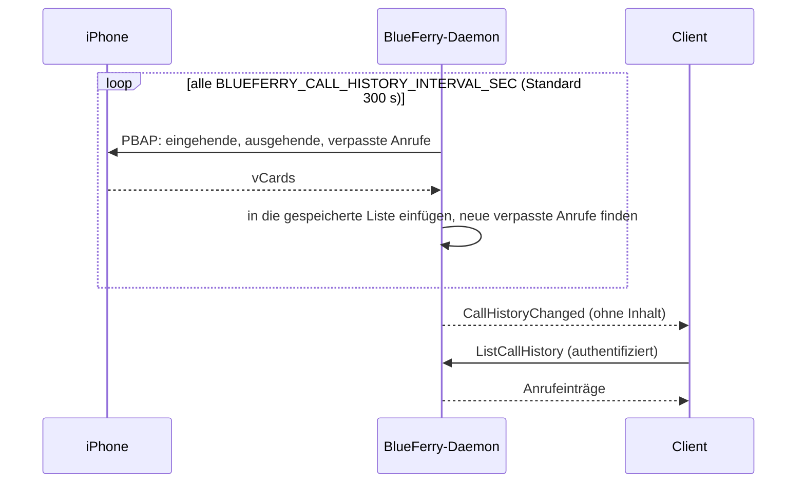

# Anrufliste (optional)

BlueFerry kann die Liste **Anrufe** des iPhones spiegeln (eingehende,
ausgehende und verpasste Anrufe) und bei neuen verpassten Anrufen eine
Desktop-Mitteilung zeigen. Das ist **standardmäßig aus**, weil dabei
gespeichert wird, wer dich wann angerufen hat.

Es nutzt die bestehende Kontaktverbindung (PBAP), daher reicht die
iPhone-Freigabe **Kontakte synchronisieren**. Für diese Funktion führt
BlueFerry keine Anrufe, nimmt keine an und hört nicht mit.

## Was es tut



- Hält eine lokale Kopie der Anruflisten des Telefons und aktualisiert sie
  regelmäßig.
- Meldet jeden neuen verpassten Anruf einmal per Desktop-Mitteilung. Mehr als
  drei auf einmal werden zusammengefasst; Anrufe, die älter als 12 Stunden
  sind, werden nie gemeldet.
- Zeigt die Liste mit `blueferry call-history` und unter **Recent Calls** im
  Menü des KDE-Clients.

## Einschalten

In `~/.config/blueferry/local.env` eintragen und das Backend neu starten:

```bash
BLUEFERRY_CALL_HISTORY_ENABLED=true
# Mitteilungen für neue verpasste Anrufe (Standard: an, wenn die Anrufliste an ist):
BLUEFERRY_MISSED_CALL_NOTIFICATIONS=true
# Wie oft das iPhone nach seinen Anruflisten gefragt wird, in Sekunden (60-86400):
BLUEFERRY_CALL_HISTORY_INTERVAL_SEC=300
```

Danach:

```bash
blueferry call-history             # letzte Anrufe
blueferry call-history --missed    # nur verpasste
blueferry call-history --sync      # vorher vom iPhone aktualisieren
```

Der erste Abgleich merkt sich nur die vorhandene Liste, damit du nicht mit
alten verpassten Anrufen überschüttet wirst.

## Grenzen

- Bluetooth meldet neue Anrufe hierfür nicht. Eine Mitteilung über einen
  verpassten Anruf kann bis zu einem Abfrageintervall nach dem Anruf kommen.
- Nachrichten haben Vorrang: Automatische Abgleiche pausieren, während sich
  die Nachrichtenverbindung neu aufbaut. `--sync` und **Refresh from iPhone**
  werden nie zurückgehalten.
- Es ist ein Spiegel des Telefons; auf dem iPhone gelöschte Anrufe
  verschwinden beim nächsten Abgleich.
- Liste und Mitteilungen brauchen gespeicherte lokale Daten. Bei gesperrter
  Brieftasche (Wallet) oder mit **Do not retain local data** funktionieren
  sie nicht.
- GTK, der Terminal-Client und Quickshell zeigen die Liste noch nicht.

## Datenschutz

- Die Liste nutzt denselben Speichermodus wie der Nachrichtenverlauf:
  standardmäßig mit dem Wallet-Schlüssel verschlüsselt. Anrufe, die älter als
  `BLUEFERRY_HISTORY_RETENTION_DAYS` sind, werden entfernt. **Clear history**
  und ein Wechsel des Speichermodus löschen sie sofort; nach dem Abschalten
  wird sie beim nächsten Start des Daemons gelöscht.
- Clients bekommen die Einträge nur über die authentifizierte,
  ratenbegrenzte Methode `ListCallHistory`. Das verteilte Signal enthält
  nichts. Der Qt-Client holt sie nur, solange **Recent Calls** offen ist.
- Mitteilungen folgen deinen Einstellungen für Nachrichtenmitteilungen:
  **No notifications** schaltet sie ab, **Only from contacts** überspringt
  unbekannte Anrufer, und `BLUEFERRY_SHOW_NOTIFICATION_CONTENT=false`
  verbirgt Anrufer und Uhrzeit.
- Logs enthalten Anzahlen und Zustände, nie Nummern oder Namen.
