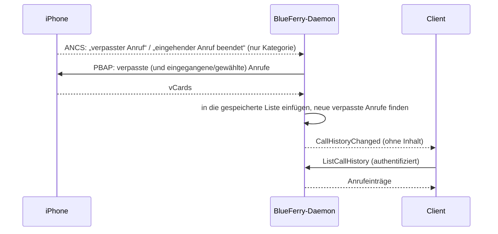

# Anrufliste (optional)

BlueFerry kann die Liste **Anrufe** des iPhones spiegeln (eingehende,
ausgehende und verpasste Anrufe) und bei neuen verpassten Anrufen eine
Desktop-Mitteilung zeigen. Das ist **standardmäßig aus**, weil dabei
gespeichert wird, wer dich wann angerufen hat.

Es nutzt die bestehende Kontaktverbindung (PBAP), daher reicht die
iPhone-Freigabe **Kontakte synchronisieren**. Für diese Funktion führt
BlueFerry keine Anrufe, nimmt keine an und hört nicht mit.

## Was es tut



- Hält eine lokale Kopie der Anruflisten des Telefons.
- Aktualisiert sie wenige Sekunden, nachdem das iPhone über seinen
  Mitteilungsdienst (ANCS) einen verpassten Anruf oder das Ende eines
  eingehenden Anrufs meldet. Dafür wird nur die Kategorie der Mitteilung
  genutzt, bei jeder Mitteilungseinstellung; Inhalte werden nicht abgefragt.
- Prüft zusätzlich alle `BLUEFERRY_CALL_HISTORY_INTERVAL_SEC` Sekunden
  (Standard 900) die Liste der verpassten Anrufe, zum Beispiel falls der
  Mitteilungszugriff aus ist.
- Meldet jeden neuen verpassten Anruf einmal per Desktop-Mitteilung. Mehr als
  drei auf einmal werden zusammengefasst; Anrufe, die älter als 12 Stunden
  sind, werden nie gemeldet. Mit **All iPhone notifications** wird die eigene
  Mitteilung des iPhones über den verpassten Anruf nicht wiederholt.
- Zeigt die Liste mit `blueferry call-history` und unter **Recent Calls** im
  Menü des KDE-Clients.

## Einschalten

Im KDE-, GTK- oder Quickshell-Client die iPhone-Einstellungen öffnen und unter **Call History**
**Keep the iPhone's recent calls** anhaken. **Notify me about missed calls**
steuert die Mitteilungen. Oder im Terminal:

```bash
blueferry call-history enable              # mit Mitteilungen
blueferry call-history enable --no-popups  # nur die Liste
blueferry call-history disable             # aus, und die Liste löschen
```

Die Änderung gilt sofort, ein Neustart ist nicht nötig.
`BLUEFERRY_CALL_HISTORY_ENABLED` und `BLUEFERRY_MISSED_CALL_NOTIFICATIONS` in
`~/.config/blueferry/local.env` setzen nur die Anfangswerte; eine in einem
Client oder mit der CLI gespeicherte Wahl hat Vorrang.
`BLUEFERRY_CALL_HISTORY_INTERVAL_SEC` (60-86400) setzt die Ersatzprüfung.

Danach:

```bash
blueferry call-history             # letzte Anrufe
blueferry call-history --missed    # nur verpasste
blueferry call-history --sync      # vorher vom iPhone aktualisieren
```

Der erste Abgleich merkt sich nur die vorhandene Liste, damit du nicht mit
alten verpassten Anrufen überschüttet wirst. Das gilt auch, nachdem du ein
anderes iPhone gekoppelt oder dieses entfernt und neu gekoppelt hast. Beim
Koppeln eines anderen iPhones wird außerdem die Liste des bisherigen gelöscht.

## Grenzen

- Ohne Mitteilungszugriff (ANCS) kann eine Mitteilung über einen verpassten
  Anruf bis zu einem Ersatzintervall nach dem Anruf kommen.
- Die Ersatzprüfung liest nur die verpassten Anrufe. Gewählte Anrufe
  erscheinen nach dem nächsten vollständigen Abgleich: nach einem eingehenden
  Anruf, mit `--sync` oder **Refresh from iPhone**.
- Nachrichten haben Vorrang: Automatische Abgleiche pausieren, während sich
  die Nachrichtenverbindung neu aufbaut, jede Anrufliste wird als eigene
  kurze Übertragung geholt, und ein fehlgeschlagener Abgleich wird später
  wiederholt, statt Bluetooth neu zu verbinden. `--sync` und **Refresh from
  iPhone** werden nie zurückgehalten.
- Es ist ein Spiegel des Telefons; auf dem iPhone gelöschte Anrufe
  verschwinden beim nächsten vollständigen Abgleich.
- Liste und Mitteilungen brauchen gespeicherte lokale Daten. Bei gesperrter
  Brieftasche (Wallet) oder mit **Do not retain local data** funktionieren
  sie nicht.
- GTK, der Terminal-Client und Quickshell zeigen die Liste noch nicht.

## Datenschutz

- Die Liste nutzt denselben Speichermodus wie der Nachrichtenverlauf:
  standardmäßig mit dem Wallet-Schlüssel verschlüsselt. Anrufe, die älter als
  `BLUEFERRY_HISTORY_RETENTION_DAYS` sind, werden entfernt. **Clear history**,
  ein Wechsel des Speichermodus und das Abschalten löschen sie sofort.
- Clients bekommen die Einträge nur über die authentifizierte,
  ratenbegrenzte Methode `ListCallHistory`. Das verteilte Signal enthält
  nichts. Der Qt-Client holt sie nur, solange **Recent Calls** offen ist.
- Mitteilungen folgen deinen Einstellungen für Nachrichtenmitteilungen:
  **No notifications** schaltet sie ab, **Only from contacts** überspringt
  unbekannte Anrufer, und `BLUEFERRY_SHOW_NOTIFICATION_CONTENT=false`
  verbirgt Anrufer und Uhrzeit. Sie sind als flüchtig markiert und bleiben
  nicht im Mitteilungsverlauf des Desktops.
- Logs enthalten Anzahlen und Zustände, nie Nummern oder Namen.
