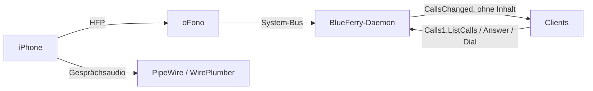

# Anrufe (optional)

BlueFerry kann eingehende iPhone-Anrufe anzeigen und über die
Freisprech-Unterstützung (HFP) von
[oFono](https://git.kernel.org/pub/scm/network/ofono/ofono.git) Anrufe
annehmen, ablehnen, starten und beenden. Die Funktion ist **standardmäßig
aus** und für Nachrichten nicht nötig. Ist sie aus, spricht BlueFerry gar
nicht mit oFono und verhält sich genau wie bisher.

Ein früherer HFP-Versuch wurde aus BlueFerry entfernt, weil oFono und das
eingebaute HFP-Backend von PipeWire um dasselbe Bluetooth-Profil
konkurrieren. Diese Integration überlässt dir diese Einrichtung, schlägt
oFono nur als optionales Paket vor und lässt den Daemon normal weiterlaufen,
wenn oFono fehlt.

## Was es tut



- Findet das oFono-Modem des iPhones, schaltet es ein, solange die
  Bluetooth-Classic-Verbindung steht, und bringt es online (iOS macht das
  nicht von selbst).
- Zeigt bei einem eingehenden Anruf eine Desktop-Mitteilung mit **Answer**
  und **Decline**. Sie schließt sich, sobald es nicht mehr klingelt.
- Der Qt-Client bekommt einen Dialog **Phone Calls**, der Terminal-Client
  ein Anruf-Panel (`c`) und die CLI die Befehlsgruppe `calls`:

  ```bash
  blueferry calls                 # Zustand und laufende Anrufe
  blueferry calls enable          # oder: disable
  blueferry calls dial '+41 79 123 45 67'   # fragt nach; --yes in Skripten
  blueferry calls answer
  blueferry calls dtmf 1234#      # Töne im aktiven Anruf
  blueferry calls hangup          # oder: hangup --all
  ```

- Stellt die Anruflautstärke von oFono auf 100 %, weil die
  Standardeinstellung von 50 % mit einem iPhone kaum hörbar ist.

Das Audio selbst leitet PipeWire. BlueFerry steuert nur den Anruf.

## Einschalten

1. oFono (entwickelt mit 2.18) als Systemdienst installieren und starten.
   BlueFerry startet es nie selbst.
2. Deinem Benutzer den Zugriff auf oFono erlauben. Die mitgelieferte Policy
   lässt nur root und `at_console`-Sitzungen zu. Lege
   `/etc/dbus-1/system.d/ofono-local.conf` an:

   ```xml
   <!DOCTYPE busconfig PUBLIC "-//freedesktop//DTD D-BUS Bus Configuration 1.0//EN"
    "http://www.freedesktop.org/standards/dbus/1.0/busconfig.dtd">
   <busconfig>
     <policy user="dein-login">
       <allow send_destination="org.ofono"/>
     </policy>
   </busconfig>
   ```

   Damit kann jeder Prozess dieses Benutzers oFono vollständig steuern, nicht
   nur BlueFerry.
3. WirePlumber soll HFP an oFono übergeben, etwa in
   `~/.config/wireplumber/wireplumber.conf.d/51-bluez-ofono.conf`:

   ```text
   monitor.bluez.properties = {
     bluez5.hfphsp-backend = "ofono"
   }
   ```

   Setze dort keine `bluez5.roles`; BlueFerrys Telefon-Audio-Fragment behält
   die Freisprech-Rollen, solange Anrufe an sind.
4. Ab BlueZ 5.87 das eigene HFP-Plugin von BlueZ abschalten, damit es oFono
   den Kanal nicht wegnimmt: `bluetoothd` mit `-P hfp` starten. Fehlt das
   und scheitert die Freisprech-Verbindung dreimal in Folge, zeigt BlueFerry
   den Zustand `bluez_conflict` und versucht es nur noch alle fünf Minuten
   oder nach einer neuen Verbindung des Telefons.
5. In den iPhone-Einstellungen des Qt-Clients **Enable phone calls through
   this computer** ankreuzen oder `blueferry calls enable` ausführen. Die
   Wahl wird gespeichert und gilt sofort. `BLUEFERRY_CALLS_ENABLED=true` in
   `~/.config/blueferry/local.env` funktioniert weiter als Anfangswert; eine
   gespeicherte Wahl hat Vorrang. Läuft WirePlumber nicht als
   systemd-Benutzerdienst, starte es danach selbst neu, damit es die
   Freisprech-Rollen übernimmt.

Solange Anrufe an sind und das iPhone verbunden ist, bleibt seine
Freisprech-Verbindung zu diesem Computer bestehen: Anrufe klingeln hier und
laufen, wenn du sie hier annimmst, auch hier über Lautsprecher und Mikrofon.
Schaltest du Anrufe aus (oder beendest das Backend), gibt BlueFerry diese
Verbindung wieder frei, und das Gesprächsaudio geht zurück aufs Telefon.

`blueferry calls` sollte dann `ready` zeigen, solange das iPhone verbunden
ist.

## Grenzen

- Experimentell. Getestet mit einem iPhone (iOS 27) auf einem
  Gentoo/OpenRC-Desktop: Das Modem kommt hoch, eingehende Anrufe klingeln,
  Anrufe lassen sich annehmen und beenden. Anklopfen, das Beenden eines
  gehaltenen Anrufs und DTMF sind ungetestet.
- Der Startwettlauf zwischen oFono und WirePlumber ist nicht gelöst. Bleibt
  der Zustand bei `searching`, starte oFono nach WirePlumber neu.
- `dial` nimmt nur einfache Nummern. `*` und `#` werden abgelehnt, weil sie
  Servicecodes bilden würden (etwa Rufumleitung), statt anzurufen. Für
  Tastentöne im Gespräch gibt es `dtmf`.
- Dual-SIM-Telefone zeigen über HFP nur die Standard-Sprachleitung.
- Notrufnummern (112, 911, 999, 000, 110, 117, 118, 119, 144 und weitere
  verbreitete) werden abgelehnt. Wähle sie am iPhone, dort hängt der Anruf
  nicht an der Bluetooth-Verbindung oder dem Audio dieses Computers.
- Jeder Client fragt vor dem Wählen nach. Mehrwertnummern unterscheiden sich
  je nach Land, deshalb versucht BlueFerry nicht, sie zu sperren.
- Wählen ist begrenzt (6 pro Minute, 60 pro Stunde), Annehmen ebenfalls
  (10 pro Minute). Auflegen wird nie blockiert.
- Die Bluetooth-Wiederherstellung schaltet den Adapter nicht aus und wieder
  ein, solange ein Anruf läuft.

## Datenschutz

- Nummern und Namen liefert nur die authentifizierte, ratenbegrenzte Methode
  `Calls1.ListCalls`. Das verteilte Signal `CallsChanged` enthält nichts.
- Anrufe landen nicht im Nachrichtenverlauf.
- Die Mitteilung verbirgt den Anrufer bei
  `BLUEFERRY_SHOW_NOTIFICATION_CONTENT=false`.
- Logs enthalten Anrufzustände und IDs, nie Nummern oder Namen.
