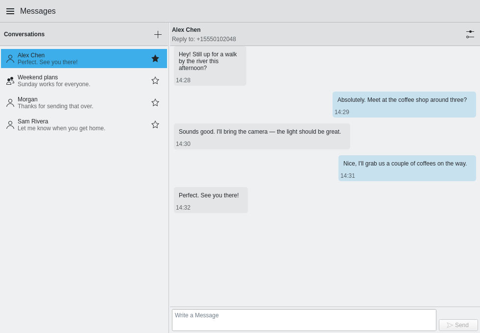
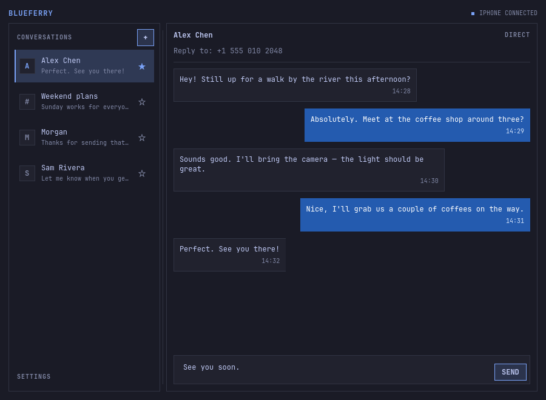
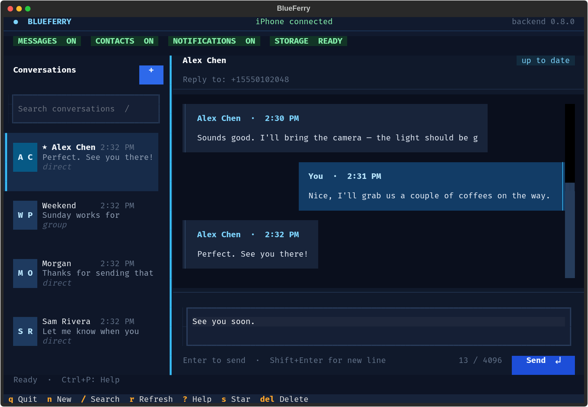

# Clients

Alle Clients sprechen mit demselben Hintergrunddienst. Du kannst also
zwischen ihnen wechseln oder mehrere gleichzeitig nutzen. Nachrichten,
Kontakte und Einstellungen sind überall dieselben.

Die Clients selbst sind derzeit auf Englisch.

## GTK (GNOME und ähnliche)

`blueferry-gtk` ist eine GTK4/libadwaita-App für GNOME, Cinnamon und ähnliche
Desktops.


## KDE Plasma (Kirigami)

`blueferry-qt` ist eine Kirigami-App für KDE Plasma. Unter Ubuntu 24.04,
Linux Mint 22.3 und Pop!_OS 24.04 gibt es sie nicht.



## Quickshell

`blueferry-quickshell` übernimmt die aktive Farbpalette und die
Monospace-Systemschrift von Omarchy, mit kompakten Bedienelementen und
dünnen Rahmen. Gesendete Nachrichten bleiben in jedem Theme blau. Außerhalb
von Omarchy nutzt der Client die Desktop-Palette. Pakete gibt es für
Arch-basierte Distributionen.



Unter Omarchy Quattro zeigt das Leisten-Widget
[omarchy-blueferry](https://github.com/erikwb/omarchy-blueferry) den
Verbindungsstatus und ungelesene Unterhaltungen, jeweils mit einem
Antwortfeld:

```bash
omarchy plugin add https://github.com/erikwb/omarchy-blueferry.git
```

Aktiviere es unter **Setup → Plugins** und füge es deiner Leiste hinzu.
Kopplung, Nachrichten und Einstellungen erledigt weiterhin der vollständige
Quickshell-Client.

## Terminal (TUI)

Der Terminal-Client ist auf jeder Distribution Teil von `blueferry-backend`.

```bash
blueferry-tui
# oder
blueferry tui
```

`?` zeigt die Tastenbelegung, `Strg+P` die Befehlspalette. Der Client hat eine
Suche in Unterhaltungen, ein mehrzeiliges Eingabefeld, Mausunterstützung,
Themes und ein Layout, das sich schmalen Terminals anpasst.



## Kommandozeile

Der Befehl `blueferry` hilft bei der Diagnose und in Skripten:

```bash
blueferry doctor                     # Voraussetzungen prüfen
blueferry sms-list                   # letzte Nachrichten (--source local für den Cache)
blueferry sms-send '+41791234567' 'bin unterwegs'
blueferry sms-send person@icloud.com 'Hallo von Linux'
blueferry sms-send Alice 'komme später'
blueferry contacts-sync              # Kontakte neu vom iPhone holen
blueferry storage-policy-set encrypted   # oder plaintext, none
blueferry storage-unlock             # Schlüsselbund zum Entsperren auffordern
blueferry history-clear              # lokalen Nachrichtenverlauf löschen
blueferry pairing-issue              # GitHub-Issue mit dem letzten Kopplungsbericht öffnen
blueferry version
```

Ist ein Kontaktname mehrdeutig, listet BlueFerry die Treffer zur Auswahl auf,
statt zu raten. `blueferry <befehl> --help` zeigt alle Optionen.

## Welcher Client sich bei einer Mitteilung öffnet

Ein Klick auf eine Nachrichtenmitteilung öffnet die Unterhaltung in einem
laufenden grafischen Client, bevorzugt in dem zuletzt benutzten. Läuft keiner,
öffnet BlueFerry den zuletzt benutzten Client. Ohne frühere Wahl bevorzugt es
GTK unter GNOME, Qt unter KDE und Quickshell unter Omarchy/Hyprland und
weicht auf einen installierten Client aus.
