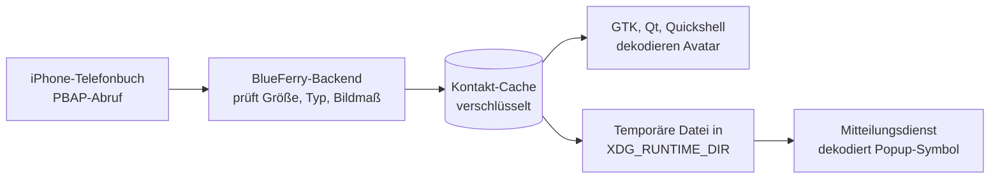

# Kontaktfotos

BlueFerry kann die Bilder aus den Kontakten deines iPhones als Avatare in der
Gesprächsliste und im Gesprächskopf der GTK-, Qt- (KDE) und Quickshell-Clients und als Symbol von
Desktop-Mitteilungen anzeigen. Die Funktion ist **standardmäßig aus**.

## So funktioniert es

Das iPhone schickt Kontaktfotos schon beim normalen Kontakt-Download mit. Ohne
diese Option verwirft BlueFerry sie, mit ihr behält BlueFerry sie. Eine zweite
Bluetooth-Übertragung gibt es nicht.



Das Backend dekodiert selbst nie ein Bild. Es prüft nur, ob ein Foto ein JPEG
oder PNG mit höchstens 1 MiB und 2048×2048 Pixeln ist. Dekodiert wird in
den Desktop-Clients und in deinem Mitteilungsdienst.

## Einschalten

1. Diese Zeile in `~/.config/blueferry/local.env` eintragen:

   ```bash
   BLUEFERRY_CONTACT_PHOTOS=true
   ```

2. Backend neu starten: `systemctl --user restart blueferry`.
3. Kontakte synchronisieren: `blueferry contacts-sync`, oder auf die nächste
   automatische Synchronisierung warten.

Gespräche mit bekannten Kontakten zeigen jetzt das Foto. Gruppen und
unbekannte Nummern behalten das übliche Symbol.

Ein einzelnes Foto in eine Datei speichern:

```bash
blueferry contacts-photo "Erika Muster" -o erika.jpg
```

Die Datei wird mit Modus 0600 angelegt und ohne `--force` nie überschrieben.

## Ausschalten

Die Zeile entfernen (oder auf `false` setzen) und das Backend neu starten. Bei
diesem Start löscht BlueFerry alle gespeicherten Fotos.

**Bevor du zu einer älteren BlueFerry-Version zurückgehst**, die Option
ausschalten und das Backend einmal starten, damit die Fotos sofort gelöscht
werden. Wenn du das vergisst, löscht die ältere Version sie zusammen mit den
Kontakten bei ihrer nächsten Kontakt-Synchronisierung oder wenn sich der
Speichermodus ändert.

## Grenzen

- Nur JPEG- und PNG-Fotos werden behalten. Fotos, die nur als Link angegeben
  sind, werden nie heruntergeladen.
- Ein Foto pro Kontakt, höchstens 1 MiB pro Foto und 32 MiB pro
  Synchronisierung. Ist das Budget einer Synchronisierung aufgebraucht,
  werden spätere Fotos übersprungen, und das Log nennt ihre Anzahl.
- Ein Foto erscheint nur, wenn die Adresse genau einem Kontakt gehört. Eine
  Nummer, die zwei Kontakte teilen, zeigt keines der beiden Fotos, und von
  einem Kontakt, dessen Nummern alle geteilt sind, wird das Foto gar nicht
  gespeichert.
- GTK, Qt und Quickshell zeigen Fotos für direkte Gespräche. Gruppen behalten
  ihre Gruppensymbole; ohne nutzbares Foto bleibt das bisherige Kontaktsymbol.
  Der Terminal-Client behält seine Symbole.
- Avatare werden asynchron geladen und nach einer Kontaktsynchronisierung
  aktualisiert. Nach dem Ausschalten und dem nächsten Statusbericht leeren
  die Clients ihre Foto-Caches. Fehler beim Laden unterbrechen keine Nachrichten.
- Popup-Symbole setzen voraus, dass der Mitteilungsdienst `image-path`
  beachtet. Bei Plasma ist das zu erwarten, aber noch nicht getestet. Ein
  Dienst, der es ignoriert, zeigt das übliche Symbol.

## Prüfen, was dein iPhone sendet

Nach jeder Synchronisierung schreibt das Backend eine Log-Zeile, die nur
Zahlen enthält, nie einen Namen, eine Nummer oder ein Bild:

```bash
journalctl --user -u blueferry | grep "with photos"
```

Sie zeigt, wie viele Fotos in welchen Größenbereich fielen und warum Fotos
nicht behalten wurden (`too-large`, `dimensions`, `format`, `not-inline`,
`shared`, `budget`, `time`). Wenn viele Fotos `too-large` oder `dimensions`
sind, melde die Zeile bitte; die Grenzen sind Schätzungen, die noch nicht mit
einem echten iPhone geprüft wurden.

## Datenschutz

- Bei ausgeschalteter Option wird nichts ausgelesen, gespeichert oder
  ausgeliefert.
- Gespeicherte Fotos haben dieselbe Verschlüsselung, denselben Speichermodus
  und denselben Austausch wie der Kontakt-Cache und werden bei jeder
  Synchronisierung ersetzt.
- Fotos stehen nie in Logs oder D-Bus-Signalen. Clients holen sie über eine
  Methode mit Ratenbegrenzung.
- Für Popups schreibt das Backend eine temporäre Kopie mit Zufallsnamen, die
  nur dir gehört, nach `$XDG_RUNTIME_DIR/blueferry`. Ändern sich die
  Kontakte, werden die Kopien für neue Popups nicht mehr verwendet, bleiben
  aber für bereits gezeigte Popups lesbar, bis neuere Kopien sie ersetzen
  (höchstens 64 Dateien). Alle Kopien werden gelöscht, wenn sich der
  Speichermodus ändert und wenn das Backend stoppt.
- Dein Mitteilungsdienst erhält das Foto, so wie er heute schon den Namen des
  Absenders erhält.
