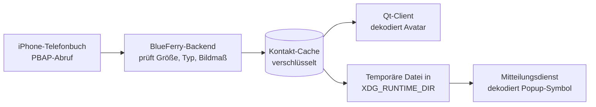

# Kontaktfotos

BlueFerry kann die Bilder aus den Kontakten deines iPhones als Avatare in der
Gesprächsliste des Qt-Clients (KDE) und als Symbol von Desktop-Mitteilungen
anzeigen. Die Funktion ist **standardmäßig aus**.

## So funktioniert es

Das iPhone schickt Kontaktfotos schon beim normalen Kontakt-Download mit. Ohne
diese Option verwirft BlueFerry sie, mit ihr behält BlueFerry sie. Eine zweite
Bluetooth-Übertragung gibt es nicht.



Das Backend dekodiert selbst nie ein Bild. Es prüft nur, ob ein Foto ein JPEG
oder PNG mit höchstens 256 KiB und 2048×2048 Pixeln ist. Dekodiert wird im
Qt-Client und in deinem Mitteilungsdienst.

## Einschalten

1. Diese Zeile in `~/.config/blueferry/local.env` eintragen:

   ```bash
   BLUEFERRY_CONTACT_PHOTOS=true
   ```

2. Backend neu starten: `systemctl --user restart blueferry`.
3. Kontakte synchronisieren: `blueferry contacts-sync`, oder auf die nächste
   automatische Synchronisierung warten.

Gespräche mit bekannten Kontakten zeigen jetzt das Foto. Gruppen und
unbekannte Nummern behalten das übliche Symbol.

Ein einzelnes Foto in eine Datei speichern:

```bash
blueferry contacts-photo "Erika Muster" -o erika.jpg
```

Die Datei wird mit Modus 0600 angelegt und ohne `--force` nie überschrieben.

## Ausschalten

Die Zeile entfernen (oder auf `false` setzen) und das Backend neu starten. Bei
diesem Start löscht BlueFerry alle gespeicherten Fotos.

**Bevor du zu einer älteren BlueFerry-Version zurückgehst**, die Option
ausschalten und das Backend einmal starten. Ältere Versionen kennen die
gespeicherten Fotos nicht und würden sie behalten.

## Grenzen

- Nur JPEG- und PNG-Fotos werden behalten. Fotos, die nur als Link angegeben
  sind, werden nie heruntergeladen.
- Ein Foto pro Kontakt, höchstens 256 KiB pro Foto und 16 MiB pro
  Synchronisierung.
- Ein Foto erscheint nur, wenn die Adresse genau einem Kontakt gehört. Eine
  Nummer, die zwei Kontakte teilen, zeigt keines der beiden Fotos.
- Bisher zeigt nur der Qt-Client Avatare. GTK-, Terminal- und
  Quickshell-Client behalten ihre Symbole.
- Popup-Symbole setzen voraus, dass der Mitteilungsdienst `image-path`
  beachtet. Bei Plasma ist das zu erwarten, aber noch nicht getestet. Ein
  Dienst, der es ignoriert, zeigt das übliche Symbol.

## Datenschutz

- Bei ausgeschalteter Option wird nichts ausgelesen, gespeichert oder
  ausgeliefert.
- Gespeicherte Fotos haben dieselbe Verschlüsselung, denselben Speichermodus
  und denselben Austausch wie der Kontakt-Cache und werden bei jeder
  Synchronisierung ersetzt.
- Fotos stehen nie in Logs oder D-Bus-Signalen. Clients holen sie über eine
  Methode mit Ratenbegrenzung.
- Für Popups schreibt das Backend eine temporäre Kopie mit Zufallsnamen, die
  nur dir gehört, nach `$XDG_RUNTIME_DIR/blueferry`. Diese Kopien werden
  gelöscht, wenn sich die Kontakte ändern und wenn das Backend stoppt.
- Dein Mitteilungsdienst erhält das Foto, so wie er heute schon den Namen des
  Absenders erhält.
