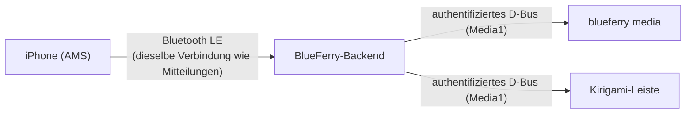

# iPhone-Mediensteuerung

BlueFerry kann anzeigen, was auf deinem iPhone läuft, und die Wiedergabe vom
Computer aus steuern: Wiedergabe, Pause, nächster und vorheriger Titel,
Lautstärke in Stufen, feste Sprünge sowie „Gefällt mir“/„Gefällt mir nicht“,
sofern die spielende App das anbietet. Dafür nutzt BlueFerry Apples Media
Service (AMS) auf derselben Bluetooth-LE-Verbindung, über die bereits die
iPhone-Systemmitteilungen laufen. Auf dem iPhone ist keine App nötig.

Die Funktion ist **standardmäßig aus**. Sie erzeugt zusätzlichen
Bluetooth-Verkehr und liegt außerhalb von BlueFerrys Schwerpunkt Nachrichten.

## Voraussetzungen

- Ein iPhone, das im normalen (vollen) Kopplungsmodus gekoppelt ist. Die
  Kompatibilitätskopplung für iOS 18 und älter verbindet nie Bluetooth LE,
  dort ist die Mediensteuerung nicht verfügbar.
- Ein BlueZ, das die LE-Verbindung des iPhones meldet (`Bearer.LE1`: BlueZ
  5.86 oder neuer mit der Bearer-API, wie heute auch für Mitteilungen). Ohne
  sie meldet `blueferry media`, dass der Zustand der LE-Verbindung unbekannt
  ist.
- Die Kommandozeile funktioniert überall. Der KDE/Kirigami-Client zeigt eine
  „Wird gespielt“-Leiste. GTK-, Terminal- und Quickshell-Client haben noch
  keine Medienansicht.

## Einschalten

Im Kirigami-Client die iPhone-Einstellungen öffnen und **Media Control**
ankreuzen. Im Terminal:

```bash
blueferry media enable    # blueferry media disable schaltet sie wieder aus
```

Das wirkt sofort, ohne das Backend neu zu starten. Nach ein paar Sekunden auf
dem iPhone Musik starten und ausführen:

```bash
blueferry media
```

`BLUEFERRY_MEDIA_CONTROL_ENABLED=true` in `~/.config/blueferry/local.env`
legt den Anfangswert fest; eine über einen Client oder die CLI gespeicherte
Wahl hat Vorrang.

## Benutzung

```bash
blueferry media                # was gerade läuft (wie "status")
blueferry media toggle         # Wiedergabe/Pause
blueferry media next           # auch: play, pause, previous
blueferry media volume-up      # auch: volume-down (eine iPhone-Stufe)
blueferry media skip-forward   # auch: skip-backward (fester Sprung der App)
blueferry media like           # auch: dislike, bookmark, repeat, shuffle
blueferry media --json         # Rohstatus für Skripte
```

BlueFerry sendet nur Befehle, die das iPhone gerade anbietet. Welche das sind,
hängt von der spielenden App ab; `blueferry media` listet sie auf. Ein Befehl,
den die App nicht anbietet, wird lokal abgelehnt und nicht gesendet.

Im Kirigami-Client erscheint über den Unterhaltungen eine kleine Leiste mit
Titel, Interpret und den Tasten Zurück/Wiedergabe-Pause/Weiter, solange etwas
läuft. Ist die Option aus, wird sie gar nicht angezeigt.



## Medientasten, Plasma und playerctl (MPRIS, optional)

Eine zweite, getrennte Option veröffentlicht das iPhone als MPRIS-Mediaplayer.
Plasmas Medienwiedergabe, die Medientasten der Tastatur und `playerctl`
zeigen und steuern die iPhone-Wiedergabe dann wie jeden Desktop-Player. In
den iPhone-Einstellungen des Kirigami-Clients unter **Media Control** das
Kästchen **Also show it in the desktop media controls (MPRIS)** ankreuzen,
oder:

```bash
blueferry media enable-mpris    # blueferry media disable-mpris schaltet es aus
```

Das wirkt sofort und nur, solange die Mediensteuerung selbst an ist.
`BLUEFERRY_MEDIA_MPRIS_ENABLED=true` in `local.env` legt den Anfangswert fest.

```bash
playerctl -p blueferry_iphone status
playerctl -p blueferry_iphone next
```

Der Player heißt „iPhone (BlueFerry)“ und erscheint nur, solange das iPhone
einen aktiven Player meldet; ein gestoppter Eintrag bleibt also nicht stehen.
Da AMS weder Stopp noch Spulen kennt, pausiert `Stop`, und Spulen bewirkt
nichts; dafür gibt es `blueferry media skip-forward`. Eine Lautstärkeänderung
bewegt die iPhone-Lautstärke um eine Stufe; bis das iPhone seine Lautstärke
gemeldet hat, zeigt der Player keinen Lautstärkeregler. Der Fortschritt folgt
der Wiedergabegeschwindigkeit des iPhones (etwa ein Podcast mit 1,5×).

Der Player nutzt eine eigene D-Bus-Verbindung. Eine App, die nur mit
Mediaplayern sprechen darf (etwa eine Flatpak-App), erreicht darüber also
nicht BlueFerrys Nachrichten-Schnittstelle.

**Vor dem Einschalten von MPRIS bitte den Abschnitt Datenschutz lesen.**

## Grenzen

- AMS kennt keine absolute Lautstärke, kein Spulen und kein Stopp. Die
  Lautstärke ändert sich stufenweise, die Sprungtasten springen um das feste
  Intervall der spielenden App.
- Wiederholen und Zufallswiedergabe schalten zum nächsten Modus der App
  weiter; ein direktes „Zufall an“ gibt es nicht.
- Kommt das iPhone nach dem Verlassen der Reichweite zurück, ist die
  Mediensteuerung von selbst wieder da. Sie braucht die LE-Verbindung und
  pausiert deshalb auch, solange die Mitteilungen getrennt sind.
- BlueFerry nutzt bewusst kein AVRCP. Als AVRCP-Fernbedienung könnte der
  Computer das iPhone dazu bringen, seinen Ton an den Computer zu schicken,
  was BlueFerry verhindert.
- Auf echter Hardware geprüft ist bisher die „Wird gespielt“-Anzeige.
  Befehle, das Vervollständigen langer Titel und Wiederverbindungen sind nur
  mit simuliertem Bluetooth getestet. Rückmeldungen sind willkommen.

## Datenschutz

- Titel, Interpret, Album und Name der App bleiben in BlueFerry. Clients
  holen sie über BlueFerrys authentifizierte D-Bus-Schnittstelle mit
  Ratenbegrenzung. Das Signal, das Clients zum Aktualisieren auffordert,
  enthält keine Inhalte.
- **Mit der MPRIS-Option ändert sich das bewusst.** MPRIS ist innerhalb deiner
  Anmeldesitzung öffentlich: Jedes Programm, das du startest, kann Titel,
  Interpret und Album lesen und wird über Änderungen informiert, genau wie bei
  Spotify, VLC oder jedem anderen Desktop-Player. Deshalb ist MPRIS eine
  eigene Option. Steuerbefehle laufen weiterhin über BlueFerrys
  Benutzerprüfung und Ratenbegrenzung.
- Protokolle enthalten Befehlsnamen und Längen, nie Titel, Interpreten oder
  App-Namen.
- Zu deiner Musik wird nichts auf der Festplatte gespeichert.
