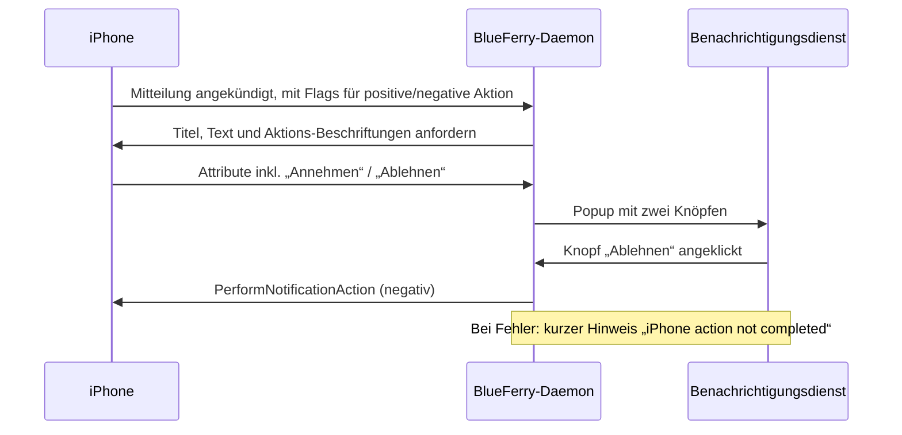

# Aktionen von iPhone-Mitteilungen

iOS hängt an manche Mitteilungen Aktionen an: **Annehmen**/**Ablehnen** bei
einem eingehenden Anruf oder einer Kalendereinladung, oder **Löschen**. Mit
dieser optionalen Funktion zeigt BlueFerry sie als Knöpfe am Desktop-Popup
an. Ein Klick auf einen Knopf bittet das iPhone über ANCS, die Aktion
auszuführen.

Die Knöpfe tragen den Text des iPhones, in der Sprache des Telefons.



## Einschalten

1. Im Client **All iPhone Notifications** auswählen.
2. Mitteilungsinhalte angezeigt lassen
   (`BLUEFERRY_SHOW_NOTIFICATION_CONTENT` ist standardmäßig `true`).
3. In den iPhone-Einstellungen des Qt-, GTK- oder Quickshell-Clients unter
   *Desktop Notifications* **Show iPhone action buttons** einschalten, oder:

   ```bash
   blueferry notification-actions enable
   ```

   Die Änderung gilt sofort; beim Ausschalten schließen sich Popups, die noch
   Knöpfe zeigen. Zum Einschalten braucht es die beiden Einstellungen
   oben; ausschalten lässt sich die Funktion immer, bei jeder
   Mitteilungseinstellung. `BLUEFERRY_ANCS_ACTIONS=true` in `local.env` setzt nur den
   Anfangswert; eine in einem Client gespeicherte Wahl hat Vorrang.

Optional in `~/.config/blueferry/local.env` (danach den Dienst neu starten):

```bash
# Wie lange Popups mit Knöpfen bleiben, 1000-120000 ms (Standard 30000)
BLUEFERRY_ANCS_ACTION_TIMEOUT_MS=30000
```

`blueferry notification-actions` und `blueferry doctor` zeigen, ob Aktionen
an sind und warum sie gegebenenfalls nicht greifen. `GetStatus` enthält
`ancs_actions`, `ancs_actions_preference` und `notification_content_shown`.

## Was die Funktion tut und was nicht

- An das iPhone geht nur etwas, wenn du auf einen beschrifteten Knopf
  klickst. Popup schließen, ablaufen lassen, auf den Text klicken oder die
  Mitteilung am Telefon erledigen löst nie eine Aktion aus. Popups mit
  Knöpfen tragen eine ausdrückliche „nichts tun“-Standardaktion, weil manche
  Benachrichtigungsdienste sonst bei einem Klick auf den Text den einzigen
  Knopf auslösen.
- Knöpfe erscheinen nur, wenn dein Benachrichtigungsdienst sie zeichnen kann
  (er meldet die Fähigkeit `actions`). Sonst kommt das normale Popup.
- Jede Mitteilung nimmt eine erfolgreiche Aktion an. Ging ein Klick nicht
  durch, kannst du es erneut versuchen.
- *Annehmen* bei einem Anruf nimmt ihn **auf dem iPhone** an. Das ist
  unabhängig von der Freisprech-Funktion: Der Ton bleibt dort, wohin iOS ihn
  leitet.
- Popups mit Knöpfen bleiben `BLUEFERRY_ANCS_ACTION_TIMEOUT_MS` lang
  (standardmäßig 30 s) statt der normalen Popup-Dauer, damit Zeit bleibt,
  einen klingelnden Anruf anzunehmen. Manche Benachrichtigungsdienste
  ignorieren die gewünschte Dauer.
- Wird die Mitteilung am iPhone erledigt oder entfernt, schließt sich ihr
  Popup.
- iOS verwendet Mitteilungsnummern wieder. Ein Knopf gehört genau zu der
  Mitteilung, die ihn angeboten hat: Schickt das iPhone etwas Neues zu dieser
  Nummer, spielt es seine vorhandenen Mitteilungen erneut ein oder baut sich
  die Bluetooth-Verbindung neu auf, verfallen die alten Knöpfe und ihre
  Popups schließen sich.
- Lässt sich die Aktion nicht ausführen (am Telefon schon erledigt, Telefon
  getrennt, Aktion abgelehnt), erscheint ein kurzer Hinweis „iPhone action
  not completed“. Er enthält keinen Mitteilungsinhalt. War das Telefon nur
  beschäftigt oder schlug das Senden fehl, hat der Hinweis einen Knopf
  **Retry**.
- Popups von Nachrichten kommen über MAP und verhalten sich wie bisher (Klick
  öffnet die Unterhaltung, Schließen markiert als gelesen).

## Grenzen

- Standardmäßig aus. Solange die Funktion aus ist, bleiben Popups und die
  beim iPhone angefragten Daten unverändert.
- Keine Knöpfe, solange `BLUEFERRY_SHOW_NOTIFICATION_CONTENT=false` gilt. Eine
  allgemeine Beschriftung wie „Positiv“/„Negativ“ könnte eine zerstörerische
  Aktion falsch beschriften, deshalb gibt es keinen Ersatz.
- Knöpfe bekommen nur Mitteilungen von Apps, die die Einstellung **All iPhone
  Notifications** und die Allow-/Blocklisten passieren.
- Ein Klick geht der Reihe nach mit den anderen Anfragen ans iPhone, weil
  Bluetooth LE nur eine offene Anfrage erlaubt. Das iPhone antwortet meist
  innerhalb von Millisekunden; lässt es eine frühere Anfrage unbeantwortet,
  kann ein Klick bis zu 15 s warten, bevor er gesendet wird.
- Clients schalten die Funktion nur ein oder aus; ausgelöst wird eine Aktion
  ausschließlich im Popup. Der Terminal-Client (TUI) hat keine
  Einstellungen; dort die CLI nehmen.
- Ob jede iOS-Version für jede Art von Mitteilung Beschriftungen schickt,
  entscheiden iOS und die jeweilige App.

## Datenschutz

- Die Beschriftungen der Knöpfe wählt die App, die die Mitteilung geschickt
  hat. Oft sind sie allgemein („Annehmen“, „Löschen“), sie können aber auch
  Inhalt tragen, etwa „CHF 50 an Bob zahlen“. Sie werden deshalb wie
  Mitteilungsinhalt behandelt: nur angefordert, solange Inhalte angezeigt
  werden, nie protokolliert, nie gespeichert und nie auf D-Bus gelegt. Sie
  erscheinen nur im kurzlebigen Popup.
- Logs enthalten nur die Mitteilungsnummer, die Art der Aktion
  (positiv/negativ), das Ergebnis und Fehlercodes.
