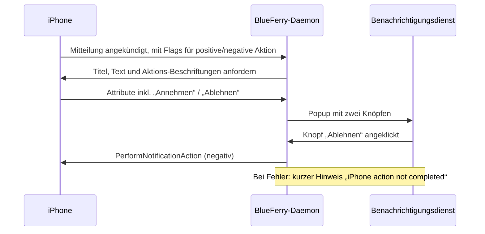

# Aktionen von iPhone-Mitteilungen

iOS hängt an manche Mitteilungen Aktionen an: **Annehmen**/**Ablehnen** bei
einem eingehenden Anruf oder einer Kalendereinladung, oder **Löschen**. Mit
dieser optionalen Funktion zeigt BlueFerry sie als Knöpfe am Desktop-Popup
an. Ein Klick auf einen Knopf bittet das iPhone über ANCS, die Aktion
auszuführen.

Die Knöpfe tragen den Text des iPhones, in der Sprache des Telefons.



## Einschalten

1. Im Client **All iPhone Notifications** auswählen.
2. Mitteilungsinhalte angezeigt lassen
   (`BLUEFERRY_SHOW_NOTIFICATION_CONTENT` ist standardmäßig `true`).
3. In `~/.config/blueferry/local.env` eintragen:

   ```bash
   BLUEFERRY_ANCS_ACTIONS=true
   # Optional: wie lange Popups mit Knöpfen bleiben, 1000-120000 ms (Standard 30000)
   BLUEFERRY_ANCS_ACTION_TIMEOUT_MS=30000
   ```

4. Den BlueFerry-User-Dienst neu starten.

`blueferry doctor` zeigt, ob Aktionen aktiv sind, und wenn nicht, warum.
`GetStatus` enthält `ancs_actions`.

## Was die Funktion tut und was nicht

- An das iPhone geht nur etwas, wenn du auf einen beschrifteten Knopf
  klickst. Popup schließen, ablaufen lassen, auf den Text klicken oder die
  Mitteilung am Telefon erledigen löst nie eine Aktion aus.
- Jedes Popup führt höchstens eine Aktion aus.
- *Annehmen* bei einem Anruf nimmt ihn **auf dem iPhone** an. Das ist
  unabhängig von der Freisprech-Funktion: Der Ton bleibt dort, wohin iOS ihn
  leitet.
- Popups mit Knöpfen bleiben `BLUEFERRY_ANCS_ACTION_TIMEOUT_MS` lang
  (standardmäßig 30 s) statt der normalen Popup-Dauer, damit Zeit bleibt,
  einen klingelnden Anruf anzunehmen. Manche Benachrichtigungsdienste
  ignorieren die gewünschte Dauer.
- Wird die Mitteilung am iPhone erledigt oder entfernt, schließt sich ihr
  Popup.
- Baut sich die Bluetooth-Verbindung zum iPhone neu auf, werden Popups mit
  Knöpfen aus der vorherigen Verbindung geschlossen, weil iOS deren
  Mitteilungsnummern wiederverwenden kann.
- Lässt sich die Aktion nicht ausführen (am Telefon schon erledigt, Telefon
  getrennt, Aktion abgelehnt), erscheint ein kurzer Hinweis „iPhone action
  not completed“. Er enthält keinen Mitteilungsinhalt.
- Popups von Nachrichten kommen über MAP und verhalten sich wie bisher (Klick
  öffnet die Unterhaltung, Schließen markiert als gelesen).

## Grenzen

- Standardmäßig aus. Ohne `BLUEFERRY_ANCS_ACTIONS=true` bleiben Popups und
  die beim iPhone angefragten Daten unverändert.
- Keine Knöpfe, solange `BLUEFERRY_SHOW_NOTIFICATION_CONTENT=false` gilt. Eine
  allgemeine Beschriftung wie „Positiv“/„Negativ“ könnte eine zerstörerische
  Aktion falsch beschriften, deshalb gibt es keinen Ersatz.
- Knöpfe bekommen nur Mitteilungen von Apps, die die Einstellung **All iPhone
  Notifications** und die Allow-/Blocklisten passieren.
- Es gibt keine D-Bus-Methode und keine Client-Oberfläche für Aktionen; das
  Popup ist die einzige Stelle. Die Einstellung liegt in `local.env`.
- Ob jede iOS-Version für jede Art von Mitteilung Beschriftungen schickt,
  entscheiden iOS und die jeweilige App.

## Datenschutz

- Die Beschriftungen der Knöpfe wählt die App, die die Mitteilung geschickt
  hat. Oft sind sie allgemein („Annehmen“, „Löschen“), sie können aber auch
  Inhalt tragen, etwa „CHF 50 an Bob zahlen“. Sie werden deshalb wie
  Mitteilungsinhalt behandelt: nur angefordert, solange Inhalte angezeigt
  werden, nie protokolliert, nie gespeichert und nie auf D-Bus gelegt. Sie
  erscheinen nur im kurzlebigen Popup.
- Logs enthalten nur die Mitteilungsnummer, die Art der Aktion
  (positiv/negativ), das Ergebnis und Fehlercodes.
