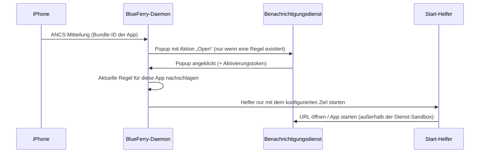

# Klickregeln für Mitteilungen

Ein Klick auf ein Nachrichten-Popup öffnet die Unterhaltung in BlueFerry.
Popups anderer iPhone-Apps (sichtbar mit **All iPhone Notifications**) tun
beim Klicken nichts, es sei denn, du legst für diese App eine **Klickregel**
an.

Eine Klickregel ordnet eine iPhone-App, erkannt an ihrer exakten Bundle-ID,
genau einem festen Ziel zu:

- einer `http`/`https`-Adresse, die im Standardbrowser geöffnet wird, oder
- einer Desktop-Entry-ID (zum Beispiel `org.mozilla.Thunderbird.desktop`),
  die wie jede installierte App gestartet wird.

| iPhone-App (Bundle-ID) | Beispielziel |
| --- | --- |
| `com.apple.mobilemail` | `org.mozilla.Thunderbird.desktop` |
| `net.whatsapp.WhatsApp` | `https://web.whatsapp.com` |
| `com.tinyspeck.chatlyio` | `com.slack.Slack.desktop` |
| `com.google.calendar` | `https://calendar.google.com/` |

## Was bei einem Klick passiert



Die Regel wird erst beim Klick nachgeschlagen. Wer eine Regel entfernt,
deaktiviert damit auch Popups, die schon sichtbar sind. Ein Popup öffnet sein
Ziel genau einmal. Klicks auf Popups mit demselben Ziel innerhalb einer
Sekunde öffnen es nur einmal; das andere Popup bleibt anklickbar.

Manche Benachrichtigungs-Shells, etwa die von Omarchy, führen einen im Popup
hinterlegten Befehl aus, statt den Klick zu melden. BlueFerry gibt solchen
Popups einen Befehl mit, der nur eine zufällige ID für dieses Popup enthält.
Der Befehl reicht die ID an den Daemon zurück, der dann genau dieselben
Schritte wie oben ausführt. Diese Shells schließen das Popup, sobald sie den
Befehl ausführen. Deshalb bleibt die ID noch zehn Sekunden gültig, nachdem
ein Popup weggeklickt wurde. Danach, nach einem von selbst abgelaufenen Popup
oder nach einem Neustart des Dienstes ist die ID unbekannt und öffnet nichts.

## Einschalten

Klickregeln wirken nur mit **All iPhone Notifications**. Einen weiteren
Schalter gibt es nicht: Ohne Regeln (Standard) verhalten sich Popups genau
wie bisher.

### Kommandozeile

```bash
blueferry notifications open-map set com.apple.mobilemail org.mozilla.Thunderbird.desktop
blueferry notifications open-map set net.whatsapp.WhatsApp https://web.whatsapp.com
blueferry notifications open-map list
blueferry notifications open-map remove net.whatsapp.WhatsApp
```

`blueferry notifications open-map` ohne Unterbefehl listet die Regeln auf.

### Qt-Client

Unter **Desktop Notifications** erscheint ein Editor für Klickregeln,
solange **All iPhone Notifications** ausgewählt ist. Dort lassen sich Regeln
hinzufügen, ändern und entfernen. Änderungen per CLI erscheinen im Editor und
umgekehrt.

Regeln wirken sofort, ein Neustart des Dienstes ist nicht nötig.

### IDs finden

- **Bundle-ID:** Das Log beobachten, während die App eine Mitteilung schickt.
  BlueFerry protokolliert jede App einmal, ohne Inhalt:

  ```bash
  journalctl --user -u blueferry -f | grep "ANCS app observed"
  ```

- **Desktop-Entry-ID:** der Dateiname der `.desktop`-Datei der App:

  ```bash
  ls /usr/share/applications ~/.local/share/applications \
     /var/lib/flatpak/exports/share/applications
  ```

## Grenzen

- Bundle-IDs werden exakt und mit Groß-/Kleinschreibung verglichen. Apple
  Nachrichten (`com.apple.MobileSMS`) lässt sich nicht zuordnen und öffnet
  weiterhin die Unterhaltung.
- URLs müssen schlichte `http`/`https`-Adressen sein, ohne Zugangsdaten,
  Leerzeichen, Anführungszeichen oder andere Zeichen, die maskiert werden
  müssten, und höchstens 2048 Zeichen lang. `javascript:`, `file:`, `data:`
  und eigene App-Schemata wie `slack://` werden abgelehnt.
- Desktop-Entries müssen reine IDs mit der Endung `.desktop` sein: keine
  Pfade, Argumente oder Befehle. Die CLI warnt, wenn der Eintrag nicht
  installiert ist; ein fehlender Eintrag bewirkt beim Klick nichts.
- Höchstens 64 Regeln.
- GTK, Quickshell und der Terminal-Client haben keinen Editor; dort hilft die
  CLI.
- Mit systemd startet das Ziel in einer eigenen, kurzlebigen User-Unit
  (`app-blueferry-open-*.service`), weil die Sandbox des BlueFerry-Dienstes
  einen Browser behindern würde. Ohne systemd (zum Beispiel OpenRC) wird es
  direkt gestartet.

## Datenschutz

- Nichts aus der Mitteilung (Titel, Text, Absender) landet im Ziel oder wird
  an die App übergeben. Nur die Bundle-ID der App dient dazu, die Regel zu
  finden. Es ist keine Shell beteiligt.
- Die Regeln liegen zusammen mit den anderen Popup-Einstellungen in
  `~/.config/blueferry/settings.json`. Die Datei ist nur für dich lesbar,
  aber **nicht verschlüsselt**. Geheime Tokens (etwa eine private
  Kalender-URL) gehören also besser nicht in eine Regel.
- Logs enthalten nie Bundle-IDs, URLs oder Desktop-IDs.
- Über D-Bus sind die Regeln nur über eine authentifizierte Methode mit
  Ratenbegrenzung lesbar. Kein Signal überträgt sie, und auch die Popups
  nicht: Der Benachrichtigungsserver sieht nur die feste Aktion „Öffnen“ und,
  bei Shells, die einen Befehl ausführen, eine zufällige ID pro Popup.
- Während ein Ziel geöffnet wird, sind dessen URL oder Desktop-ID kurz in der
  Prozessliste und in der kurzlebigen Unit sichtbar. Daran lässt sich
  erkennen, dass eine Mitteilung dieser App angeklickt wurde.
