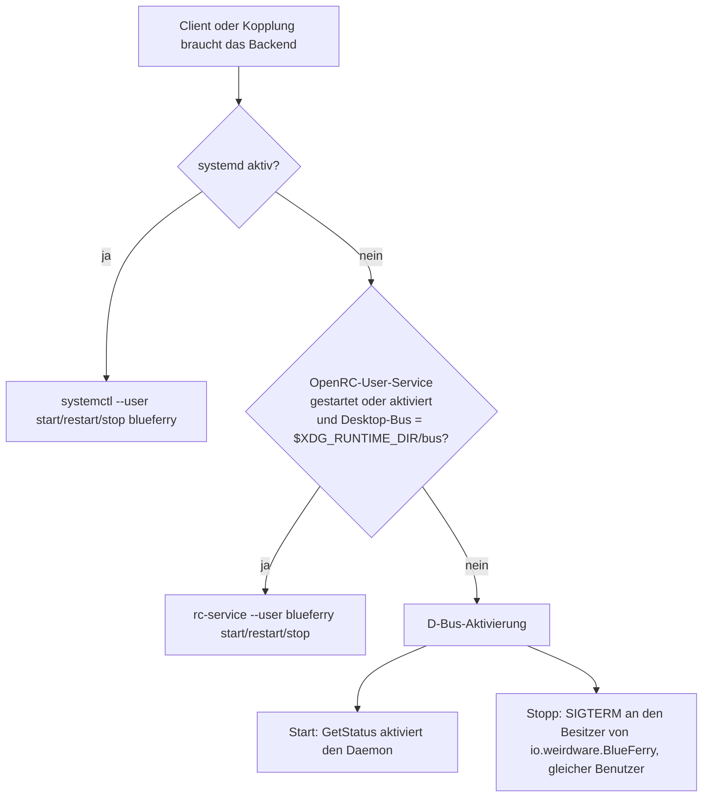

# Betrieb ohne systemd (OpenRC)

BlueFerrys Pakete sind auf systemd ausgerichtet, das Backend läuft aber auch
unter OpenRC und auf anderen Systemen ohne systemd. Einschalten musst du
nichts: BlueFerry erkennt, dass kein systemd läuft, und startet und stoppt
sein Backend über den Session-Bus. Auf systemd-Systemen ändert sich nichts.

OpenRC ist nicht Teil der CI-Paketmatrix und hat kein Paketrezept. Die
Paketierungsdetails stehen in
[packaging/openrc/README.md](https://github.com/erikwb/blueferry/blob/main/packaging/openrc/README.md).

## Was es tut



- **Start**: Ein Client fragt den Daemon nach seinem Status, und der
  Session-Bus startet `blueferry run` aus der installierten
  Aktivierungsdatei.
- **Stopp und Neustart** (nach dem Koppeln, dem Entfernen eines Telefons oder
  einem Update): BlueFerry fragt den Bus-Daemon, welcher Prozess
  `io.weirdware.BlueFerry` besitzt, prüft, dass er unter deinem Benutzer
  läuft, und schickt ihm `SIGTERM`. Ein Neustart aktiviert danach einen
  neuen Daemon. BlueFerry wartet nur so lange, wie die Anfrage erlaubt (30
  bis 45 Sekunden). Ein Daemon, der dann noch eine Bluetooth-Übertragung
  abschliesst, beendet sich danach von selbst, und die Anfrage meldet, dass
  er noch herunterfährt; versuche es kurz darauf erneut. Dafür braucht es
  weder Root noch das Durchsuchen der Prozessliste.
- **Reparaturhinweise** nennen unter OpenRC `sudo rc-service bluetooth
  restart` und bei unbekanntem Init-System allgemein „den Bluetooth-Dienst
  neu starten“.

## Einrichtung

1. Installiere BlueFerry so, dass `io.weirdware.BlueFerry.service` in
   `/usr/share/dbus-1/services/` liegt. Ein Init-Skript ist nicht nötig.
2. Für iPhone-Systemmitteilungen (ANCS) muss `bluetoothd` mit `-E` laufen.
   Als Administrator in `/etc/conf.d/bluetooth`:
   - Gentoo: `BLUETOOTH_OPTS="-E"`
   - Alpine: `command_args="-E"`

   Danach `sudo rc-service bluetooth restart`. Das trennt kurz alle
   Bluetooth-Geräte. Bis dahin koppelt BlueFerry für Nachrichten und Kontakte
   und zeigt diese Schritte statt eines Aktivieren-Knopfs.
3. Erlaube BlueFerry, die Geräteklasse des Adapters zu setzen. Zum Koppeln
   muss sie auf A/V Hands-Free stehen, und der Daemon repariert sie, wenn sie
   sich ändert, etwa nach einem Bluetooth-Neustart. Ohne systemd ruft
   BlueFerry das argumentgeprüfte Hilfsskript als
   `sudo -n -- /usr/lib/blueferry/blueferry-set-cod N` auf (`N` ist der
   Adapterindex; `-n` fragt nie nach einem Passwort). Ein Administrator
   erlaubt das einmalig mit `visudo -f /etc/sudoers.d/blueferry` (Gruppe
   anpassen; braucht sudo 1.9.10 oder neuer):

   ```
   %wheel ALL=(root) NOPASSWD: /usr/lib/blueferry/blueferry-set-cod ^[0-9]+$
   ```

   Fehlt die Regel, erklärt die Einrichtung, wie du sie anlegst oder das
   Skript einmal von Hand startest, etwa
   `sudo /usr/lib/blueferry/blueferry-set-cod 0` für `hci0`.

4. Koppeln wie gewohnt mit `blueferry-qt`, `blueferry-gtk`,
   `blueferry-quickshell` oder `blueferry pair`.

### Optional: OpenRC-User-Service

Den User-Service aus `packaging/openrc/blueferry` (OpenRC 0.62 oder neuer mit
`pam_openrc`-Sitzung) nur verwenden, wenn der Session-Bus deines Desktops
`$XDG_RUNTIME_DIR/bus` ist. Prüfe das im Desktop:

```sh
echo "$DBUS_SESSION_BUS_ADDRESS"
```

Steht dort `unix:path=/tmp/dbus-…`, wie bei Plasma, das greetd oder SDDM über
`dbus-run-session` startet, richte **keinen** User-Service ein. Er würde einen
zweiten Daemon auf einem zweiten Bus starten, der mit dem ersten um Bluetooth
konkurriert. Dort ist D-Bus-Aktivierung allein richtig. Ist der Service auf
so einem Desktop trotzdem aktiviert, schreibt BlueFerry eine Warnung ins Log
und ignoriert ihn.

Mit passendem Bus:

```sh
rc-update --user add blueferry default
rc-service --user blueferry start
```

Der Daemon schreibt sein Log dann nach `~/.local/state/blueferry/daemon.log`.

## Grenzen

- **Weniger Sandboxing.** Die systemd-Unit schränkt den Daemon ein
  (`ProtectSystem=strict`, `PrivateDevices=`, `RestrictAddressFamilies=` und
  mehr). D-Bus-Aktivierung und OpenRC haben dafür kein Gegenstück, der Daemon
  läuft also mit deinen normalen Benutzerrechten. Der User-Service behält
  `umask 077` und `no_new_privs`.
- D-Bus-Aktivierung startet den Daemon auch, bevor ein Telefon gekoppelt ist.
- `blueferry pair` wartet höchstens 30 Sekunden, bis der alte Daemon beendet
  ist. Ein hängender Daemon wird nicht abgeschossen; beende ihn selbst oder
  melde dich ab und wieder an.
- Ein mit systemd gestartetes System, dessen `systemctl` nicht unter
  `/usr/bin/systemctl` liegt (zum Beispiel NixOS), wird wie ein System ohne
  systemd behandelt: BlueFerry nutzt D-Bus-Aktivierung und Signale, statt am
  fehlenden Befehl zu scheitern.
- Den Experimental-Modus erkennt BlueFerry über `/proc`. Eine gebündelte
  Option wie `-nE` wird nicht erkannt, und bei `/proc` mit `hidepid=1` oder
  `2` gilt er als inaktiv.
- Die sudoers-Regel führt ein kurzes Shell-Skript mit vollen Root-Rechten
  aus, ohne die Sandbox der systemd-Unit, und gilt für alle Sitzungen der
  genannten Benutzer, nicht nur für lokale. Sie kann trotzdem nur die Klasse
  eines vorhandenen Adapters setzen.
- `sudo -n` gelingt auch ohne Regel, solange ein frischer `sudo`-Zeitstempel
  aus einem Terminal zwischengespeichert ist.
- Lehnt sudo ab, versucht es der Daemon erst nach einem Neustart von
  bluetoothd wieder. Eine fehlende Regel füllt also nicht das
  Authentifizierungslog.
- Der optionale User-Service setzt `no_new_privs`, damit kann sein Daemon
  kein sudo nutzen. BlueFerry erkennt das und ruft sudo gar nicht erst auf;
  starte das Skript nach Bluetooth-Neustarts selbst oder setze
  `no_new_privs=""` in `~/.config/rc/conf.d/blueferry`. `doas` wird nicht
  unterstützt.
- WirePlumber wird nach einer Richtlinienänderung nur neu gestartet, wenn er
  als OpenRC-User-Service läuft. Mit einem Sitzungsstarter wie
  `gentoo-pipewire-launcher` startest du WirePlumber selbst neu oder meldest
  dich neu an.

## Datenschutz

Am Umgang mit Daten ändert sich nichts. Der Lebenszyklus-Code fragt den
Session-Bus nur nach Benutzer-ID und Prozess-ID des Besitzers von
`io.weirdware.BlueFerry` und schickt diesem Prozess nur dann ein Signal, wenn
er dir gehört. Er liest keine Nachrichten oder Kontakte und protokolliert
keine persönlichen Daten.
