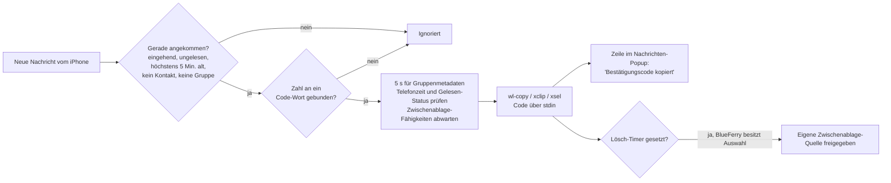

# Einmalcodes in die Zwischenablage kopieren

BlueFerry kann einen Bestätigungscode (2FA/OTP) aus einer neu empfangenen
SMS oder iMessage direkt in die Zwischenablage des Desktops kopieren. So
fügst du ihn mit Strg+V in ein Login-Formular ein, statt ihn vom Telefon
abzutippen.

Die Funktion ist **standardmässig aus**, weil sie die Zwischenablage ohne dein
Zutun ändert und jedes Programm, das die Zwischenablage liest, den Code sehen
kann.

## Was passiert



- Nur ungelesene, **gerade angekommene** Nachrichten zählen. Gesendete
  Nachrichten, der Verlauf, bereits gelesene Nachrichten und Nachrichten
  ohne Zeitstempel aus den letzten fünf Minuten werden ignoriert. Auch
  zukünftige Zeitstempel werden ignoriert. Fehlt der Zeitstempel in der
  Meldung, wird er in einer begrenzten Posteingangsliste nachgeschlagen.
  BlueFerry prüft immer die Zeit und den aktuellen Gelesen-Status genau
  dieser Nachricht, nie die Desktop-Ankunftszeit oder die Zeit einer
  anderen Nachricht. Wird sie während des Wartens gelesen, entfällt die Kopie. Aktuelle Nachrichten können auch vor dem
  Backend-Start empfangen worden sein. Schlägt die Abfrage fehl oder fehlt
  die Nachricht unter den neuesten 20 Einträgen, wird nichts kopiert.
- Codes kommen von Diensten, darum werden Nachrichten von **gespeicherten
  Kontakten** und aus erkannten **Gruppenunterhaltungen** ignoriert.
  Kandidaten warten fünf Sekunden auf Gruppenmetadaten aus Apple-Messages-
  Mitteilungen. Pro Minute sind höchstens drei Prüfungen und drei Kopien
  erlaubt; auch fehlgeschlagene Prüfungen zählen, bevor Telefonarbeit
  eingereiht wird.
- Eine Zahl gilt nur dann als Code, wenn sie an ein Code-Wort gebunden ist:
  - ein OTP-typisches Wort in der Nähe: „Bestätigungscode",
    „Sicherheitscode", „mTAN", „OTP", „Bestätigungsnummer",
    „verification code", „Steam Guard code", …;
  - „Code" direkt vor der Zahl: „Code: 123456", „Code lautet 123456";
  - „123456 ist Ihr … Code";
  - „Code" unmittelbar vor der Zahl, etwa „Telegram code 58291";
  - „geben Sie 123456 ein" oder „enter 123456" in einem Satz über
    Authentifizierung oder das Zurücksetzen eines Passworts.

  Einfache PINs und Passwörter brauchen Authentifizierungskontext. Tür- und
  WLAN-Codes sowie Zahlen mit Einheiten wie Schritten oder Nachrichten
  werden ausgeschlossen. Ein Code-Wort in einem anderen Satz bindet keine
  unzusammenhängende Zahl.

  Wörter wie „Einmal", „verify" oder „one-time" allein binden keine Zahl;
  „Einmalzahlung von 1500" oder „Verify your email to get 5000 points"
  kopieren also nichts. Werbung und Buchungen brauchen ein OTP-typisches
  Wort. Beträge, Datumsangaben, Uhrzeiten, Telefonnummern sowie Bestell-,
  Sendungs- und Rechnungsnummern werden übersprungen.
- `G-123456` und `123-456` werden als `123456` kopiert.
- Das Nachrichten-Popup bekommt eine zusätzliche Zeile, dass der Code
  kopiert wurde. Gibt es kein Nachrichten-Popup (etwa wenn Mitteilungen auf
  Kontakte beschränkt sind), bestätigt ein eigenes kurzes Popup das
  Kopieren; es landet nicht im Benachrichtigungsverlauf.

## Einschalten

Diese Zeilen in `~/.config/blueferry/local.env` eintragen:

```bash
BLUEFERRY_OTP_AUTOCOPY=true
# Optional: Zwischenablage nach so vielen Sekunden leeren (0 = behalten, max. 600)
BLUEFERRY_OTP_CLEAR_SECONDS=60
```

Danach den BlueFerry-Benutzerdienst neu starten.

Du brauchst ein Zwischenablage-Hilfsprogramm:

| Sitzung | Hilfsprogramm | Paket |
| --- | --- | --- |
| Wayland | `wl-copy` | wl-clipboard (2.3 oder neuer empfohlen) |
| X11 | `xclip` oder `xsel` | xclip / xsel |

Einrichtung prüfen:

```bash
blueferry otp-status     # an/aus, verwendetes Hilfsprogramm, Sensitiv-Markierung
blueferry doctor         # warnt bei fehlendem Hilfsprogramm oder altem wl-clipboard
echo 'Dein Code lautet 123456' | blueferry otp-check   # Probelauf, kopiert nichts
```

## Zwischenablage-Verlauf (Klipper und andere)

Ab wl-clipboard 2.3 wird der Code als sensibel markiert. Manager, die diese
Markierung beachten, nehmen ihn nicht in ihren Verlauf auf. Die erste Kopie
wartet auf die Fähigkeitsprüfung; schlägt sie fehl, entfallen wartende
Kopien und die nächste Nachricht kann die Prüfung erneut versuchen. Ältere
wl-clipboard-Versionen und die X11-Programme können diese Markierung nicht
setzen; dann bleibt der Code im Verlauf des Managers, auch nachdem der
Lösch-Timer abgelaufen ist. `blueferry otp-status` zeigt, welcher Fall
zutrifft.

## Lösch-Timer

Mit `BLUEFERRY_OTP_CLEAR_SECONDS=N` gibt BlueFerry nach N Sekunden seine
eigene Zwischenablage-Quelle frei. Hast du inzwischen etwas anderes
kopiert, bleibt deine Auswahl erhalten. Beim Beenden wird die eigene
Quelle auch ohne Timer freigegeben.

Programme wie wl-clip-persist können die Auswahl sofort übernehmen.
BlueFerry kann deren Kopien nicht sicher leeren: Zwischen Lesen und
Leeren könntest du etwas Neues kopieren, das dann gelöscht würde.
Darum beendet die Bereinigung nur BlueFerrys eigenes Hilfsprogramm,
liest die Zwischenablage nie zurück und ruft keinen globalen Löschbefehl
auf. Kopien und Verlaufseinträge anderer Programme bleiben unter deren
Kontrolle, auch beim Beenden.

## Grenzen

- **Es ist eine Heuristik.** Ungewöhnlich formulierte Codes können verpasst
  werden; andere Texte können trotzdem wie Authentifizierungsnachrichten
  aussehen. Mit `blueferry otp-check` kannst du
  Nachrichten deiner eigenen Anbieter testen; es prüft nur den Text, nicht
  die Absender-Regeln.
- **Gruppenunterhaltungen.** Die Nachrichten-Meldung des iPhones sagt nicht,
  ob eine Nachricht zu einer Gruppe gehört. Live-Mitteilungen von Apple
  Messages liefern diese Information; BlueFerry wartet fünf Sekunden und
  prüft erneut unmittelbar vor dem Kopieren. Fehlende oder spätere Metadaten
  können Gruppen unerkannt lassen. Gespeicherte Kontakte werden immer
  übersprungen.
- **Zeitzonen.** Das iPhone sendet Nachrichtenzeiten oft ohne Zeitzone.
  Nutzen Telefon und Computer verschiedene Zonen, wirken Codes älter als
  fünf Minuten und werden übersprungen. Das Debug-Log zeigt dann „ignoring a
  message N seconds old".
- **Sitzungserkennung.** Das Backend braucht die grafische Sitzung in seiner
  Umgebung: `WAYLAND_DISPLAY` (oder genau einen `wayland-N`-Socket in
  `$XDG_RUNTIME_DIR`) bzw. unter X11 `DISPLAY` und `XAUTHORITY`. Scheitert
  `wl-copy`, versucht BlueFerry einmal `xclip`/`xsel`.
- **X11 und die systemd-Unit.** Die Unit setzt `PrivateTmp=true` und
  versteckt damit `/tmp`. X-Programme erreichen den Server weiterhin über
  seinen abstrakten Socket, eine `XAUTHORITY`-Datei unter `/tmp` ist aber
  unsichtbar; das Log sagt es, wenn `xclip`/`xsel` daran scheitern.
- **Compositoren.** Das Kopieren im Hintergrund braucht das
  Wayland-Data-Control-Protokoll, das KWin und wlroots-Compositoren
  anbieten. GNOME/Mutter ohne dieses Protokoll ist ungetestet.
- **Kein Schalter in den Clients.** Die Einstellung gibt es nur in
  `local.env`.

## Datenschutz

- Der Code wird **nie geloggt, gespeichert oder** über BlueFerrys
  D-Bus-Schnittstelle **veröffentlicht**. Einen Befehl, der den letzten Code
  anzeigt, gibt es absichtlich nicht.
- Der Code geht über stdin an das Hilfsprogramm, nie über die
  Kommandozeile; andere lokale Benutzer können ihn also nicht aus der
  Prozessliste lesen. Das Hilfsprogramm erhält nur eine kleine, erlaubte
  Auswahl an Umgebungsvariablen.
- Das Popup zeigt Code und Absender nur mit
  `BLUEFERRY_SHOW_NOTIFICATION_CONTENT=true`. Dann erhält sie der
  Benachrichtigungsdienst des Desktops, wie bei jedem Nachrichten-Popup. Die
  Zeile im Nachrichten-Popup wiederholt den Code nie. Mit der
  Benachrichtigungseinstellung **Keine** wird der Code ohne Popup kopiert.
- `GetStatus` meldet nur, ob die Funktion eingeschaltet ist
  (`otp_autocopy`).
- Solange `wl-copy` die Zwischenablage hält, legt es den Text selbst in einer
  privaten temporären Datei ab. Das ist das Verhalten von wl-clipboard.
