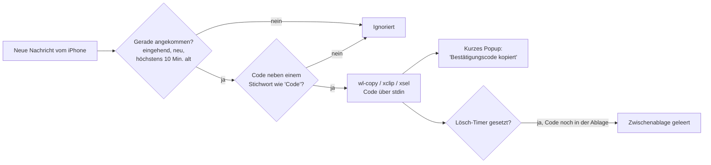

# Einmalcodes in die Zwischenablage kopieren

BlueFerry kann einen Bestätigungscode (2FA/OTP) aus einer neu empfangenen
SMS oder iMessage direkt in die Zwischenablage des Desktops kopieren. So
fügst du ihn mit Strg+V in ein Login-Formular ein, statt ihn vom Telefon
abzutippen.

Die Funktion ist **standardmässig aus**, weil sie die Zwischenablage ohne dein
Zutun ändert und jedes Programm, das die Zwischenablage liest, den Code sehen
kann.

## Was passiert



- Nur **gerade angekommene** Nachrichten zählen. Gesendete Nachrichten, der
  Verlauf, bereits gesehene und über zehn Minuten alte Nachrichten werden
  ignoriert.
- Eine Zahl gilt nur dann als Code, wenn ein Wort wie „Code",
  „Bestätigungscode", „verification", „code de vérification", „codice" oder
  „código" danebensteht. Beträge, Datumsangaben, Uhrzeiten, Telefonnummern
  sowie Bestell-, Sendungs- und Rechnungsnummern werden übersprungen.
- `G-123456` und `123-456` werden als `123456` kopiert.
- Ein kurzes Popup bestätigt das Kopieren. Es landet nicht im
  Benachrichtigungsverlauf.

## Einschalten

Diese Zeilen in `~/.config/blueferry/local.env` eintragen:

```bash
BLUEFERRY_OTP_AUTOCOPY=true
# Optional: Zwischenablage nach so vielen Sekunden leeren (0 = behalten, max. 600)
BLUEFERRY_OTP_CLEAR_SECONDS=60
```

Danach den BlueFerry-Benutzerdienst neu starten.

Du brauchst ein Zwischenablage-Hilfsprogramm:

| Sitzung | Hilfsprogramm | Paket |
| --- | --- | --- |
| Wayland | `wl-copy` | wl-clipboard (2.3 oder neuer empfohlen) |
| X11 | `xclip` oder `xsel` | xclip / xsel |

Einrichtung prüfen:

```bash
blueferry otp-status     # an/aus, verwendetes Hilfsprogramm, Sensitiv-Markierung
blueferry doctor         # warnt bei fehlendem Hilfsprogramm oder altem wl-clipboard
echo 'Dein Code lautet 123456' | blueferry otp-check   # Probelauf, kopiert nichts
```

## Zwischenablage-Verlauf (Klipper und andere)

Ab wl-clipboard 2.3 wird der Code als sensibel markiert, sodass Klipper und
andere Zwischenablage-Manager ihn nicht in ihren Verlauf aufnehmen. Ältere
wl-clipboard-Versionen und die X11-Programme können diese Markierung nicht
setzen; dann bleibt der Code im Verlauf des Managers, auch nachdem der
Lösch-Timer abgelaufen ist. `blueferry otp-status` zeigt, welcher Fall
zutrifft.

## Lösch-Timer

Mit `BLUEFERRY_OTP_CLEAR_SECONDS=N` entfernt BlueFerry den Code nach N
Sekunden, aber nur, wenn er noch in der Zwischenablage liegt. Hast du
inzwischen etwas anderes kopiert, bleibt deine Kopie erhalten. Beim Beenden
des BlueFerry-Backends wird ein Code, den es noch hält, ebenfalls entfernt.

## Grenzen

- **Es ist eine Heuristik.** Ungewöhnlich formulierte Codes werden verpasst,
  und ein beiläufiges „der Türcode ist 4711" im Chat wird kopiert. Mit
  `blueferry otp-check` kannst du Nachrichten deiner eigenen Anbieter testen.
- **Zeitzonen.** Das iPhone sendet Nachrichtenzeiten oft ohne Zeitzone.
  Nutzen Telefon und Computer verschiedene Zonen, wirken Codes älter als
  zehn Minuten und werden übersprungen. Das Debug-Log zeigt dann „ignoring a
  message N seconds old".
- **Sitzungserkennung.** Das Backend braucht die grafische Sitzung in seiner
  Umgebung: `WAYLAND_DISPLAY` (oder genau einen `wayland-N`-Socket in
  `$XDG_RUNTIME_DIR`) bzw. unter X11 `DISPLAY` und `XAUTHORITY`. Scheitert
  `wl-copy`, versucht BlueFerry einmal `xclip`/`xsel`.
- **Compositoren.** Das Kopieren im Hintergrund braucht das
  Wayland-Data-Control-Protokoll, das KWin und wlroots-Compositoren
  anbieten. GNOME/Mutter ohne dieses Protokoll ist ungetestet.
- **Kein Schalter in den Clients.** Die Einstellung gibt es nur in
  `local.env`.

## Datenschutz

- Der Code wird **nie geloggt, gespeichert oder** über BlueFerrys
  D-Bus-Schnittstelle **veröffentlicht**. Einen Befehl, der den letzten Code
  anzeigt, gibt es absichtlich nicht.
- Der Code geht über stdin an das Hilfsprogramm, nie über die
  Kommandozeile; andere lokale Benutzer können ihn also nicht aus der
  Prozessliste lesen. Das Hilfsprogramm erhält nur eine kleine, erlaubte
  Auswahl an Umgebungsvariablen.
- Das Popup zeigt Code und Absender nur mit
  `BLUEFERRY_SHOW_NOTIFICATION_CONTENT=true`. Mit der
  Benachrichtigungseinstellung **Keine** wird der Code ohne Popup kopiert.
- `GetStatus` meldet nur, ob die Funktion eingeschaltet ist
  (`otp_autocopy`).
- Solange `wl-copy` die Zwischenablage hält, legt es den Text selbst in einer
  privaten temporären Datei ab. Das ist das Verhalten von wl-clipboard.
