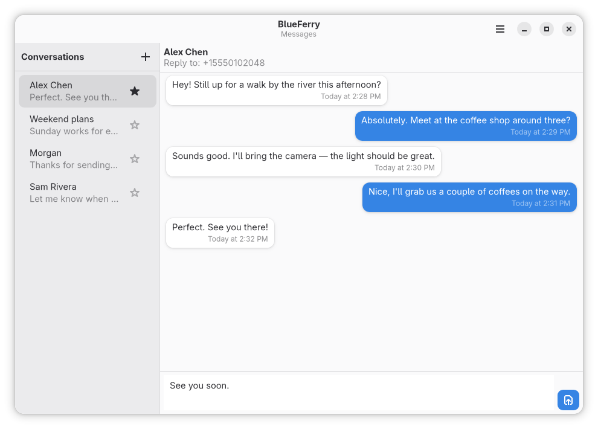

# Überblick

BlueFerry verbindet deinen Linux-Rechner über Bluetooth direkt mit deinem
iPhone und nutzt dafür Bluetooth-Profile, die iOS von Haus aus unterstützt.
Ein Hintergrunddienst auf dem Rechner hält die Verbindung; die grafischen
Clients und der Terminal-Client zeigen deine Unterhaltungen an.

## Was funktioniert

- SMS, RCS und iMessage über das iPhone empfangen und senden.
- Neue Unterhaltungen beginnen und synchronisierte Kontakte durchsuchen.
- Kontakte synchronisieren, einschließlich Telefonnummern und
  Apple-ID-E-Mail-Adressen.
- Nachrichten am Desktop als gelesen markieren.
- Desktop-Mitteilungen für Nachrichten und auf Wunsch auch für andere
  iPhone-Apps anzeigen.
- Gruppenchats, sofern BlueFerry die Teilnehmer sicher erkennen kann.
- Den lokalen Verlauf mit GNOME Schlüsselbund oder KDE Wallet verschlüsseln.
- Native Clients für GTK, KDE/Kirigami, Quickshell und das Terminal.

## Was nicht funktioniert

Das sind Grenzen dessen, was iOS über Bluetooth anbietet, keine fehlenden
Einstellungen:

- BlueFerry kennt nur Nachrichten, die es während einer Verbindung sieht. Es
  lädt weder dein iCloud-Nachrichtenarchiv noch deinen vollständigen Verlauf
  gesendeter Nachrichten.
- Anhänge, Reaktionen und Tippanzeigen werden nicht unterstützt.
- Anrufe und FaceTime werden nicht unterstützt; Anrufe und Musik bleiben auf
  dem iPhone.
- Bluetooth liefert BlueFerry keine verlässliche Gruppen-ID und keine
  vollständige Mitgliederliste. Antworten in Gruppen sind deshalb bewusst
  vorsichtig (siehe [Gruppenchats](#gruppenchats)).
- Mitteilungen anderer iPhone-Apps werden nur angezeigt. Du kannst nicht
  darauf antworten.

## So verbindet sich BlueFerry

BlueFerry nutzt drei Standard-Bluetooth-Dienste:

| Dienst | Bluetooth | Liefert |
| --- | --- | --- |
| MAP (Message Access Profile) | Classic | Nachrichten, Lesestatus, Senden |
| PBAP (Phone Book Access Profile) | Classic | Kontakte |
| ANCS (Apple Notification Center Service) | Low Energy | Optionale Mitteilungen und Gruppendetails |

Nachrichten und Kontakte funktionieren auch ohne ANCS. ANCS liefert die
Angaben, mit denen BlueFerry Gruppennachrichten erkennt, und ermöglicht das
Spiegeln anderer App-Mitteilungen.

## Voraussetzungen

- Ein Bluetooth-Adapter mit Bluetooth Classic **und** Bluetooth 4.0 oder
  neuer mit LE-Advertising. LE-Advertising ist auch für Nachrichten und
  Kontakte nötig, weil das iPhone erst dadurch deren Schalter anzeigt.
  Adapter, die nur Bluetooth 3 können, funktionieren nicht.
- BlueZ 5.72 oder neuer für Nachrichten und Kontakte. iPhone-Mitteilungen
  (ANCS) brauchen BlueZ 5.86 oder neuer.
- Ein iPhone. Entwickelt wurde vor allem mit einem iPhone 16 Pro Max unter
  iOS 26.5, zusätzlich erfolgreich getestet mit einem iPhone 17 Pro Max mit
  einer Beta von iOS 27. Für iOS 18 oder älter nimm die
  Kompatibilitätskopplung (siehe [iPhone koppeln](pairing.md#kopplungsoptionen)).

Die Unterstützung hängt von Adapter und iOS-Version ab. Realtek-Adapter
unterstützen Systemmitteilungen und Gruppenchats meist nicht.

## Unterhaltungen

Direkte Unterhaltungen fassen die Telefonnummern und E-Mail-Adressen
zusammen, die eindeutig zu einem synchronisierten Kontakt gehören. Antworten
gehen an die zuletzt eingehende Adresse, die über der Unterhaltung als
**Reply to** steht. Gemeinsam genutzte Adressen und Kontakte, die nur
gleich heißen, bleiben getrennt.

## Gruppenchats

Bluetooth verrät BlueFerry weder die ID noch die vollständige Mitgliederliste
einer Gruppe. Wenn die Teilnehmer unklar sind, deaktiviert BlueFerry deshalb
das Antworten:

- Bei einer benannten Gruppe lernt BlueFerry die Mitglieder nur von den
  Personen, die hineinschreiben. Es bittet dich einmal, die vollständige
  Empfängerliste zu bestätigen.
- Die gespeicherte Liste bleibt, bis du die Unterhaltung löschst, den Verlauf
  leerst oder den Speichermodus änderst. Die Gruppe auf dem iPhone bleibt
  unverändert.
- Eine Nachricht landet nur dann in ihrer Gruppe, wenn BlueFerry auch die
  zugehörige iPhone-Mitteilung erhält. Sonst erscheint sie in der
  Einzelunterhaltung mit dem Absender.

## Nächste Schritte

[BlueFerry installieren](install.md), dann [dein iPhone koppeln](pairing.md).
