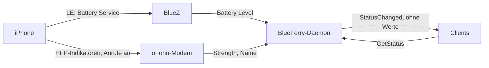

# Akku, Empfang und Netz des iPhones

BlueFerry zeigt den Akkustand des iPhones, solange es verbunden ist. Der
Akkustand kommt über die Bluetooth-LE-Verbindung, die BlueFerry für
Mitteilungen ohnehin hält. Dafür braucht es weder das Freisprech-Profil noch
oFono. Sind die optionalen [Anrufe](calls.md) an, zeigt BlueFerry zusätzlich
Empfangsstärke und Netz (Betreiber), die nur die Freisprech-Verbindung liefert.

## Was es tut



- **Akku**: aus BlueZ' `Battery1`, falls BlueZ es für das Telefon anbietet,
  sonst aus dem Standard-GATT-Battery-Service (Merkmal Battery Level), einmal
  gelesen und danach über Benachrichtigungen verfolgt. Auf 1 % genau. Sind
  Anrufe an und es gibt keinen LE-Wert, wird der Freisprech-Wert verwendet
  (20-%-Schritte, als „etwa“ angezeigt).
- **Empfang und Netz**: nur mit eingeschalteten Anrufen, von oFono.
- **Qt**: eine kleine Akku- (und Empfangs-)Anzeige neben „Conversations“;
  der Tooltip zeigt das Netz.
- **Terminal-Client, Quickshell-Kopfzeile, GTK-Statusseite**: Akku und
  Empfang stehen in der Verbindungszeile.
- **CLI**:

  ```bash
  blueferry phone-status            # Battery: 87 % (+ Signal/Network mit Anrufen)
  blueferry phone-status --json
  blueferry phone-status --warn     # oder --no-warn: Warnung bei leerem Akku
  ```

- **Optionale Warnung bei niedrigem Akku** (standardmäßig aus): eine
  Desktop-Mitteilung pro Entladung, wenn der Akku die Schwelle erreicht.
  Einschalten mit **Warn when the iPhone's battery runs low** in den
  iPhone-Einstellungen des Qt-Clients oder `blueferry phone-status --warn`.

## Einstellungen

Die Wahl wird in `settings.json` gespeichert. In
`~/.config/blueferry/local.env` lassen sich Anfangswert und Schwelle setzen:

```bash
BLUEFERRY_PHONE_BATTERY_NOTIFY=true         # Anfangswert; gespeicherte Wahl gewinnt
BLUEFERRY_PHONE_BATTERY_LOW_PERCENT=20      # 0-80, Standard 20
```

## Grenzen

- Bisher geprüft: Ein iPhone mit iOS 27 bietet den Battery Service über LE an
  (BlueZ 5.87 hatte einen Battery Level von 91 % zwischengespeichert).
  BlueFerrys Lesepfad ist nur gegen Attrappen getestet; melde dich bitte,
  wenn dein Telefon nichts anzeigt.
- Der Akkustand erscheint nur, solange das iPhone verbunden ist.
- Über die Freisprech-Verbindung bewegen sich Akku und Empfang in
  20-%-Schritten. Eine Ladeanzeige gibt es nicht.
- Der Netzname ist das, was das Telefon über HFP meldet (bis zu 16 Zeichen),
  und leer, solange es kein Netz hat.
- Die Warnung kommt erst wieder, wenn das Telefon mindestens 20 % über die
  Schwelle geladen wurde, und nach einem Neustart von BlueFerry einmal mehr,
  falls der Akku noch niedrig ist.
- Sobald der genaue LE-Wert bekannt ist, lösen die 20-%-Stufen der
  Freisprechverbindung die Warnung nicht mehr aus, solange das Telefon
  verbunden bleibt. Ein Akku mit 23 % warnt also nie als „20 %“, wenn der
  LE-Wert kurz wegfällt.
- Änderungen erreichen die Clients höchstens alle 10 Sekunden.

## Datenschutz

- Die Werte liefert nur die authentifizierte Methode `GetStatus`. Clients
  erfahren von Änderungen über das argumentlose Signal `StatusChanged`; kein
  Wert wird verteilt.
- Mit eingeschalteten Anrufen fragt oFono beim ersten Lesen des Akkus die
  eigene Nummer des Telefons ab. BlueFerry verwirft sie und speichert, loggt
  oder liefert sie nie.
- Logs enthalten nie die Werte oder den Netznamen.
