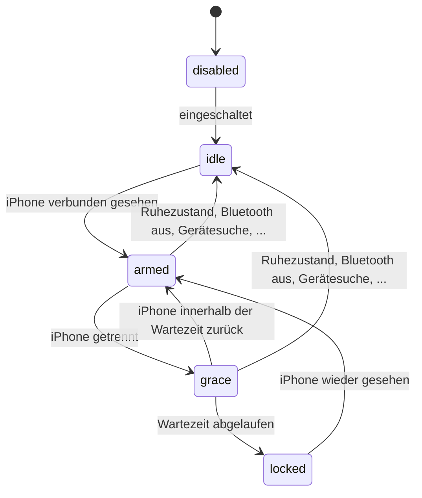

# Abwesenheitssperre (sperren, wenn das iPhone weg ist)

BlueFerry kann deine Desktop-Sitzung sperren, wenn das gekoppelte iPhone eine
Weile nicht mehr verbunden ist. Gedacht ist das als Sicherheitsnetz für
„Bildschirm vergessen zu sperren“, wenn das Telefon sowieso den ganzen Tag mit
BlueFerry verbunden ist.

Die Abwesenheitssperre ist **standardmässig aus** und sie **sperrt nur**.
BlueFerry entsperrt den Desktop nie, wenn das iPhone zurückkommt.

## Einschalten

Im Qt-Client (KDE) öffnest du die iPhone-Einstellungen und nutzt den Abschnitt
**Away Lock**: Schalter, Wartezeit, aktueller Zustand und ein Warnhinweis.

Im Terminal:

```bash
blueferry proximity-lock enable --grace 60   # einschalten, nach 60 s sperren
blueferry proximity-lock status              # aktueller Zustand
blueferry proximity-lock test                # Probelauf, sperrt nie
blueferry proximity-lock disable
```

Der GTK-, der Terminal- (TUI) und der Quickshell-Client haben dafür noch keine
Einstellungen; dort nutzt du die CLI.

### Einstellungen in `local.env`

| Variable | Standard | Bedeutung |
| --- | --- | --- |
| `BLUEFERRY_PROXIMITY_LOCK` | `false` | Abwesenheitssperre einschalten |
| `BLUEFERRY_PROXIMITY_LOCK_GRACE_SEC` | `60` | Sekunden, die das iPhone weg sein muss (10–3600) |

Diese Werte gelten nur als Startwerte. Eine im Client oder per CLI
gespeicherte Wahl hat Vorrang; der Dienst schreibt dann beim Start einmal ins
Log, dass er einen abweichenden `local.env`-Wert ignoriert.

## Wie entschieden wird

BlueFerry nutzt den Bluetooth-Verbindungszustand, den es ohnehin beobachtet
(Classic oder LE verbunden, alle 5 Sekunden geprüft). Es gibt keinen
zusätzlichen Scan und keine Messung der Signalstärke.



- Scharf wird die Sperre erst, wenn das iPhone seit dem Dienststart, dem
  Aufwachen aus dem Ruhezustand oder der letzten Pause verbunden war. Ein
  Dienst, der ohne Telefon in der Nähe startet, sperrt nie.
- Eine Trennung startet die Wartezeit; kommt das iPhone innerhalb dieser Zeit
  zurück, wird nicht gesperrt. Die nächste Trennung startet eine volle neue
  Wartezeit.
- Nach einer Sperre wartet BlueFerry, bis das iPhone wieder gesehen wird. Es
  sperrt also nicht wiederholt, während du weg bist.
- Nie gesperrt wird, während das System in den Ruhezustand geht, Bluetooth am
  Desktop aus ist, eine Bluetooth-Gerätesuche oder Kopplung läuft, BlueFerry
  den Adapter wiederherstellt oder nachdem das iPhone entfernt wurde.
- Trennt dieser Rechner die Verbindung selbst (zum Beispiel **Trennen** im
  Bluetooth-Applet des Desktops), pausiert die Sperre, bis das iPhone wieder
  verbunden ist. Ältere BlueZ-Versionen ohne diese Meldung pausieren nicht.

### Wie gesperrt wird

BlueFerry ruft zuerst `org.freedesktop.ScreenSaver.Lock` auf dem Sitzungsbus
auf (KDE Plasma und andere). Nur wenn das nicht verfügbar ist, wird `Lock` auf
deiner eigenen logind- bzw. elogind-Sitzung verwendet. KDE antwortet erst,
wenn der Sperrbildschirm angezeigt wird; eine langsame Antwort erscheint als
`screensaver-requested`.

## Grenzen

- **Verzögerung:** Bis zur Sperre vergehen die Wartezeit plus die Zeit, die
  das iPhone braucht, um die Bluetooth-Verbindung abzubauen (oft einige
  Sekunden), plus bis zu 5 Sekunden Abfrageintervall.
- **Bluetooth am iPhone aus** sieht genauso aus wie Weggehen und sperrt den
  Desktop.
- **Jede App, die eine Bluetooth-Gerätesuche startet,** pausiert die Sperre,
  solange die Suche läuft.
- **Sperren per Richtlinie abgeschaltet:** Ist das Bildschirmsperren per Richtlinie
  abgeschaltet (zum Beispiel KDE-Kiosk `lock_screen=false`), meldet Plasma
  Erfolg, ohne zu sperren, und BlueFerry kann das nicht erkennen.
- Die Abwesenheitssperre ist bisher nur mit simuliertem Bluetooth und D-Bus
  getestet, nicht mit einem echten Telefon, das sich entfernt.

## Sicherheit und Datenschutz

- **Das ist ein Auslöser zum Sperren, keine Sicherheitsfunktion.**
  Bluetooth-Anwesenheit lässt sich weiterleiten oder fälschen. Behalte dein
  normales Passwort oder deine PIN. Automatisches Entsperren wurde bewusst
  weggelassen.
- Jedes Programm, das unter deinem Benutzer läuft, kann die Sperre ein- oder
  ausschalten. Im schlimmsten Fall wird der Bildschirm gesperrt.
- Es wird nichts Neues an andere Programme gesendet. Der Status meldet nur
  einen Sperrzustand (`disabled`, `idle`, `armed`, `grace`, `locked`).
- Logs enthalten Zustände, Zeitspannen und BlueZ-Grundcodes, nie Namen,
  Nummern oder Adressen.
