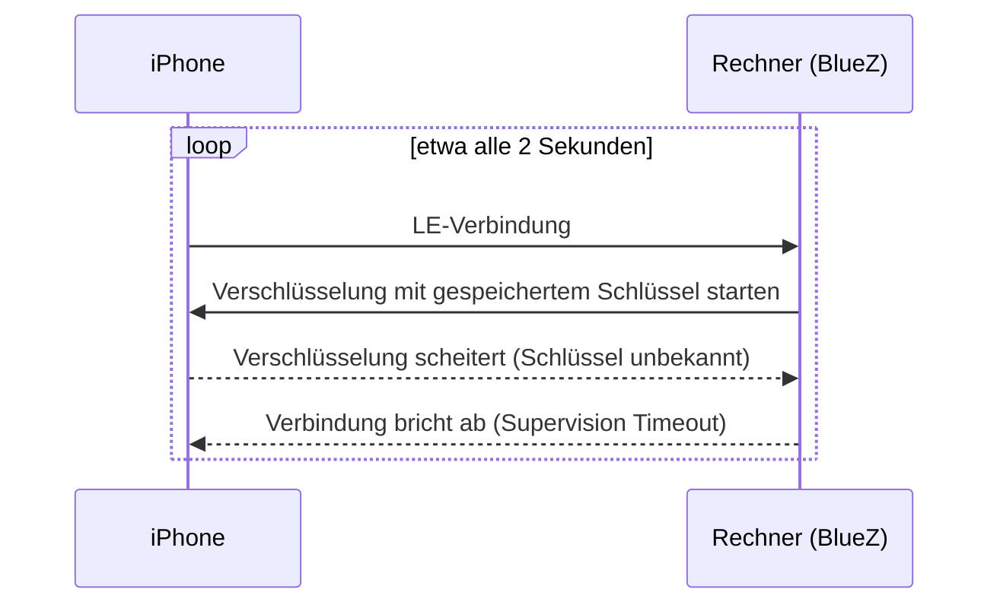

# Veraltete LE-Kopplung des iPhones

Ein iPhone ist mit deinem Rechner zweimal gekoppelt: einmal über klassisches
Bluetooth (Nachrichten, Kontakte, Anrufe) und einmal über Bluetooth Low
Energy (LE), das die iPhone-Mitteilungen (ANCS) nutzen. Veraltet die
LE-Hälfte der Kopplung, funktionieren Mitteilungen nie, während Nachrichten
weiterlaufen können. BlueFerry erkennt dieses Muster und sagt dir, wie du es
behebst.

## Das Symptom

Meist passiert das, wenn die Kopplung nur auf einer Seite entfernt wurde,
zum Beispiel **Dieses Gerät ignorieren** auf dem iPhone, aber nicht auf dem
Rechner. Das iPhone kennt den Schlüssel, den der Rechner verwendet, dann
nicht mehr.

BlueZ verbindet sich endlos neu, `Paired` bleibt `true`, und Mitteilungen
kommen nie an. In `btmon` scheitert `LE Start Encryption` mit Status 0x08,
gefolgt von `Disconnect Complete` mit Grund 0x08.

## Was BlueFerry tut

Einzuschalten gibt es nichts; die Erkennung ist immer aktiv.

- Nach **5 kurzen LE-Abbrüchen innerhalb von 60 Sekunden** (jede Verbindung
  jünger als 15 Sekunden, und dazwischen nichts, was eine brauchbare
  Verbindung belegt) stuft BlueFerry die LE-Kopplung als **verdächtig** ein.
- Es schreibt **eine** Warnung mit der Abhilfe ins Log, ohne Adresse oder
  Namen.
- Es stellt seine eigenen LE-Verbindungsversuche ein und schaltet den Adapter
  nicht aus und wieder ein, weil beides einen Schlüssel, den das Telefon
  verworfen hat, nicht zurückbringt. Verbindungen, die das iPhone selbst
  aufbaut, werden weiter beobachtet.
- Der Qt-Client zeigt ein Banner mit der Abhilfe und **Open iPhone
  Settings**; der Terminal-Client zeigt einen Hinweis. `blueferry doctor`
  gibt die Abhilfe samt `bluetoothctl remove`-Befehl aus, und
  Kopplungsberichte erwähnen sie.
- Wiederholte Log-Zeilen „rebuilding ANCS subscription“ erscheinen höchstens
  einmal pro Minute.

Die Warnung verschwindet von selbst, sobald eine LE-Verbindung 15 Sekunden
hält, das iPhone Mitteilungen freigibt, eine neue Kopplung entsteht oder
bluetoothd neu startet.

## So behebst du es

1. Auf dem iPhone **Einstellungen > Bluetooth** öffnen, neben diesem Rechner
   auf (i) tippen und **Dieses Gerät ignorieren** wählen.
2. Auf dem Rechner `bluetoothctl remove <iPhone-Adresse>` ausführen, mit der
   Adresse, die `blueferry doctor` als Ziel anzeigt. Das Backend beendet
   sich, wenn die Kopplung verschwindet.
3. Das iPhone im BlueFerry-Client neu koppeln.

## Grenzen

- Die Schwellen (5 Abbrüche, 60 s, 15 s) stammen aus einer einzigen
  beobachteten Aufzeichnung. Am Rand der Funkreichweite können Verbindungen
  ebenfalls aufkommen und vor der Verschlüsselung abbrechen, was die Warnung
  auslösen kann. Deshalb sagt sie „wahrscheinlich“. Eine brauchbare
  Verbindung hebt sie automatisch auf.
- Unter BlueZ älter als 5.84 (oder ohne LE-Bearer-Schnittstelle) fragt
  BlueFerry ersatzweise alle 5 Sekunden ab. Die Erkennung ist dann langsamer
  (180-s-Fenster) und sieht nur Stichproben der Abbrüche.
- GTK- und Quickshell-Client zeigen noch kein Banner; `blueferry doctor`
  funktioniert überall.

## Datenschutz

- Kein Signal überträgt Daten; Clients erfahren über das bestehende,
  argumentlose `StatusChanged()` vom Zustand.
- `GetStatus` erhält drei Schlüssel: `le_bond_suspect` (true/false),
  `le_flap_count` (eine Zahl) und `last_le_disconnect_reason` (ein festes
  Wort wie `timeout`).
- Die Warnung des Daemons enthält keine Adresse, keinen Namen und keine
  Nummer. `blueferry doctor` zeigt die konfigurierte iPhone-Adresse wie
  bisher an, damit du den `bluetoothctl remove`-Befehl kopieren kannst.
