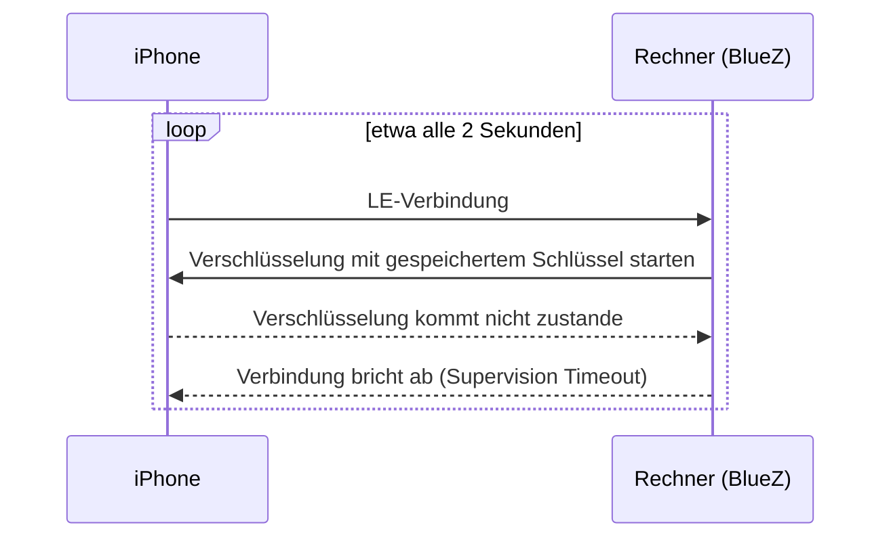

# Veraltete LE-Kopplung des iPhones

Ein iPhone ist mit deinem Rechner zweimal gekoppelt: einmal über klassisches
Bluetooth (Nachrichten, Kontakte, Anrufe) und einmal über Bluetooth Low
Energy (LE), das die iPhone-Mitteilungen (ANCS) nutzen. Veraltet die
LE-Hälfte der Kopplung, funktionieren Mitteilungen nie, während Nachrichten
weiterlaufen können. BlueFerry erkennt ein Muster, das darauf hindeutet, und
sagt dir, was helfen kann.

## Das Symptom

Vermutete Ursache ist eine Kopplung, die nur auf einer Seite entfernt wurde,
zum Beispiel auf dem Rechner entfernt und neu angelegt, während das iPhone
seine alte LE-Kopplung behielt. Die beiden Seiten haben dann nicht mehr
denselben Schlüssel. Genau so war es auf dem Rechner, auf dem das Problem
zuerst auftrat, und neues Koppeln auf beiden Seiten hat es dort behoben
(siehe Grenzen).

BlueZ verbindet sich endlos neu, `Paired` bleibt `true`, und Mitteilungen
kommen nie an. In `btmon` scheitert `LE Start Encryption` mit Status 0x08,
gefolgt von `Disconnect Complete` mit Grund 0x08.

## Was BlueFerry tut

Einzuschalten gibt es nichts; die Erkennung ist aktiv, sobald
iPhone-Mitteilungen eingeschaltet sind und der Controller nicht als
ANCS-untauglich bekannt ist. Sie meldet nur. BlueFerry verbindet, verbindet
neu und repariert genau so, wie es das ohne sie täte.

- Ein LE-Abbruch zählt nur, wenn **klassisches Bluetooth über den ganzen
  Zeitraum verbunden bleibt** (das Telefon ist nachweislich in der Nähe),
  die LE-Verbindung **höchstens 5 Sekunden** bestand und BlueZ als Grund
  Timeout, Remote oder Authentication nennt. Abbrüche durch diesen Rechner
  (rfkill, Adapter aus, BlueFerry selbst), unbekannte Gründe und Suspend
  zählen nie.
- Mindestens **5 solche Abbrüche innerhalb von 60 Sekunden**, über
  **3 Minuten** anhaltend, stufen die LE-Kopplung als **verdächtig** ein.
- BlueFerry schreibt **eine** Warnung mit der möglichen Abhilfe ins Log,
  ohne Adresse oder Namen.
- Qt-, GTK- und Quickshell-Client zeigen ein Banner, der Terminal-Client
  einen Hinweis. `blueferry doctor` gibt die Abhilfe samt
  `bluetoothctl remove`-Befehl aus, und Kopplungsberichte erwähnen sie.
- Wiederholte Log-Zeilen „rebuilding ANCS subscription“ erscheinen höchstens
  einmal pro Minute.

Die Warnung verschwindet von selbst, sobald eine LE-Verbindung 15 Sekunden
hält, das iPhone Mitteilungen freigibt, eine neue Kopplung entsteht,
bluetoothd neu startet oder klassisches Bluetooth 2 Minuten weg ist (das
Telefon ist fort). Der Abbruchzähler fällt nach einer ruhigen Minute auf 0.

## Was helfen kann

1. Auf dem iPhone **Einstellungen > Bluetooth** öffnen, neben diesem Rechner
   auf (i) tippen und **Dieses Gerät ignorieren** wählen.
2. Auf dem Rechner `bluetoothctl remove <iPhone-Adresse>` ausführen, mit der
   Adresse, die `blueferry doctor` als Ziel anzeigt. Das Backend beendet
   sich, wenn die Kopplung verschwindet.
3. Das iPhone im BlueFerry-Client neu koppeln.

## Grenzen

- Die Schwellen stammen aus einer einzigen beobachteten Aufzeichnung. Sie
  zeigte `Encryption Change` mit Status 0x08 (Verbindungs-Timeout); ein
  Telefon ohne Schlüssel würde normalerweise 0x06 (PIN or Key Missing)
  melden. Auf diesem Rechner (Intel AX200, BlueZ 5.87, iOS 27) haben
  **Dieses Gerät ignorieren** auf dem iPhone, `bluetoothctl remove` und
  neues Koppeln es behoben: Die Verschlüsselung kam zustande und
  Mitteilungen kamen an. Ein Fall ist kein Beweis für jedes Telefon und
  jeden Adapter, deshalb sagt die Warnung „kann“.
- Unter BlueZ älter als 5.84 (oder ohne LE-Bearer-Schnittstelle) fragt
  BlueFerry ersatzweise alle 5 Sekunden ab. Die Erkennung ist dann langsamer
  (180-s-Fenster, 9 Minuten Dauer) und sieht nur Stichproben der Abbrüche.

## Datenschutz

- Kein Signal überträgt Daten; Clients erfahren über das bestehende,
  argumentlose `StatusChanged()` vom Zustand.
- `GetStatus` erhält drei Schlüssel: `le_bond_suspect` (true/false),
  `le_flap_count` (eine Zahl) und `last_le_disconnect_reason` (ein festes
  Wort wie `timeout`).
- Die Warnung des Daemons enthält keine Adresse, keinen Namen und keine
  Nummer. `blueferry doctor` zeigt die konfigurierte iPhone-Adresse wie
  bisher an, damit du den `bluetoothctl remove`-Befehl kopieren kannst.
