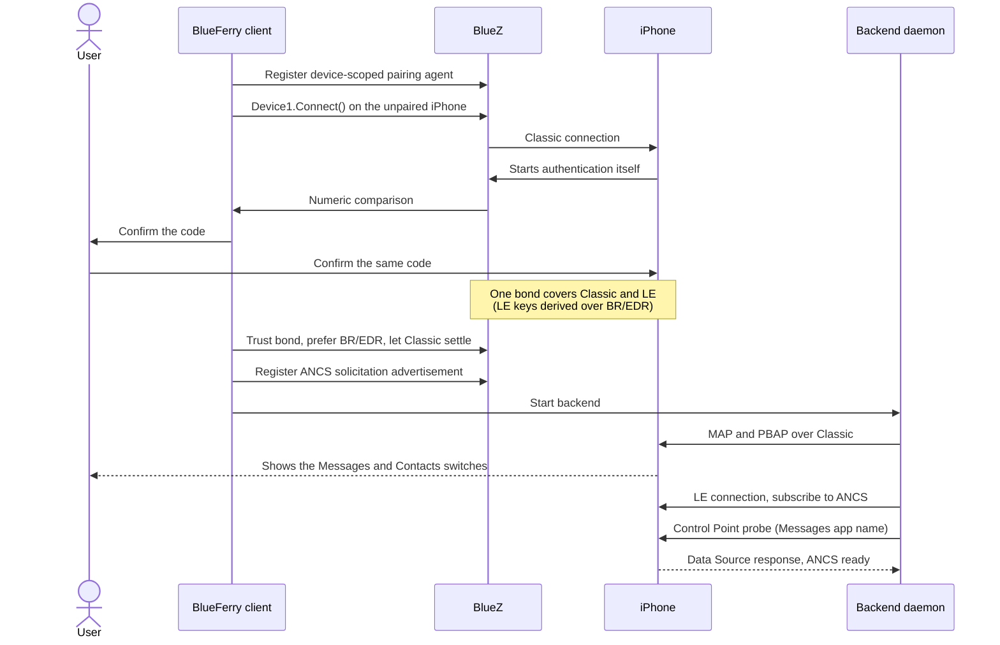

# Architecture

> **Note:** This is a short summary.
> [ARCHITECTURE.md](https://github.com/erikwb/blueferry/blob/main/ARCHITECTURE.md)
> is the authoritative and complete description, including the module map.

## Process boundaries

- `blueferry-backend` owns MAP, PBAP, ANCS, contact resolution, thread
  identity, history retention, notification policy, and the D-Bus API. It
  runs unprivileged and has no sudo path.
- GTK, Qt, TUI, Quickshell, and the CLI message commands are replaceable
  clients. They receive opaque thread keys and can't construct different
  recipients for an existing thread.
- Inside the backend, `dbus_service` is only a wire adapter over
  `backend_operations`. `daemon` orchestrates lifecycle, `event_dispatcher`
  fans events out to sinks, and `profile_supervisor` owns MAP/PBAP
  transitions.

## Bluetooth

| Profile | Transport | Modules |
| --- | --- | --- |
| MAP | Classic, OBEX | `obex/` (sessions, worker, events, send, read) |
| PBAP | Classic, OBEX | `contacts.py`, `contact_sync.py`, `contact_repository.py` |
| ANCS | LE, GATT | `ancs/` (client, parsers, sequencer) |

- One worker thread with its own bus connection serializes every blocking
  OBEX operation, so the GLib main loop never blocks.
- `bearer_supervisor` connects Bluetooth Classic first, then keeps LE
  connected alongside it. `solicitation_supervisor` keeps the ANCS
  advertisement on air until ANCS is proven healthy.
- `adapter_class_supervisor` repairs Class-of-Device drift through a fixed
  systemd helper allowed by a narrow Polkit rule.
- `bluetooth_recovery` is a rate-limited, last-resort adapter power cycle for
  persistent ANCS outages.

## Pairing

`pair_setup` is the low-level layer, and `setup_client` exposes typed
operations to GTK, Qt, and the CLI wizard. Quickshell reaches the same
operations through `pairing-*` JSON helpers. `pairing_policy` resolves two
independent axes instead of a table of device quirks:

- **Delivery mode:** full (MAP, PBAP, ANCS) or compatibility (MAP and PBAP
  only, `BLUEFERRY_ANCS_ENABLED=false`).
- **Authentication:** Connect-first, letting the iPhone start
  authentication, or explicit `Device1.Pair()` for controllers that cancel
  Connect-first.

Confirmation in the initiating client is mandatory; no caller falls through to
a desktop Bluetooth agent.

### Pairing sequence (full mode, Connect-first)

Success means MAP/PBAP work end to end, not only that a bond exists. The
behavior behind each step is documented in
[PROTOCOL.md](https://github.com/erikwb/blueferry/blob/main/PROTOCOL.md#pairing-and-iphone-permissions).

## Storage and privacy

- Everything from the iPhone is untrusted input. Parsers, transfers, and
  retained payloads have explicit limits in `limits.py`.
- History and the contact cache are owner-only SQLite files. Sensitive
  records are encrypted with AES-256-GCM under a random key held by the Secret
  Service. Clients never see the key.
- Storage fails closed: a missing or wrong key makes storage unavailable
  without deleting records, while live delivery continues.
- Logs never contain message bodies, notification text, or recipient
  identities.

## Clients

- All Python clients decode the API through `client_wire` into `models`, and
  share conversation and reply logic in `conversation_state`.
- GTK uses a worker-owned bus connection, Qt a `BridgeController` on a
  thread pool, the TUI Textual workers. Quickshell talks to one persistent
  `quickshell_bridge` process over stdin.
- Some Quickshell rules are re-implemented in QML (`OnboardingState.qml`,
  `ConversationLogic.qml`). A change to those rules has to be made in both
  places.

## Growth rules

- Keep Bluetooth and storage ownership in the backend.
- Add protocol behavior behind the D-Bus boundary before adding UI.
- Change versioned interfaces only compatibly and update the XML and client
  models in the same patch.
- Keep `Events1` signals content-free.

Each rule is explained in
[ARCHITECTURE.md](https://github.com/erikwb/blueferry/blob/main/ARCHITECTURE.md#growth-rules).
