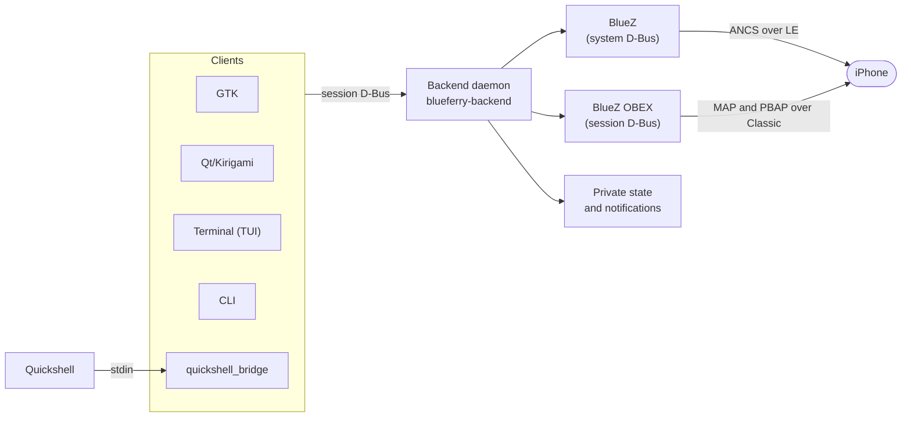

# Developer guide

BlueFerry is written in Python. One unprivileged per-user backend owns every
Bluetooth connection to the iPhone and all stored state. The GTK, Qt/Kirigami,
Quickshell, and terminal clients, as well as the CLI, are thin clients of a
private session D-Bus API.

## Where to read next

| Page | Source of truth |
| --- | --- |
| [Architecture](architecture.md) | [ARCHITECTURE.md](https://github.com/erikwb/blueferry/blob/main/ARCHITECTURE.md): module map, process boundaries, privacy rules |
| [D-Bus API](dbus-api.md) | [`data/io.weirdware.BlueFerry.xml`](https://github.com/erikwb/blueferry/blob/main/data/io.weirdware.BlueFerry.xml) and `src/blueferry/protocol.py` |
| [Testing](testing.md) | [TESTING.md](https://github.com/erikwb/blueferry/blob/main/TESTING.md) |
| Bluetooth behavior | [PROTOCOL.md](https://github.com/erikwb/blueferry/blob/main/PROTOCOL.md): empirical iPhone and BlueZ findings |

The documents in the repository root are authoritative. These pages give an
entry point and link to them rather than copying them.

## Repository layout

| Path | Content |
| --- | --- |
| `src/blueferry/` | Backend, shared client layer, CLI, TUI, GTK (`ui/`), Qt (`qt/`) |
| `data/` | D-Bus interface XML, desktop files, AppStream metadata, Quickshell client |
| `systemd/` | User service and the Class-of-Device helper unit with its Polkit rule |
| `packaging/` | Arch, DEB, and RPM recipes |
| `tests/` | Hermetic test suite |
| `po/` | Translation inventory |
| `website/public/` | Static project website |
| `docs/` | These pages |
