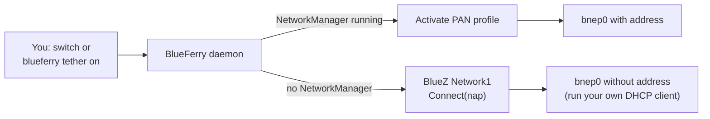

# Internet sharing (Bluetooth tethering)

BlueFerry can use your iPhone's Personal Hotspot over Bluetooth (PAN), so
your computer gets internet through the phone it is already connected to.
No Wi-Fi hotspot setup is needed.

This feature is **experimental**. It has only been tested against simulated
BlueZ and NetworkManager services, not yet with a real iPhone.

## What it does

- The feature is **off until you enable it**. While it is off, BlueFerry
  ignores Bluetooth network connections completely, including ones you start
  from the Plasma network applet (see [While it is off](#while-it-is-off)).
- Once enabled, you turn sharing on and off yourself. BlueFerry never starts
  it unless you ask, or unless you also enable automatic tethering.
- It reuses the Bluetooth link BlueFerry already keeps to your iPhone. It
  never connects or disconnects the phone itself, so messages, contacts and
  notifications keep working while you share.
- With NetworkManager, NetworkManager gets the address and DNS for you.
  Without it, BlueFerry only brings up the link and you run a DHCP client.

## How to use it

1. Enable the feature once:
   - KDE, GTK or Quickshell client: **iPhone Settings → Internet Sharing →
     Enable Bluetooth tethering** (Quickshell: **Internet sharing**).
   - Terminal client: press `t` and tick **Enable Bluetooth tethering**.
   - Command line: `blueferry tether enable` (add `--autoconnect` to also
     tether automatically).

   The **Share iPhone Internet** switch and **Connect automatically when the
   iPhone is connected** only appear after this.
2. On the iPhone, open **Settings → Personal Hotspot** and turn on **Allow
   Others to Join**. If it is off, the connection usually fails and BlueFerry
   tells you to turn it on.
3. Make sure BlueFerry is connected to the iPhone as usual.
4. Turn sharing on with **Share iPhone Internet** or `blueferry tether on`.
5. Turn it off the same way, or with `blueferry tether off`.

`blueferry tether` (or `blueferry tether status`) shows the current state.
`--json` prints it as JSON, and `--wait SECONDS` sets how long `on`, `off`
and `disable` wait for the result (default 60, `0` returns at once). Exit
status: `0` reached (or accepted with `--wait 0`), `1` not reached, `2`
rejected, for example because tethering is not enabled (the message says
how to enable it).

`blueferry tether disable` turns the feature off again. It stops sharing that
BlueFerry started; sharing another tool started keeps running, BlueFerry just
stops tracking it.

### With NetworkManager

BlueFerry asks NetworkManager to activate the phone's Bluetooth network
profile. If one already exists, for example because you connected through
the Plasma network applet before, BlueFerry uses it exactly as it is and
never changes or deletes it. Only if there is none does BlueFerry create
"BlueFerry iPhone hotspot": visible only to your user and with autoconnect
off.

If NetworkManager reports a permission error, polkit probably does not see
the BlueFerry daemon as part of your active desktop session.

### Without NetworkManager

BlueFerry brings up only the Bluetooth link and shows the interface name,
usually `bnep0`. Run your own DHCP client on it, for example
`sudo dhcpcd bnep0`. BlueFerry never runs privileged commands. This link
belongs to the daemon's D-Bus connection, so it ends when the daemon stops or
restarts.

## Settings

**Enable Bluetooth tethering** and **Connect automatically** are saved in
BlueFerry's `settings.json` when you change them in a client or with
`blueferry tether enable`/`disable`, and take effect at once. Automatic
tethering only works while tethering is enabled; `blueferry tether off`, or
turning sharing off in the network applet, pauses it until the next explicit
`on`.

Optional variables in `~/.config/blueferry/local.env`:

| Variable | Default | Meaning |
| --- | --- | --- |
| `BLUEFERRY_TETHER_ENABLED` | `false` | First value of **Enable Bluetooth tethering**. A choice saved later wins; the daemon logs when it ignores this. |
| `BLUEFERRY_TETHER_AUTOCONNECT` | `false` | First value of **Connect automatically**. A choice saved later wins. |
| `BLUEFERRY_TETHER_BACKEND` | `auto` | `auto` prefers NetworkManager, `networkmanager` forces it, `bluez` forces the link-only mode. |

Restart the daemon after changing `local.env`.

## Requirements

- Kernel with Bluetooth BNEP support (`CONFIG_BT_BNEP`).
- BlueZ with its network plugin.
- For the NetworkManager path: NetworkManager built with Bluetooth support.

## Limits

- Not yet verified with a real iPhone. In particular it is open whether iOS
  accepts the connection from a computer paired by BlueFerry, and whether
  messages stay healthy while sharing.
- If the iPhone did not advertise its network service when you paired, the
  state shows `not-supported` until BlueZ refreshes the phone's services.
- An existing network profile is used as configured. If it has autoconnect
  on, NetworkManager may start sharing on its own; BlueFerry does not change
  profiles it did not create.
- "Personal Hotspot is off" is a best guess: BlueZ reports a generic failure,
  so the message is worded carefully.
- A sharing link that was already up when you disable the feature, and that
  BlueFerry did not start in this session (for example after a daemon
  restart), is left running. Turn it off in the network applet if needed.

## While it is off

This is the default.

- The daemon still offers the `Tether1` D-Bus interface, but it does not
  watch the phone's Bluetooth network state.
- Sharing you start elsewhere, for example from the Plasma network applet,
  is not picked up and does not affect BlueFerry.
- BlueFerry's last-resort Bluetooth adapter recovery (which restores iPhone
  notifications) works exactly as without this feature.
- `blueferry tether on` and the D-Bus `Connect` call are refused.

## While it is on

- BlueFerry watches the phone's Bluetooth network state (read-only).
- Sharing started elsewhere, for example from the Plasma network applet, is
  shown as active in BlueFerry and can be turned off there.
- While a sharing link exists, BlueFerry skips its last-resort Bluetooth
  adapter power cycle so it does not cut your connection. With an unknown
  interface this waits at most 10 minutes. Disabling the feature lifts this
  at once.

## Privacy

- The change signal carries no data. Clients ask for the state, which holds
  only the state, interface name, backend name, whether it was started
  elsewhere, an error code and four flags (including your two choices).
- No IP address, MAC address or device name is shown, broadcast or logged.
  Logs contain only error names, error codes and NetworkManager reason
  numbers.
- The profile BlueFerry creates has a neutral name and is visible only to
  your user.
