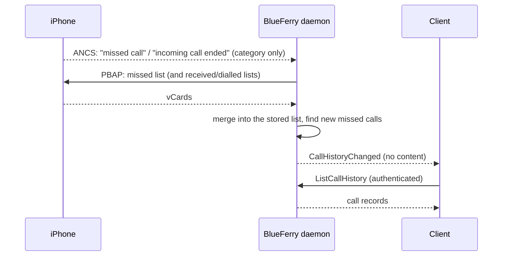

# Call history (optional)

BlueFerry can mirror the iPhone's **Recents** list (incoming, outgoing, and
missed calls) and show a desktop notification for new missed calls. It is
**off by default**, because it keeps a record of who called you and when.

It reuses the existing contacts connection (PBAP), so the iPhone's **Sync
Contacts** permission is all it needs. BlueFerry does not place, answer, or
listen to calls for this feature.

## What it does



- Keeps a local copy of the phone's call lists.
- Refreshes it a few seconds after the iPhone reports a missed call or the
  end of an incoming call over its notification service (ANCS). Only the
  notification's category is used for this, under every notification
  setting; no content is requested.
- Also checks the missed-calls list every
  `BLUEFERRY_CALL_HISTORY_INTERVAL_SEC` seconds (default 900) as a fallback,
  for example when notification access is off.
- Announces each new missed call once in a desktop popup. More than three at
  once are summarized in one popup; calls older than 12 hours are never
  announced. With **All iPhone notifications**, the iPhone's own missed-call
  popup is not repeated.
- Shows the list with `blueferry call-history` and in **Recent Calls** in
  the KDE client's menu.

## How to turn it on

In the KDE client, open the iPhone settings and check **Keep the iPhone's
recent calls** under **Call History**. **Notify me about missed calls**
controls the popups. Or from a terminal:

```bash
blueferry call-history enable              # with missed-call popups
blueferry call-history enable --no-popups  # list only
blueferry call-history disable             # off, and erase the list
```

The change applies at once; no restart is needed. `BLUEFERRY_CALL_HISTORY_ENABLED`
and `BLUEFERRY_MISSED_CALL_NOTIFICATIONS` in `~/.config/blueferry/local.env`
only set the initial values; a choice saved in a client or with the CLI takes
precedence. `BLUEFERRY_CALL_HISTORY_INTERVAL_SEC` (60-86400) sets the fallback
check.

Then:

```bash
blueferry call-history             # recent calls
blueferry call-history --missed    # missed calls only
blueferry call-history --sync      # refresh from the iPhone first
```

The first refresh only records the existing list, so you are not flooded with
old missed calls. The same applies after you pair a different iPhone or
remove and re-pair this one. Pairing a different iPhone also erases the
previous phone's list.

## Limits

- Without notification access (ANCS), a missed-call popup can arrive up to one
  fallback interval after the call.
- The fallback check reads only the missed-calls list. Dialled calls appear
  after the next full refresh: after an incoming call, `--sync`, or
  **Refresh from iPhone**.
- Messages come first: automatic refreshes pause while the message connection
  reconnects, each call list is fetched as its own short transfer, and a
  failed refresh is retried later rather than reconnecting Bluetooth.
  `--sync` and **Refresh from iPhone** are never held back.
- It mirrors the phone; calls you delete on the iPhone disappear on the next
  full refresh.
- The list and missed-call popups need stored local data. They don't work
  while the wallet is locked or with **Do not retain local data**.
- GTK, the terminal client, and Quickshell don't show the list yet.

## Privacy

- The list uses the same storage mode as message history: encrypted with the
  wallet key by default. Calls older than `BLUEFERRY_HISTORY_RETENTION_DAYS`
  are removed. **Clear history**, changing the storage mode, and turning the
  option off erase it at once.
- Clients get the records only through the authenticated, rate-limited
  `ListCallHistory` method. The broadcast signal carries no content. The Qt
  client fetches them only while **Recent Calls** is open.
- Popups follow your message popup settings: **No notifications** silences
  them, **Only from contacts** skips unknown callers, and
  `BLUEFERRY_SHOW_NOTIFICATION_CONTENT=false` hides caller and time. They are
  marked transient, so they don't stay in the desktop's notification history.
- Logs contain counts and states, never numbers or names.
