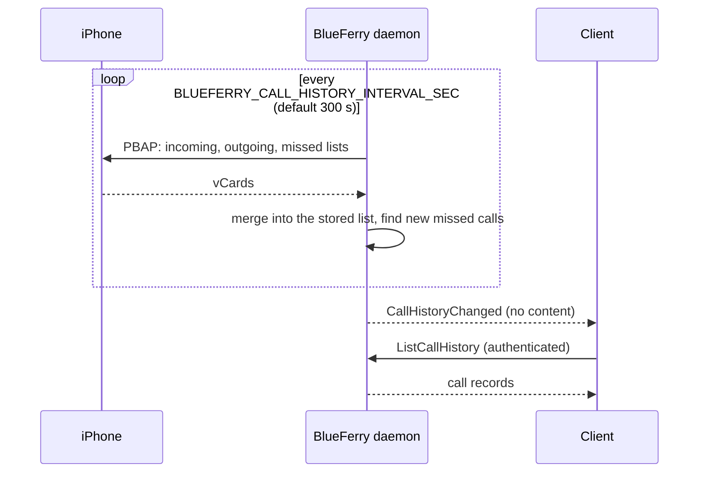

# Call history (optional)

BlueFerry can mirror the iPhone's **Recents** list (incoming, outgoing, and
missed calls) and show a desktop notification for new missed calls. It is
**off by default**, because it keeps a record of who called you and when.

It reuses the existing contacts connection (PBAP), so the iPhone's **Sync
Contacts** permission is all it needs. BlueFerry does not place, answer, or
listen to calls for this feature.

## What it does



- Keeps a local copy of the phone's call lists and refreshes it regularly.
- Announces each new missed call once in a desktop popup. More than three at
  once are summarized in one popup; calls older than 12 hours are never
  announced.
- Shows the list with `blueferry calls-history` and in **Recent Calls** in
  the KDE client's menu.

## How to enable it

Add to `~/.config/blueferry/local.env`, then restart the backend:

```bash
BLUEFERRY_CALL_HISTORY_ENABLED=true
# Popups for new missed calls (default true when call history is enabled):
BLUEFERRY_MISSED_CALL_NOTIFICATIONS=true
# How often to ask the iPhone for its call lists, in seconds (60-86400):
BLUEFERRY_CALL_HISTORY_INTERVAL_SEC=300
```

Then:

```bash
blueferry calls-history             # recent calls
blueferry calls-history --missed    # missed calls only
blueferry calls-history --sync      # refresh from the iPhone first
```

The first refresh only records the existing list, so you are not flooded with
old missed calls.

## Limits

- Bluetooth has no "new call" event for this. A missed-call popup can arrive
  up to one refresh interval after the call.
- Messages come first: automatic refreshes pause while the message connection
  reconnects. `--sync` and **Refresh from iPhone** are never held back.
- It mirrors the phone; calls you delete on the iPhone disappear on the next
  refresh.
- The list and missed-call popups need stored local data. They don't work
  while the wallet is locked or with **Do not retain local data**.
- GTK, the terminal client, and Quickshell don't show the list yet.

## Privacy

- The list uses the same storage mode as message history: encrypted with the
  wallet key by default. Calls older than `BLUEFERRY_HISTORY_RETENTION_DAYS`
  are removed. **Clear history** and changing the storage mode erase it at
  once; after turning the option off, it is erased at the next daemon start.
- Clients get the records only through the authenticated, rate-limited
  `ListCallHistory` method. The broadcast signal carries no content. The Qt
  client fetches them only while **Recent Calls** is open.
- Popups follow your message popup settings: **No notifications** silences
  them, **Only from contacts** skips unknown callers, and
  `BLUEFERRY_SHOW_NOTIFICATION_CONTENT=false` hides caller and time.
- Logs contain counts and states, never numbers or names.
