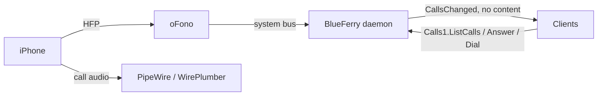

# Phone calls (optional)

BlueFerry can show incoming iPhone calls and answer, decline, place, and hang
up calls through [oFono](https://git.kernel.org/pub/scm/network/ofono/ofono.git)'s
Hands-Free Profile (HFP) support. The feature is **off by default** and is not
needed for messaging. With it off, BlueFerry does not contact oFono at all and
behaves exactly as before.

An earlier HFP experiment was removed from BlueFerry because oFono and
PipeWire's native HFP backend compete for the same Bluetooth profile. This
integration leaves that setup to you, only suggests oFono as an optional
package, and keeps the daemon running normally when oFono is missing.

## What it does



- Finds the iPhone's oFono modem, powers it up while the Bluetooth Classic
  link is connected, and brings it online (iOS does not do this by itself).
- Shows a desktop popup for an incoming call with **Answer** and
  **Decline**. It closes itself when the call stops ringing.
- The Qt client gets a **Phone Calls** dialog, the terminal client a calls
  panel (`c`), and the CLI a `calls` command group:

  ```bash
  blueferry calls                 # state and current calls
  blueferry calls enable          # or: disable
  blueferry calls dial '+41 79 123 45 67'   # asks first; --yes in scripts
  blueferry calls answer
  blueferry calls dtmf 1234#      # tones on the active call
  blueferry calls hangup          # or: hangup --all
  ```

- Raises oFono's call volume to 100 %, because the 50 % default is barely
  audible with an iPhone.

Audio itself is routed by PipeWire. BlueFerry only controls the call.

## How to enable it

1. Install and start oFono (developed with 2.18) as a system service.
   BlueFerry never starts it.
2. Allow your user to talk to oFono. Its shipped policy only admits root and
   `at_console` sessions. Add `/etc/dbus-1/system.d/ofono-local.conf`:

   ```xml
   <!DOCTYPE busconfig PUBLIC "-//freedesktop//DTD D-BUS Bus Configuration 1.0//EN"
    "http://www.freedesktop.org/standards/dbus/1.0/busconfig.dtd">
   <busconfig>
     <policy user="your-login">
       <allow send_destination="org.ofono"/>
     </policy>
   </busconfig>
   ```

   Every process of that user can then fully control oFono, not only
   BlueFerry.
3. Let WirePlumber hand HFP to oFono, for example in
   `~/.config/wireplumber/wireplumber.conf.d/51-bluez-ofono.conf`:

   ```text
   monitor.bluez.properties = {
     bluez5.hfphsp-backend = "ofono"
   }
   ```

   Don't set `bluez5.roles` there; BlueFerry's phone-audio fragment keeps the
   hands-free roles while calls are on.
4. With BlueZ 5.87 or newer, disable BlueZ's own HFP plugin so it doesn't
   take the channel before oFono: start `bluetoothd` with `-P hfp`. If you
   forget and the hands-free link fails three times in a row, BlueFerry shows
   the state `bluez_conflict` and tries again only every five minutes, or
   when the phone reconnects.
5. Tick **Enable phone calls through this computer** in the Qt client's
   iPhone settings, or run `blueferry calls enable`. The choice is saved and
   applies at once. `BLUEFERRY_CALLS_ENABLED=true` in
   `~/.config/blueferry/local.env` still works as the initial value; a saved
   choice wins. If WirePlumber is not a systemd user service, restart it
   yourself afterwards so it picks up the hands-free roles.

While calls are on and the iPhone is connected, its hands-free link stays
up with this computer: calls ring here and, once answered here, their audio
plays here. Turning calls off (or quitting the backend) releases that link
again, so call audio goes back to the phone.

`blueferry calls` should then show `ready` while the iPhone is connected.

## Limits

- Experimental. It has worked with one iPhone (iOS 27) on one Gentoo/OpenRC
  desktop: the modem comes up, incoming calls ring, and calls can be answered
  and hung up. Call waiting, hanging up a held call, and DTMF are untested.
- The startup race between oFono and WirePlumber is not solved. If the state
  stays at `searching`, restart oFono after WirePlumber.
- `dial` accepts plain numbers only. `*` and `#` are refused, because they
  would form service codes (for example call forwarding) instead of placing a
  call. Use `dtmf` for keypad symbols during a call.
- Dual-SIM phones expose only the default voice line over HFP.
- Make emergency calls on the iPhone itself, where the call doesn't depend on
  this computer's Bluetooth link or audio. BlueFerry refuses a fixed list of
  known emergency numbers (112, 911, 999, 000, 110, 117, 118, 119, 144 and
  about fifty other national ones), however they are spaced or punctuated.
  The list can't be complete: a number that isn't on it is dialed, and so is
  any longer number that merely contains one, such as `1120` or `0112`.
- Every client asks before it dials. Premium-rate prefixes differ by country,
  so BlueFerry doesn't try to block them.
- Dialing is rate-limited (6 per minute, 60 per hour), answering too (10 per
  minute). Hanging up is never blocked.
- Bluetooth recovery doesn't power-cycle the adapter while a call is in
  progress.

## Privacy

- Caller numbers and names are only returned by the authenticated,
  rate-limited `Calls1.ListCalls` method. The broadcast `CallsChanged` signal
  carries no content.
- Calls are not written to message history.
- The popup hides the caller when `BLUEFERRY_SHOW_NOTIFICATION_CONTENT=false`.
- Logs contain call states and IDs, never numbers or names.
