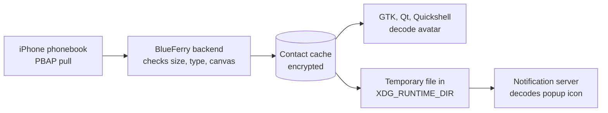

# Contact photos

BlueFerry can show the pictures from your iPhone's contacts as avatars in the
GTK, Qt (KDE), and Quickshell conversation lists and conversation headers,
and as the icon of desktop message popups. This is
**off by default**.

## How it works

The iPhone already sends contact photos in the normal contact download. Without
this option BlueFerry throws them away; with it, BlueFerry keeps them. There is
no second Bluetooth transfer.



The backend never decodes an image itself. It only checks that a photo is a
JPEG or PNG of at most 1 MiB and 2048×2048 pixels. Decoding happens in the
desktop clients and in your notification server.

## Turn it on

1. Add this line to `~/.config/blueferry/local.env`:

   ```bash
   BLUEFERRY_CONTACT_PHOTOS=true
   ```

2. Restart the backend: `systemctl --user restart blueferry`.
3. Sync contacts: `blueferry contacts-sync`, or wait for the next automatic
   sync.

Conversations with a known contact now show the photo. Groups and unknown
numbers keep the usual icon.

To save one photo to a file:

```bash
blueferry contacts-photo "Jane Doe" -o jane.jpg
```

The file is created with mode 0600 and is never overwritten without `--force`.

## Turn it off

Remove the line (or set it to `false`) and restart the backend. On that start,
BlueFerry deletes all stored photos.

**Before going back to an older BlueFerry release**, turn the option off and
start the backend once, so the photos are deleted right away. If you forget,
the older release deletes them together with the contacts at its next
contact sync or when the storage mode changes.

## Limits

- Only JPEG and PNG photos are kept. Photos given as a link are never
  downloaded.
- One photo per contact, at most 1 MiB each and 32 MiB per sync. When the
  per-sync budget runs out, later photos are skipped and the log says how
  many.
- A photo shows only when the address belongs to exactly one contact. A number
  shared by two contacts shows neither photo, and a contact whose every
  number is shared doesn't have its photo stored at all.
- GTK, Qt and Quickshell show photos for direct conversations. Groups keep
  their group icons, and a contact without a usable photo keeps its usual icon.
  The terminal client keeps its icons.
- Avatars load asynchronously and refresh after a contact sync. Turning photos
  off clears the clients' photo caches after they receive the updated status.
  Photo lookup failures do not interrupt messaging.
- Popup icons depend on the notification server honouring `image-path`.
  Plasma is expected to; this hasn't been tested yet. A server that ignores
  it shows the usual icon.

## Check what your iPhone sends

After each sync the backend logs one line with counts only, never a name,
number or picture:

```bash
journalctl --user -u blueferry | grep "with photos"
```

It shows how many photos fell into each size range and why photos were not
kept (`too-large`, `dimensions`, `format`, `not-inline`, `shared`, `budget`,
`time`). If many photos are `too-large` or `dimensions`, please report the
line; the limits are estimates that haven't been checked against a real
iPhone yet.

## Privacy

- With the option off, nothing is parsed, stored or served.
- Stored photos use the same encryption, storage mode and replacement as the
  contact cache, and are replaced on every sync.
- Photos never appear in logs or D-Bus signals. Clients fetch them through a
  rate-limited method.
- For popups, the backend writes a temporary owner-only copy with a random
  name to `$XDG_RUNTIME_DIR/blueferry`. When contacts change, the copies are
  no longer used for new popups but stay readable for popups already shown,
  until newer copies replace them (at most 64 files). All copies are deleted
  when the storage mode changes and when the backend stops.
- Your notification server receives the photo, just as it already receives
  the sender's name.
