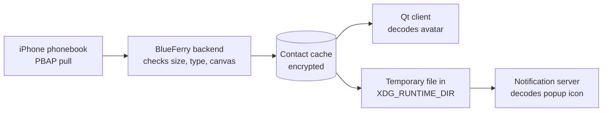

# Contact photos

BlueFerry can show the pictures from your iPhone's contacts as avatars in the
Qt (KDE) conversation list and as the icon of desktop message popups. This is
**off by default**.

## How it works

The iPhone already sends contact photos in the normal contact download. Without
this option BlueFerry throws them away; with it, BlueFerry keeps them. There is
no second Bluetooth transfer.



The backend never decodes an image itself. It only checks that a photo is a
JPEG or PNG of at most 256 KiB and 2048×2048 pixels. Decoding happens in the
Qt client and in your notification server.

## Turn it on

1. Add this line to `~/.config/blueferry/local.env`:

   ```bash
   BLUEFERRY_CONTACT_PHOTOS=true
   ```

2. Restart the backend: `systemctl --user restart blueferry`.
3. Sync contacts: `blueferry contacts-sync`, or wait for the next automatic
   sync.

Conversations with a known contact now show the photo. Groups and unknown
numbers keep the usual icon.

To save one photo to a file:

```bash
blueferry contacts-photo "Jane Doe" -o jane.jpg
```

The file is created with mode 0600 and is never overwritten without `--force`.

## Turn it off

Remove the line (or set it to `false`) and restart the backend. On that start,
BlueFerry deletes all stored photos.

**Before going back to an older BlueFerry release**, turn the option off and
start the backend once. Older releases don't know about stored photos and
would keep them.

## Limits

- Only JPEG and PNG photos are kept. Photos given as a link are never
  downloaded.
- One photo per contact, at most 256 KiB each and 16 MiB per sync.
- A photo shows only when the address belongs to exactly one contact. A number
  shared by two contacts shows neither photo.
- Only the Qt client shows avatars so far. The GTK, terminal and Quickshell
  clients keep their icons.
- Popup icons depend on the notification server honouring `image-path`.
  Plasma is expected to; this hasn't been tested yet. A server that ignores
  it shows the usual icon.

## Privacy

- With the option off, nothing is parsed, stored or served.
- Stored photos use the same encryption, storage mode and replacement as the
  contact cache, and are replaced on every sync.
- Photos never appear in logs or D-Bus signals. Clients fetch them through a
  rate-limited method.
- For popups, the backend writes a temporary owner-only copy with a random
  name to `$XDG_RUNTIME_DIR/blueferry`. These copies are deleted when contacts
  change and when the backend stops.
- Your notification server receives the photo, just as it already receives
  the sender's name.
