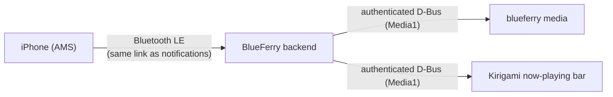

# iPhone media control

BlueFerry can show what your iPhone is playing and control playback from the
computer: play, pause, next and previous track, volume steps, fixed skips,
and like/dislike where the playing app offers them. It uses Apple's Media
Service (AMS) on the same Bluetooth LE connection that already carries iPhone
system notifications. No app on the iPhone is needed.

The feature is **off by default**. It adds Bluetooth traffic and is outside
BlueFerry's messaging focus.

## Requirements

- An iPhone paired in the normal (full) pairing mode. Compatibility pairing
  for iOS 18 or earlier never connects Bluetooth LE, so media control is not
  available there.
- BlueZ that reports the iPhone's LE link (`Bearer.LE1`: BlueZ 5.86 or newer
  with the bearer API, as notifications need today). Without it,
  `blueferry media` reports that the LE link state is unknown.
- The command line works everywhere. The KDE/Kirigami client shows a
  now-playing bar. The GTK, terminal and Quickshell clients have no media
  view yet.

## Turn it on

In the Kirigami client, open the iPhone settings and tick **Media Control**.
From a terminal:

```bash
blueferry media enable    # blueferry media disable turns it off again
```

It takes effect at once, without restarting the backend. After a few
seconds, start music on the iPhone and run:

```bash
blueferry media
```

`BLUEFERRY_MEDIA_CONTROL_ENABLED=true` in `~/.config/blueferry/local.env`
sets the initial value; a choice saved through a client or the CLI takes
precedence.

## Use it

```bash
blueferry media                # what is playing (same as "status")
blueferry media toggle         # play/pause
blueferry media next           # also: play, pause, previous
blueferry media volume-up      # also: volume-down (one iPhone step)
blueferry media skip-forward   # also: skip-backward (the app's fixed skip)
blueferry media like           # also: dislike, bookmark, repeat, shuffle
blueferry media --json         # the raw status for scripts
```

BlueFerry only sends commands the iPhone currently offers. Which ones those
are depends on the app that is playing; `blueferry media` lists them. A
command the app does not offer is refused locally and nothing is sent.

In the Kirigami client a small bar with title, artist and
previous/play-pause/next buttons appears above the conversations while
something is playing. It is not shown at all while the option is off.



## Limits

- AMS has no absolute volume, seek or stop. Volume moves one step at a time,
  and the skip buttons jump by the playing app's fixed interval.
- Repeat and shuffle advance to the app's next mode; there is no direct
  "shuffle on".
- Media control returns on its own after the iPhone leaves and comes back in
  range. It needs the LE link, so it pauses while notifications are
  disconnected, too.
- BlueFerry deliberately does not use AVRCP. Acting as an AVRCP remote could
  make the iPhone send its audio to the computer, which BlueFerry prevents.
- Verified on real hardware so far: the now-playing display. Commands,
  long-title completion and reconnects are tested with simulated Bluetooth
  only. Please report what you see.

## Privacy

- Track, artist, album and player name stay inside BlueFerry. Clients fetch
  them through BlueFerry's authenticated, rate-limited D-Bus interface.
  The change signal that tells clients to refresh carries no content.
- Logs contain command names and value lengths, never titles, artists or
  player names.
- Nothing about your music is stored on disk.
