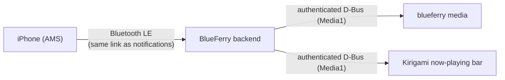

# iPhone media control

BlueFerry can show what your iPhone is playing and control playback from the
computer: play, pause, next and previous track, volume steps, fixed skips,
and like/dislike where the playing app offers them. It uses Apple's Media
Service (AMS) on the same Bluetooth LE connection that already carries iPhone
system notifications. No app on the iPhone is needed.

The feature is **off by default**. It adds Bluetooth traffic and is outside
BlueFerry's messaging focus.

## Requirements

- An iPhone paired in the normal (full) pairing mode. Compatibility pairing
  for iOS 18 or earlier never connects Bluetooth LE, so media control is not
  available there.
- BlueZ that reports the iPhone's LE link (`Bearer.LE1`: BlueZ 5.86 or newer
  with the bearer API, as notifications need today). Without it,
  `blueferry media` reports that the LE link state is unknown.
- The command line works everywhere. The KDE/Kirigami client shows a
  now-playing bar. The GTK and Quickshell clients have the switches but no
  media view yet; the terminal client has neither.

## Turn it on

In the Kirigami, GTK or Quickshell client, open the iPhone settings and
switch on **Media Control**. From a terminal:

```bash
blueferry media enable    # blueferry media disable turns it off again
```

It takes effect at once, without restarting the backend. After a few
seconds, start music on the iPhone and run:

```bash
blueferry media
```

`BLUEFERRY_MEDIA_CONTROL_ENABLED=true` in `~/.config/blueferry/local.env`
sets the initial value; a choice saved through a client or the CLI takes
precedence.

## Use it

```bash
blueferry media                # what is playing (same as "status")
blueferry media toggle         # play/pause
blueferry media next           # also: play, pause, previous
blueferry media volume-up      # also: volume-down (one iPhone step)
blueferry media skip-forward   # also: skip-backward (the app's fixed skip)
blueferry media like           # also: dislike, bookmark, repeat, shuffle
blueferry media --json         # the raw status for scripts
```

BlueFerry only sends commands the iPhone currently offers. Which ones those
are depends on the app that is playing; `blueferry media` lists them. A
command the app does not offer is refused locally and nothing is sent.

In the Kirigami client a small bar with title, artist and
previous/play-pause/next buttons appears above the conversations while
something is playing. It is not shown at all while the option is off.



## Media keys, Plasma and playerctl (MPRIS, optional)

A second, separate option publishes the iPhone as an MPRIS media player. The
Plasma media controller, keyboard media keys and `playerctl` then show and
control iPhone playback like any desktop player. Tick **Also show it in the
desktop media controls (MPRIS)** under **Media Control** in the iPhone
settings of the Kirigami, GTK or Quickshell client, or run:

```bash
blueferry media enable-mpris    # blueferry media disable-mpris turns it off
```

It applies at once and only while media control itself is on.
`BLUEFERRY_MEDIA_MPRIS_ENABLED=true` in `local.env` sets the initial value.

```bash
playerctl -p blueferry_iphone status
playerctl -p blueferry_iphone next
```

The player is called "iPhone (BlueFerry)" and appears only while the iPhone
reports an active player, so no stopped entry lingers. Because AMS has no
stop or seek, `Stop` pauses and seeking does nothing; use
`blueferry media skip-forward` instead. A volume change moves one iPhone step,
and until the iPhone has reported its volume the player shows no volume
control. Progress follows the iPhone's playback speed (for example a podcast
at 1.5×).

The player uses a D-Bus connection of its own, so an application that is only
allowed to talk to media players (for example a Flatpak app) cannot reach
BlueFerry's message interface through it.

**Read the privacy note below before turning MPRIS on.**

## Limits

- AMS has no absolute volume, seek or stop. Volume moves one step at a time,
  and the skip buttons jump by the playing app's fixed interval.
- Repeat and shuffle advance to the app's next mode; there is no direct
  "shuffle on".
- Media control returns on its own after the iPhone leaves and comes back in
  range. It needs the LE link, so it pauses while notifications are
  disconnected, too.
- BlueFerry deliberately does not use AVRCP. Acting as an AVRCP remote could
  make the iPhone send its audio to the computer, which BlueFerry prevents.
- Verified on real hardware so far: the now-playing display. Commands,
  long-title completion and reconnects are tested with simulated Bluetooth
  only. Please report what you see.

## Privacy

- Track, artist, album and player name stay inside BlueFerry. Clients fetch
  them through BlueFerry's authenticated, rate-limited D-Bus interface.
  The change signal that tells clients to refresh carries no content.
- **With the MPRIS option this changes on purpose.** MPRIS is public within
  your login session: every application you run can read the current title,
  artist and album and is notified of changes, exactly as with Spotify, VLC
  or any other desktop player. That is why MPRIS is its own opt-in. Calls
  that control playback still go through BlueFerry's user check and rate
  limits.
- Logs contain command names and value lengths, never titles, artists or
  player names.
- Nothing about your music is stored on disk.
