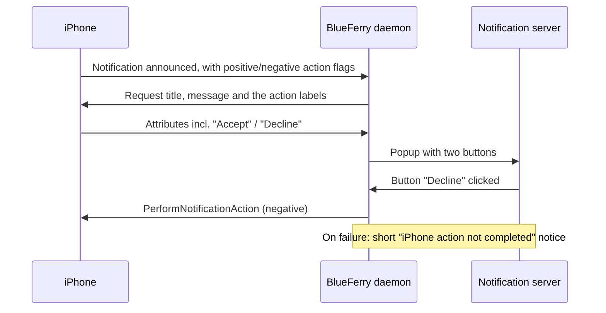

# iPhone notification actions

iOS attaches actions to some notifications: **Accept**/**Decline** on an
incoming call or a calendar invitation, or **Clear**. With this opt-in
feature, BlueFerry shows them as buttons on the desktop popup. Clicking a
button asks the iPhone to perform that action over ANCS.

The buttons carry the iPhone's own text, in the phone's language.



## Turn it on

1. Select **All iPhone Notifications** in the client.
2. Keep notification content shown (`BLUEFERRY_SHOW_NOTIFICATION_CONTENT`
   is true by default).
3. Add to `~/.config/blueferry/local.env`:

   ```bash
   BLUEFERRY_ANCS_ACTIONS=true
   # Optional: how long popups with buttons stay, 1000-120000 ms (default 30000)
   BLUEFERRY_ANCS_ACTION_TIMEOUT_MS=30000
   ```

4. Restart the BlueFerry user service.

`blueferry doctor` shows whether actions are enabled, and why not if they
aren't. `GetStatus` contains `ancs_actions`.

## What it does and doesn't do

- Nothing is sent to the iPhone unless you click a labelled button.
  Dismissing a popup, letting it expire, clicking its body, or handling the
  notification on the phone never triggers an action.
- Each popup runs at most one action.
- *Accept* on a call answers it **on the iPhone**. This is independent of
  hands-free calling: the audio stays wherever iOS routes it.
- Popups with buttons stay for `BLUEFERRY_ANCS_ACTION_TIMEOUT_MS` (30 s by
  default) instead of the normal popup timeout, so there's time to answer a
  ringing call. Some notification servers ignore the requested timeout.
- When the notification is handled or removed on the iPhone, its popup closes.
- When the Bluetooth connection to the iPhone is re-established, popups with
  buttons from the previous connection are closed, because iOS may reuse
  their notification numbers.
- If the action can't be performed (already handled on the phone, phone
  disconnected, action refused), a short "iPhone action not completed" notice
  appears. It contains no notification content.
- Messages popups come from MAP and keep their normal behaviour (click opens
  the conversation, dismiss marks it read).

## Limits

- Off by default. Without `BLUEFERRY_ANCS_ACTIONS=true`, popups and the data
  requested from the iPhone are unchanged.
- No buttons at all while `BLUEFERRY_SHOW_NOTIFICATION_CONTENT=false`. A
  generic "Positive"/"Negative" label could mislabel a destructive action,
  so there is no fallback.
- Only notifications whose app passes the **All iPhone Notifications** policy
  and the allow/block lists get buttons.
- There is no D-Bus method or client UI for actions; the popup is the only
  surface. The setting lives in `local.env`.
- Whether every iOS version sends labels for every kind of notification is up
  to iOS and the app.

## Privacy

- Button labels are chosen by the app that posted the notification. They are
  often generic ("Accept", "Clear") but can contain content, for example
  "Pay CHF 50 to Bob". They are treated like notification content: requested
  only while content is shown, never logged, never stored, and never put on
  D-Bus. They only appear in the transient popup.
- Logs contain only the notification number, the action kind
  (positive/negative), the result and error codes.
