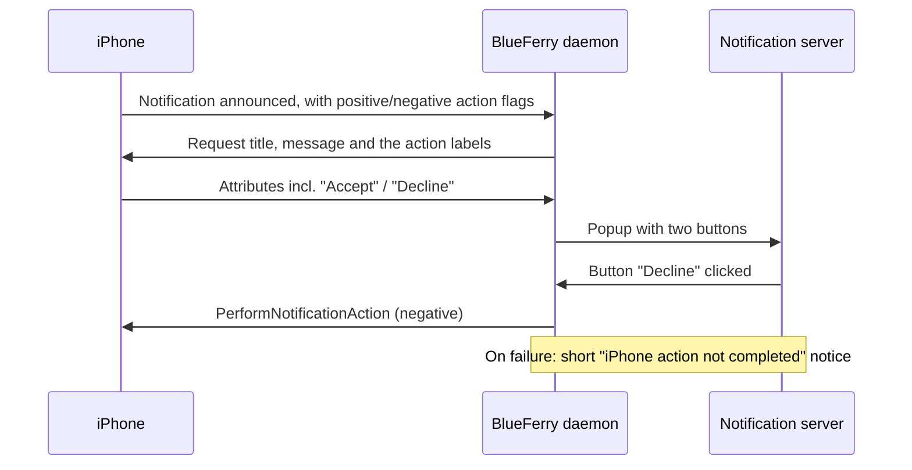

# iPhone notification actions

iOS attaches actions to some notifications: **Accept**/**Decline** on an
incoming call or a calendar invitation, or **Clear**. With this opt-in
feature, BlueFerry shows them as buttons on the desktop popup. Clicking a
button asks the iPhone to perform that action over ANCS.

The buttons carry the iPhone's own text, in the phone's language.



## Turn it on

1. Select **All iPhone Notifications** in the client.
2. Keep notification content shown (`BLUEFERRY_SHOW_NOTIFICATION_CONTENT`
   is true by default).
3. Tick **Show iPhone action buttons** under *Desktop Notifications* in the
   Qt client's iPhone settings, or run:

   ```bash
   blueferry notification-actions enable
   ```

   The change applies immediately; turning it off closes popups that still
   show buttons. `BLUEFERRY_ANCS_ACTIONS=true` in `local.env` only sets the
   initial value; a choice saved from a client wins.

Optional, in `~/.config/blueferry/local.env` (restart the service after
editing):

```bash
# How long popups with buttons stay, 1000-120000 ms (default 30000)
BLUEFERRY_ANCS_ACTION_TIMEOUT_MS=30000
```

`blueferry notification-actions` and `blueferry doctor` show whether actions
are on, and why they are inactive if they are. `GetStatus` contains
`ancs_actions`, `ancs_actions_preference` and `notification_content_shown`.

## What it does and doesn't do

- Nothing is sent to the iPhone unless you click a labelled button.
  Dismissing a popup, letting it expire, clicking its body, or handling the
  notification on the phone never triggers an action. Popups with buttons
  carry an explicit "do nothing" default action, because some notification
  servers would otherwise run the only button on a body click.
- Buttons appear only if your notification server can draw them (it reports
  the `actions` capability). Otherwise you get the normal popup.
- Each notification accepts one successful action. If a click did not go
  through, you can try again.
- *Accept* on a call answers it **on the iPhone**. This is independent of
  hands-free calling: the audio stays wherever iOS routes it.
- Popups with buttons stay for `BLUEFERRY_ANCS_ACTION_TIMEOUT_MS` (30 s by
  default) instead of the normal popup timeout, so there's time to answer a
  ringing call. Some notification servers ignore the requested timeout.
- When the notification is handled or removed on the iPhone, its popup closes.
- iOS reuses notification numbers. A button is bound to the exact
  notification that offered it: when the iPhone sends anything new for that
  number, replays its existing notifications, or the Bluetooth connection is
  re-established, the old buttons are retired and their popups close.
- If the action can't be performed (already handled on the phone, phone
  disconnected, action refused), a short "iPhone action not completed" notice
  appears. It contains no notification content. If the phone was only busy or
  the send failed, the notice has a **Retry** button.
- Messages popups come from MAP and keep their normal behaviour (click opens
  the conversation, dismiss marks it read).

## Limits

- Off by default. While it is off, popups and the data requested from the
  iPhone are unchanged.
- No buttons at all while `BLUEFERRY_SHOW_NOTIFICATION_CONTENT=false`. A
  generic "Positive"/"Negative" label could mislabel a destructive action,
  so there is no fallback.
- Only notifications whose app passes the **All iPhone Notifications** policy
  and the allow/block lists get buttons.
- Clients only switch the feature on or off; the popup is the only place
  where an action can be triggered. The GTK and Quickshell clients have no
  switch yet; use the Qt client or the CLI.
- Whether every iOS version sends labels for every kind of notification is up
  to iOS and the app.

## Privacy

- Button labels are chosen by the app that posted the notification. They are
  often generic ("Accept", "Clear") but can contain content, for example
  "Pay CHF 50 to Bob". They are treated like notification content: requested
  only while content is shown, never logged, never stored, and never put on
  D-Bus. They only appear in the transient popup.
- Logs contain only the notification number, the action kind
  (positive/negative), the result and error codes.
