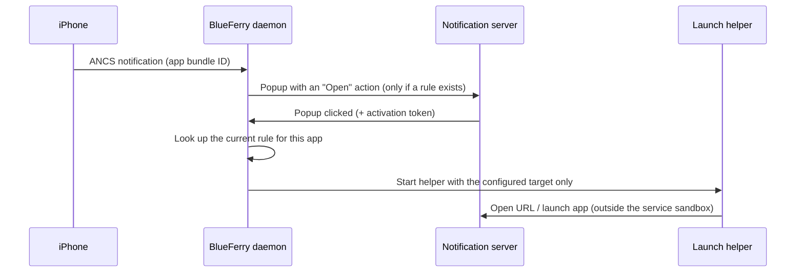

# Notification click rules

Clicking a message popup opens the conversation in BlueFerry. Popups from
other iPhone apps (shown with **All iPhone Notifications**) do nothing when
clicked, unless you add a **click rule** for that app.

A click rule maps one iPhone app, identified by its exact bundle ID, to one
fixed target:

- an `http`/`https` address, opened in your default browser, or
- a desktop entry ID (for example `org.mozilla.Thunderbird.desktop`),
  launched like any installed app.

| iPhone app (bundle ID) | Example target |
| --- | --- |
| `com.apple.mobilemail` | `org.mozilla.Thunderbird.desktop` |
| `net.whatsapp.WhatsApp` | `https://web.whatsapp.com` |
| `com.tinyspeck.chatlyio` | `com.slack.Slack.desktop` |
| `com.google.calendar` | `https://calendar.google.com/` |

## What happens on a click



The rule is looked up again at click time, so removing a rule also disables
popups that are already on screen. A popup opens its target once.

## Turn it on

Click rules only matter with **All iPhone Notifications** selected. There is
no other switch: with no rules (the default), popups behave exactly as before.

### Command line

```bash
blueferry notifications open-map set com.apple.mobilemail org.mozilla.Thunderbird.desktop
blueferry notifications open-map set net.whatsapp.WhatsApp https://web.whatsapp.com
blueferry notifications open-map list
blueferry notifications open-map remove net.whatsapp.WhatsApp
```

`blueferry notifications open-map` without a subcommand lists the rules.

### Qt client

Under **Desktop Notifications**, an editor for click rules appears while
**All iPhone Notifications** is selected. Add, change and remove rules there.
Changes made with the CLI show up in the editor and the other way round.

Rules take effect immediately; no service restart is needed.

### Finding IDs

- **Bundle ID:** watch the log while the app sends a notification. BlueFerry
  logs each app once, without content:

  ```bash
  journalctl --user -u blueferry -f | grep "ANCS app observed"
  ```

- **Desktop entry ID:** the file name of the app's `.desktop` file:

  ```bash
  ls /usr/share/applications ~/.local/share/applications \
     /var/lib/flatpak/exports/share/applications
  ```

## Limits

- Bundle IDs are matched exactly and case-sensitively. Apple Messages
  (`com.apple.MobileSMS`) can't be mapped; it keeps opening the conversation.
- URLs must be plain `http`/`https` addresses without credentials, spaces,
  quotes or other characters that need escaping, at most 2048 characters.
  `javascript:`, `file:`, `data:` and custom app schemes such as `slack://`
  are rejected.
- Desktop entries must be bare IDs ending in `.desktop`: no paths, arguments
  or commands. The CLI warns if the entry isn't installed; a missing entry
  does nothing when clicked.
- At most 64 rules.
- The GTK, Quickshell and terminal clients have no editor; use the CLI.
- With systemd, the target is started in its own transient user unit
  (`app-blueferry-open-*.service`), because the BlueFerry service sandbox
  would break a browser. Without systemd (for example OpenRC), it is launched
  directly.

## Privacy

- Nothing from the notification (title, text, sender) is added to the target
  or passed to the app. Only the app's bundle ID is used, to find the rule.
  No shell is involved.
- Rules are stored with the other popup preferences in
  `~/.config/blueferry/settings.json`. That file is readable only by you but
  **not encrypted**, so don't put secret tokens (for example a private
  calendar URL) into a rule if that matters to you.
- Logs never contain bundle IDs, URLs or desktop IDs.
- Rules are readable over D-Bus only through an authenticated, rate-limited
  method. No signal carries them.
- While a target is being opened, its URL or desktop ID is briefly visible in
  the process list and in the transient unit, which reveals that a
  notification from that app was clicked.
