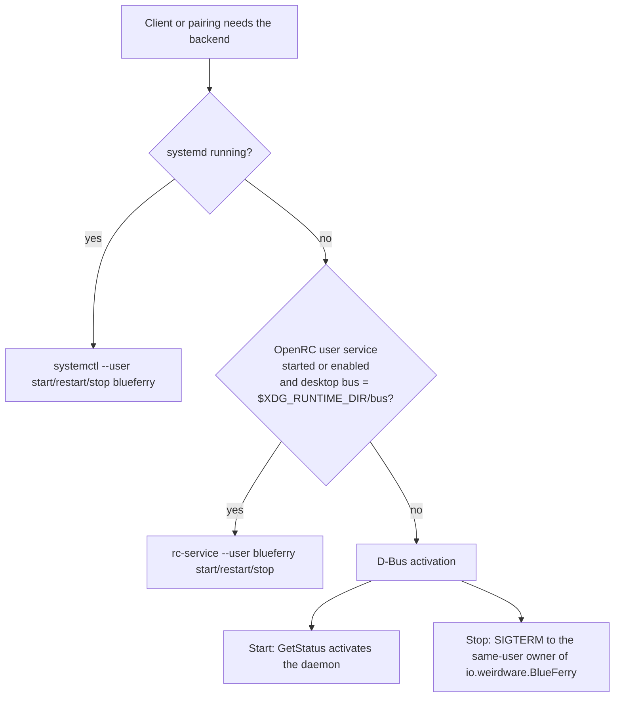

# Running without systemd (OpenRC)

BlueFerry's packages target systemd, but the backend also runs on OpenRC
and other hosts without systemd. Nothing needs to be switched on: BlueFerry
detects that no systemd is running and uses the session bus to start and stop
its backend. systemd hosts behave exactly as before.

OpenRC is not part of the CI package matrix and has no package recipe. The
packaging details are in
[packaging/openrc/README.md](https://github.com/erikwb/blueferry/blob/main/packaging/openrc/README.md).

## What it does



- **Start**: a client asks the daemon for its status, and the session bus
  starts `blueferry run` from the installed activation file.
- **Stop and restart** (after pairing, forgetting a phone, or an upgrade):
  BlueFerry asks the bus daemon which process owns `io.weirdware.BlueFerry`,
  checks that it runs as your user, and sends it `SIGTERM`. A restart then
  activates a new daemon. BlueFerry waits only as long as the request allows
  (30 to 45 seconds). A daemon still finishing a Bluetooth transfer by then
  keeps shutting down on its own, and the request reports that it is still
  shutting down; try again a moment later. No root and no process scanning
  are involved.
- **Repair hints** name `sudo rc-service bluetooth restart` on OpenRC and a
  generic "restart the Bluetooth service" when the init system is unknown.

## How to set it up

1. Install BlueFerry so that `io.weirdware.BlueFerry.service` is in
   `/usr/share/dbus-1/services/`. No init script is needed.
2. For iPhone system notifications (ANCS), start `bluetoothd` with `-E`.
   As an administrator, edit `/etc/conf.d/bluetooth`:
   - Gentoo: `BLUETOOTH_OPTS="-E"`
   - Alpine: `command_args="-E"`

   Then run `sudo rc-service bluetooth restart`. This briefly disconnects all
   Bluetooth devices. Until then BlueFerry pairs for messages and contacts
   and shows these steps instead of an activation button.
3. Let BlueFerry set the adapter's device class. Pairing needs the class
   set to A/V Hands-Free, and the daemon repairs it when it drifts, for
   example after Bluetooth restarts. Without systemd, BlueFerry runs the
   argument-checked helper as
   `sudo -n -- /usr/lib/blueferry/blueferry-set-cod N` (`N` is the adapter
   index; `-n` never prompts). An administrator allows that once with
   `visudo -f /etc/sudoers.d/blueferry` (adjust the group; needs sudo 1.9.10
   or newer):

   ```
   %wheel ALL=(root) NOPASSWD: /usr/lib/blueferry/blueferry-set-cod ^[0-9]+$
   ```

   Without the rule, setup tells you how to add it or how to run the helper
   once by hand, for example `sudo /usr/lib/blueferry/blueferry-set-cod 0`
   for `hci0`.

4. Pair as usual with `blueferry-qt`, `blueferry-gtk`,
   `blueferry-quickshell`, or `blueferry pair`.

### Optional: OpenRC user service

Only use the user service in `packaging/openrc/blueferry` (OpenRC 0.62 or
newer with a `pam_openrc` session) if your desktop's session bus is
`$XDG_RUNTIME_DIR/bus`. Check it in the desktop:

```sh
echo "$DBUS_SESSION_BUS_ADDRESS"
```

If it shows `unix:path=/tmp/dbus-…`, as with Plasma started by greetd or
SDDM through `dbus-run-session`, **do not** create a user service. It would
run a second daemon on a second bus, competing for Bluetooth. D-Bus
activation alone is correct there. If the service is enabled on such a
desktop anyway, BlueFerry logs a warning and ignores it.

With a matching bus:

```sh
rc-update --user add blueferry default
rc-service --user blueferry start
```

The daemon then logs to `~/.local/state/blueferry/daemon.log`.

## Limits

- **Less sandboxing.** The systemd unit confines the daemon
  (`ProtectSystem=strict`, `PrivateDevices=`, `RestrictAddressFamilies=` and
  more). D-Bus activation and OpenRC have no equivalent, so the daemon runs
  with your normal user rights. The user service keeps `umask 077` and
  `no_new_privs`.
- D-Bus activation also starts the daemon before a phone is paired.
- `blueferry pair` waits at most 30 seconds for the old daemon to exit. A hung
  daemon is not killed; end it yourself or log out and back in.
- A system booted with systemd whose `systemctl` is not at
  `/usr/bin/systemctl` (NixOS, for example) is treated like a host without
  systemd: BlueFerry uses D-Bus activation and signals instead of failing on
  the missing command.
- Experimental mode is found through `/proc`. A bundled option such as `-nE`
  is not recognized, and with `/proc` mounted `hidepid=1` or `2` it reads as
  inactive.
- The sudoers rule runs a short shell script as full root, without the
  systemd unit's sandbox, and applies to every session of the listed users,
  not only local ones. It can still only set an existing adapter's class.
- `sudo -n` also succeeds without the rule while a recent terminal `sudo`
  timestamp is cached.
- After sudo refuses, the daemon stops retrying until bluetoothd restarts, so
  a missing rule does not fill the authentication log.
- The optional user service sets `no_new_privs`, which rules out sudo for its
  daemon. BlueFerry notices and does not call sudo; rerun the helper after
  Bluetooth restarts, or set `no_new_privs=""` in
  `~/.config/rc/conf.d/blueferry`. `doas` is not supported.
- WirePlumber is restarted after a policy change only if it runs as an OpenRC
  user service. With a session launcher such as `gentoo-pipewire-launcher`,
  restart WirePlumber yourself or log in again.

## Privacy

Nothing about data handling changes. The lifecycle code only asks the session
bus for the owner's user ID and process ID of `io.weirdware.BlueFerry`, and
signals that process only if it belongs to you. It reads no message or
contact data and logs no personal data.
