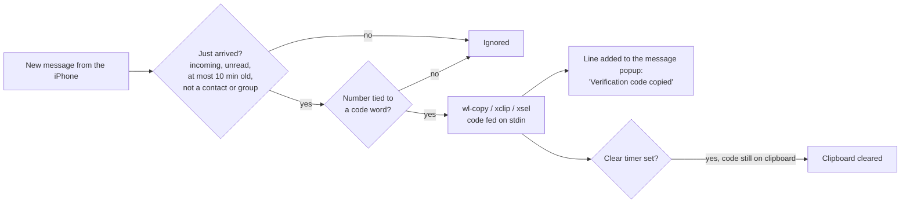

# Copy one-time codes to the clipboard

BlueFerry can copy a verification code (2FA/OTP) from a newly received SMS
or iMessage straight to the desktop clipboard, so you can paste it into a
login form with Ctrl+V instead of typing it from the phone.

The feature is **off by default**, because it changes the clipboard without
you doing anything and every application that reads the clipboard can see
the code.

## What it does



- Only unread messages that have **just arrived** count. Sent messages,
  history, messages that were already read, and messages without a time from
  the last ten minutes are ignored.
- Codes come from services, so messages from **saved contacts** and **group
  conversations** are ignored. At most three codes per minute are copied.
- A number counts as a code only when it is tied to a code word:
  - an OTP-specific word near it: "verification code",
    "Bestätigungscode", "Sicherheitscode", "mTAN", "OTP", "Steam Guard code",
    "Bestätigungsnummer", "code de vérification", ...;
  - "code" followed by the number: "code: 123456", "Code lautet 123456";
  - "123456 is your ... code";
  - "code" near the number in a message about verifying or logging in;
  - "enter 123456" or "geben Sie 123456 ein" in such a message.

  Words like "verify", "one-time" or "Einmal" alone never pick a number,
  so "Verify your email to get 5000 points" or "Einmalzahlung von 1500"
  copy nothing. Promotions and bookings need an OTP-specific word. Amounts,
  dates, times, phone numbers, and order, tracking or invoice numbers are
  skipped.
- `G-123456` and `123-456` are copied as `123456`.
- The message popup gets one extra line saying the code was copied. If
  there is no message popup (for example with notifications limited to
  contacts), a short popup of its own confirms the copy; it is not kept in
  the notification history.

## Turn it on

Add these lines to `~/.config/blueferry/local.env`:

```bash
BLUEFERRY_OTP_AUTOCOPY=true
# Optional: clear the clipboard after this many seconds (0 = keep, max 600)
BLUEFERRY_OTP_CLEAR_SECONDS=60
```

Then restart the BlueFerry user service.

You need one clipboard helper:

| Session | Helper | Package |
| --- | --- | --- |
| Wayland | `wl-copy` | wl-clipboard (2.3 or newer recommended) |
| X11 | `xclip` or `xsel` | xclip / xsel |

Check the setup:

```bash
blueferry otp-status     # is it on, which helper is used, sensitive marking
blueferry doctor         # warns about a missing helper or an old wl-clipboard
echo 'Your code is 123456' | blueferry otp-check   # dry run, copies nothing
```

## Clipboard history (Klipper and others)

With wl-clipboard 2.3 or newer the code is marked as sensitive, so Klipper
and other clipboard managers keep it out of their history. Older
wl-clipboard versions and the X11 tools can't set that mark, and the code
then stays in the manager's history even after the clear timer fired.
`blueferry otp-status` tells you which case applies.

## Clear timer

With `BLUEFERRY_OTP_CLEAR_SECONDS=N`, BlueFerry removes the code after N
seconds, but only if it is still on the clipboard. If you copied something
else in the meantime, your own copy stays. Stopping the BlueFerry backend
also removes a code it still holds.

Clipboard persistence tools such as wl-clip-persist take the selection over
right away, so BlueFerry's helper no longer holds the code. The timer and
backend shutdown then read the clipboard back (`wl-paste`, `xclip -o` or
`xsel --output`) and clear it only if it still holds exactly the code. Only
a few bytes are read, and they are only compared.

## Limits

- **It's a heuristic.** Unusually phrased codes are missed, and "the door
  code is 4711" from a number that isn't a saved contact is still copied.
  Use `blueferry otp-check` to test messages from your own providers; it
  checks only the text, not the sender rules.
- **Group conversations.** The iPhone's message push does not say whether a
  message belongs to a group. BlueFerry skips it when it already knows the
  group; group members you saved as contacts are skipped anyway.
- **Time zones.** The iPhone often sends message times without a time zone.
  If phone and computer use different zones, codes can look older than ten
  minutes and are skipped. The debug log then shows "ignoring a message N
  seconds old".
- **Session detection.** The backend needs the graphical session in its
  environment: `WAYLAND_DISPLAY` (or exactly one `wayland-N` socket in
  `$XDG_RUNTIME_DIR`), or `DISPLAY` and `XAUTHORITY` on X11. If `wl-copy`
  fails, BlueFerry tries `xclip`/`xsel` once.
- **X11 and the systemd unit.** The unit sets `PrivateTmp=true`, which hides
  `/tmp`. X clients still reach the server through its abstract socket, but
  an `XAUTHORITY` file under `/tmp` is invisible; the log says so when that
  is why `xclip`/`xsel` failed.
- **Compositors.** Copying in the background relies on the Wayland
  data-control protocol, which KWin and wlroots compositors provide.
  GNOME/Mutter without it is untested.
- **No toggle in the clients.** The setting lives in `local.env` only.

## Privacy

- The code is **never logged, stored, or published** on BlueFerry's D-Bus
  API. There is deliberately no command to show the last code.
- The code goes to the helper on stdin, never on the command line, so other
  local users can't read it from the process list. The helper only gets a
  small allowlisted environment.
- The popup shows the code and sender only when
  `BLUEFERRY_SHOW_NOTIFICATION_CONTENT=true`. Then the desktop's
  notification server receives them, as it does for every message popup.
  The line added to the message popup never repeats the code. With the
  notification setting **None**, the code is copied without a popup.
- `GetStatus` only reports whether the feature is turned on
  (`otp_autocopy`).
- While it holds the clipboard, `wl-copy` itself keeps the text in a private
  temporary file. That is wl-clipboard's behaviour.
