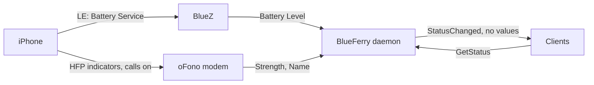

# Phone battery, signal, and network

BlueFerry shows the iPhone's battery level while the phone is connected. The
battery comes over the Bluetooth LE link BlueFerry already holds for
notifications, so it needs neither the hands-free profile nor oFono. With the
optional [phone calls](calls.md) on, BlueFerry also shows the signal strength
and the network (operator) name, which only the hands-free link reports.

## What it does



- **Battery**: from BlueZ's `Battery1` if BlueZ publishes it for the phone,
  otherwise from the standard GATT Battery Service (Battery Level
  characteristic), read once and then followed through notifications. This is
  exact to 1 %. With calls on and no LE value, the hands-free value (20 %
  steps, shown as "about") is used instead.
- **Signal and network**: only with calls on, from oFono.
- **Qt**: a small battery (and signal) indicator next to "Conversations";
  hover for the network name.
- **Terminal client, Quickshell header, GTK status page**: battery and
  signal are added to the connection line.
- **CLI**:

  ```bash
  blueferry phone-status            # Battery: 87 % (+ Signal/Network with calls on)
  blueferry phone-status --json
  blueferry phone-status --warn     # or --no-warn: the low-battery warning
  ```

- **Optional low-battery warning** (off by default): one desktop
  notification per discharge when the battery reaches the threshold. Turn it
  on with **Warn when the iPhone's battery runs low** in the Qt iPhone
  settings or `blueferry phone-status --warn`.

## Settings

The warning choice is saved in `settings.json`. In
`~/.config/blueferry/local.env` you can seed it and set the threshold:

```bash
BLUEFERRY_PHONE_BATTERY_NOTIFY=true         # initial value; a saved choice wins
BLUEFERRY_PHONE_BATTERY_LOW_PERCENT=20      # 0-80, default 20
```

## Limits

- Verified so far: an iPhone on iOS 27 exposes the Battery Service over LE
  (BlueZ 5.87 cached a Battery Level of 91 %). BlueFerry's reading path is
  tested against fakes only; please report if your phone shows nothing.
- The battery is shown only while the iPhone is connected.
- Over the hands-free link the battery moves in 20 % steps and the signal
  too. There is no charging indicator.
- The operator name is what the phone reports over HFP (up to 16
  characters) and is empty while the phone has no network.
- The warning fires again only after the phone has charged at least 20 %
  above the threshold, and once more after a restart of BlueFerry if the
  phone is still low.
- Once the exact LE level was seen, the 20 % hands-free steps no longer
  trigger the warning while the phone stays connected, so a battery at 23 %
  never warns as "20 %" when the LE level briefly drops out.
- Changes reach the clients at most every 10 seconds.

## Privacy

- The values are only returned by the authenticated `GetStatus` method.
  Clients are told about changes with the argument-free `StatusChanged`
  signal; no value is ever broadcast.
- With calls on, oFono asks the phone for its own number when the battery is
  first read. BlueFerry discards that number and never stores, logs, or
  returns it.
- Logs never contain the levels or the operator name.
