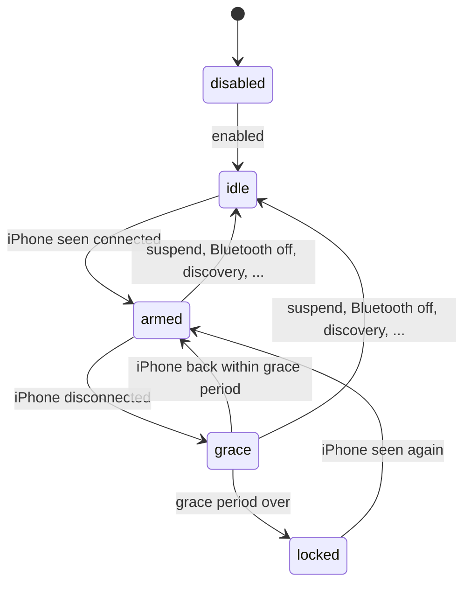

# Away lock (lock when the iPhone goes away)

BlueFerry can lock your desktop session after the paired iPhone has been
disconnected for a while. It is a "forgot to lock my screen" safety net for
people who keep the phone connected to BlueFerry all day.

The away lock is **off by default** and it **only locks**. BlueFerry never
unlocks the desktop when the iPhone comes back.

## Turn it on

In the Qt (KDE) client, open the iPhone settings and use the **Away Lock**
section: a switch, the grace period, the current state and a warning.

From a terminal:

```bash
blueferry proximity-lock enable --grace 60   # opt in, lock after 60 s away
blueferry proximity-lock status              # current state
blueferry proximity-lock test                # dry run, never locks
blueferry proximity-lock disable
```

The GTK and Quickshell clients have an **Away Lock** switch in their iPhone
settings. It turns the lock on or off and keeps the saved grace period; change
the grace period in the Qt client or with the CLI. The terminal client (TUI)
has no setting for this; use the CLI there.

### Settings in `local.env`

| Variable | Default | Meaning |
| --- | --- | --- |
| `BLUEFERRY_PROXIMITY_LOCK` | `false` | Turn the away lock on |
| `BLUEFERRY_PROXIMITY_LOCK_GRACE_SEC` | `60` | Seconds the iPhone must stay away (10–3600) |

These only set the initial values. A choice saved from a client or the CLI
takes precedence, and the service logs once at startup when it ignores a
different `local.env` value for that reason.

## How it decides

BlueFerry uses the Bluetooth link state it already watches (Classic or LE
connected, checked every 5 seconds). There is no extra scanning and no
signal-strength measurement.



- It arms only after it has seen the iPhone connected since the service
  started, the system resumed, or the last pause. A service that starts
  without the phone nearby never locks.
- A disconnect starts the grace period; a reconnect within it cancels the
  lock. The next disconnect starts a full new period.
- After locking once it waits until the iPhone is seen again, so it never
  locks repeatedly while you are away.
- It never locks while the system is suspending, while Bluetooth on the
  desktop is off, during Bluetooth discovery or pairing, while BlueFerry is
  recovering the adapter, or after the iPhone was forgotten.
- When this computer ends the connection itself (for example **Disconnect**
  in the desktop Bluetooth applet), the lock pauses until the iPhone is
  connected again. Older BlueZ versions without this report do not pause.

### How the screen is locked

BlueFerry first asks `org.freedesktop.ScreenSaver.Lock` on the session bus
(KDE Plasma and others). Only if that is not available does it fall back to
`Lock` on your own logind or elogind session. KDE answers only once the lock
screen is shown; a slow answer is reported as `screensaver-requested`.

## Limits

- **Delay:** the real time to lock is the grace period plus the time the
  iPhone needs to drop the Bluetooth link (often several seconds) plus up to
  5 seconds of polling.
- **Bluetooth off on the iPhone** looks exactly like walking away and locks
  the desktop.
- **Any app that starts Bluetooth discovery** pauses the lock while it runs.
- **Disabled locking:** if screen locking is disabled by policy (for example
  a KDE Kiosk `lock_screen=false` restriction), Plasma reports success without
  locking, and BlueFerry cannot tell.
- The away lock has only been tested with simulated Bluetooth and D-Bus so
  far, not with a real phone walking away.

## Security and privacy

- **This is a lock trigger, not a security feature.** Bluetooth presence can
  be relayed or spoofed. Keep your normal password or PIN. Automatic
  unlocking was left out on purpose.
- Any program running as your user can turn the away lock on or off. The worst
  outcome is a locked screen.
- Nothing new is broadcast to other programs. The status only reports a lock
  state (`disabled`, `idle`, `armed`, `grace`, `locked`).
- Logs contain states, durations and BlueZ reason codes, never names, numbers
  or addresses.
