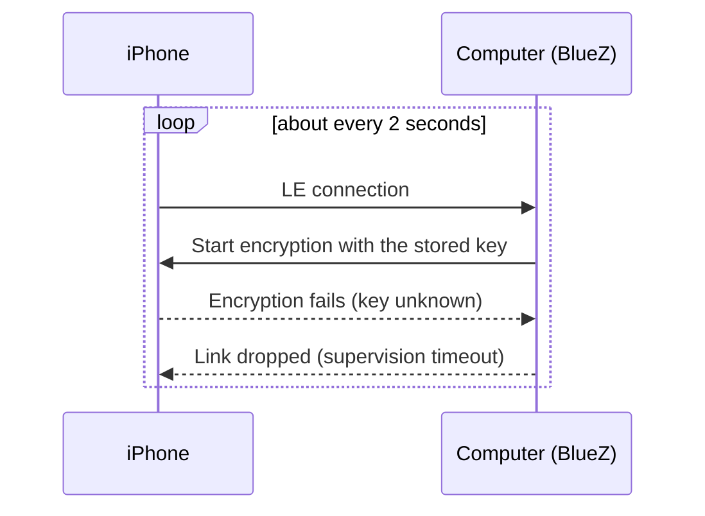

# Stale iPhone LE pairing

An iPhone pairs with your computer twice: once over classic Bluetooth
(messages, contacts, calls) and once over Bluetooth Low Energy (LE), which
iPhone notifications (ANCS) use. If the LE half of the pairing goes stale,
notifications can never work, while messages may keep working. BlueFerry
detects this pattern and tells you how to fix it.

## The symptom

This usually happens when the pairing was removed on only one side, for
example **Forget This Device** on the iPhone but not on the computer. The
iPhone no longer has the key the computer uses.

BlueZ keeps reconnecting forever, `Paired` stays true, and notifications
never arrive. In `btmon`, `LE Start Encryption` fails with status 0x08,
followed by `Disconnect Complete` with reason 0x08.

## What BlueFerry does

There is nothing to switch on; the detection is always active.

- After **5 short LE drops within 60 seconds** (each link younger than
  15 seconds, nothing proving the link usable in between), BlueFerry marks the
  LE pairing as **suspect**.
- It logs **one** warning with the remedy, without address or name.
- It stops its own LE connection attempts and doesn't power-cycle the
  adapter, because neither can restore a key the phone discarded. Links the
  iPhone starts itself are still watched.
- The Qt client shows a banner with the remedy and **Open iPhone Settings**;
  the terminal client shows a notice. `blueferry doctor` prints the remedy
  including the `bluetoothctl remove` command, and pairing reports mention it.
- Repeated "rebuilding ANCS subscription" log lines are limited to one per
  minute.

The warning clears by itself when an LE link stays up for 15 seconds, when
the iPhone authorizes notifications, when a new pairing appears, or when
bluetoothd restarts.

## How to fix it

1. On the iPhone, open **Settings > Bluetooth**, tap (i) next to this
   computer, and choose **Forget This Device**.
2. On the computer, run `bluetoothctl remove <iPhone address>`, using the
   address `blueferry doctor` shows as the target. The backend stops when the
   pairing disappears.
3. Pair the iPhone again from the BlueFerry client.

## Limits

- The thresholds (5 drops, 60 s, 15 s) come from one observed trace. At the
  edge of radio range, links may also come up and drop before encrypting,
  which can trigger the warning. That's why it says "probably". A usable link
  clears it automatically.
- On BlueZ older than 5.84 (or without the LE bearer interface), BlueFerry
  falls back to polling every 5 seconds. Detection is then slower (180 s
  window) and only samples the drops.
- The GTK and Quickshell clients show no banner yet; `blueferry doctor`
  works everywhere.

## Privacy

- No signal carries data; clients learn about the state through the existing
  argument-free `StatusChanged()`.
- `GetStatus` gains three keys: `le_bond_suspect` (true/false),
  `le_flap_count` (a number) and `last_le_disconnect_reason` (a fixed word
  such as `timeout`).
- The daemon's warning contains no address, name or number. `blueferry
  doctor` prints the configured iPhone address, as it already does, so you
  can copy the `bluetoothctl remove` command.
