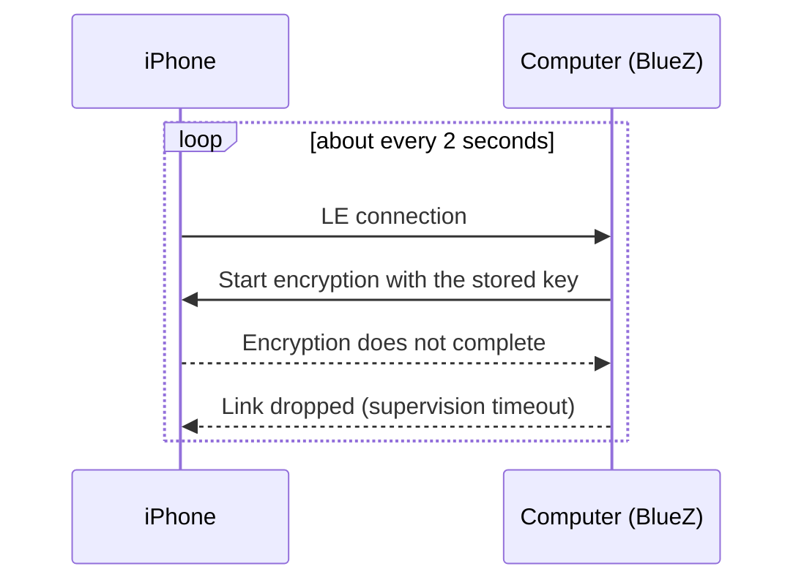

# Stale iPhone LE pairing

An iPhone pairs with your computer twice: once over classic Bluetooth
(messages, contacts, calls) and once over Bluetooth Low Energy (LE), which
iPhone notifications (ANCS) use. If the LE half of the pairing goes stale,
notifications can never work, while messages may keep working. BlueFerry
recognizes a pattern that suggests this and tells you what may fix it.

## The symptom

The suspected cause is a pairing removed on only one side, for example
removed and re-created on the computer while the iPhone kept its old LE
pairing, so the two sides no longer share the same key. This was the case on
the setup where the problem was first seen, and re-pairing on both sides
fixed it there (see Limits).

BlueZ keeps reconnecting forever, `Paired` stays true, and notifications
never arrive. In `btmon`, `LE Start Encryption` fails with status 0x08,
followed by `Disconnect Complete` with reason 0x08.

## What BlueFerry does

There is nothing to switch on; the detection is active whenever iPhone
notifications are enabled and the controller is not one known to fail ANCS.
It only reports. BlueFerry connects, reconnects and recovers exactly as it
would without it.

- An LE drop counts only when **classic Bluetooth stays connected** across
  the whole burst (the phone is demonstrably nearby), the LE link lived
  **at most 5 seconds**, and BlueZ names the reason as timeout, remote or
  authentication. Drops caused by this computer (rfkill, adapter power,
  BlueFerry itself), unknown reasons and suspend never count.
- At least **5 such drops within any 60 seconds**, sustained for
  **3 minutes**, mark the LE pairing as **suspect**.
- BlueFerry logs **one** warning with the possible remedy, without address
  or name.
- The Qt, GTK and Quickshell clients show a banner, the terminal client a
  notice. `blueferry doctor` prints the remedy including the `bluetoothctl
  remove` command, and pairing reports mention it.
- Repeated "rebuilding ANCS subscription" log lines are limited to one per
  minute.

The warning clears by itself when an LE link stays up for 15 seconds, when
the iPhone authorizes notifications, when a new pairing appears, when
bluetoothd restarts, or when classic Bluetooth has been gone for 2 minutes
(the phone is away). The drop count falls back to 0 after a quiet minute.

## What may fix it

1. On the iPhone, open **Settings > Bluetooth**, tap (i) next to this
   computer, and choose **Forget This Device**.
2. On the computer, run `bluetoothctl remove <iPhone address>`, using the
   address `blueferry doctor` shows as the target. The backend stops when the
   pairing disappears.
3. Pair the iPhone again from the BlueFerry client.

## Limits

- The thresholds come from one observed trace. That trace showed
  `Encryption Change` with status 0x08 (connection timeout); a phone that
  has lost the key would normally answer 0x06 (PIN or key missing). On
  that setup (Intel AX200, BlueZ 5.87, iOS 27), forgetting the computer on
  the iPhone, `bluetoothctl remove` and pairing again cured it: encryption
  completed and notifications arrived. One case is not proof for every
  phone and adapter, so the warning says "may".
- Detection needs BlueZ 5.84 or newer with its LE bearer interface. Older
  BlueZ cannot tell the LE link apart, so nothing is detected there. If the
  disconnect signal cannot be watched, BlueFerry samples the LE link every
  5 seconds instead; detection is then slower (180 s window, 9 minutes of
  persistence) and only sees some of the drops.
- The warning clears once the phone has been away for two minutes, once no
  short LE drop was seen for 10 minutes, or after pairing again.

## Privacy

- No signal carries data; clients learn about the state through the existing
  argument-free `StatusChanged()`.
- `GetStatus` gains three keys: `le_bond_suspect` (true/false),
  `le_flap_count` (a number) and `last_le_disconnect_reason` (a fixed word
  such as `timeout`).
- The daemon's warning contains no address, name or number. `blueferry
  doctor` prints the configured iPhone address, as it already does, so you
  can copy the `bluetoothctl remove` command.
